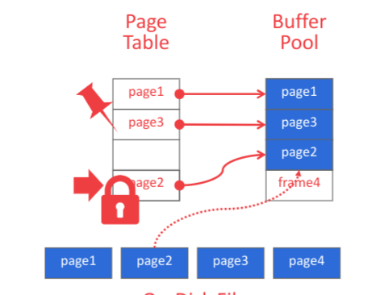

- 结构： 
	- page table：维持page_id -> frame_id 的映射
	- Buffer pool：保存page的frame
		- page数据
		- pin count: 引用数
		- dirty:
- allocate 策略
	- 全局的，所有的query 共享一个pool
	- query 有独立的buffer pool 防止污染
- 一些优化
	- Multiple Buffer Pools
		- 原因
			- 不同任务的需求不同，可能需要不同的置换策略
			- 减少锁的开销和增加局部性
		- 实现
			- object IDs
				- 在record ID中嵌入一个标示符
				- 根据标示符来选
			- hashing
				- hash record id
	- Pre-Fetching
		- 遍历的时候，预先取下一个page
		- 通过index 查询的时候，预先取子节点的page
		- 等等
	- Scan Sharing
		- 多个query 共享cursor，避免重复读取
		- @全局采样器
	- Buffer Pool Bypass
		- 有些任务比如遍历整个表，可能只被执行一次
		- 所以不需要污染buffer pool，可以直接本地跑一个小cache即可
- Buffer Replacement Policies
	- LRU
	- clock
	- LRU-K
		- 每一页记录最近访问的k次
		- 淘汰第k次距现在最远的那一页
	- 一些其它可能的影响因素
		- 局部性：每个query单独考虑
		- 优先级：有些page很重要，比如index的根
		- dirty页的换出开销更大