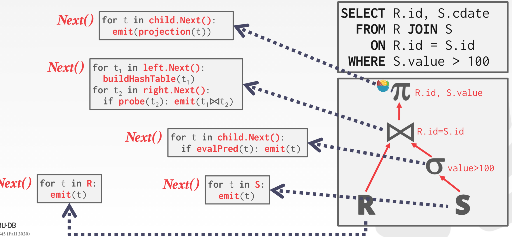
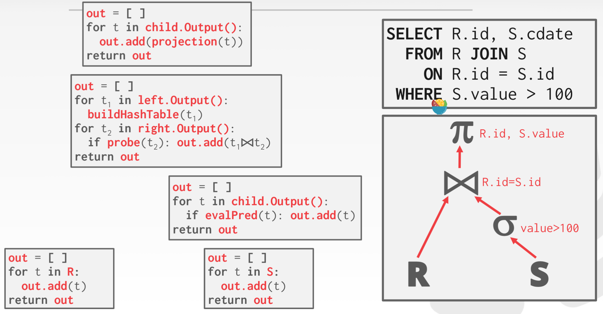
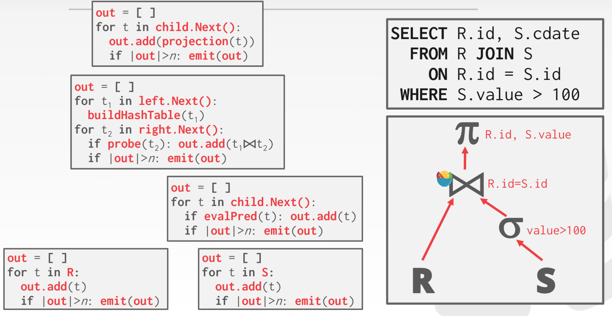
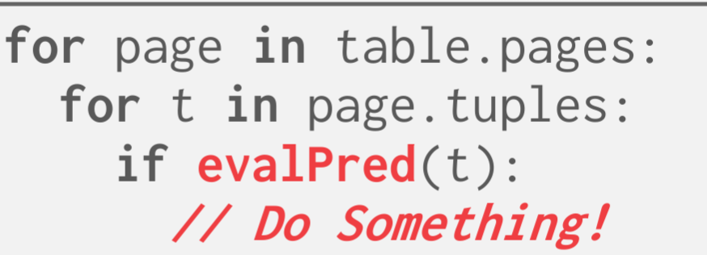
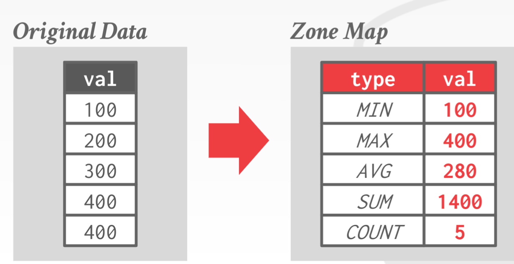
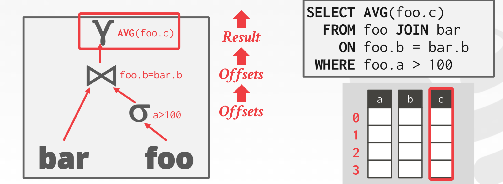
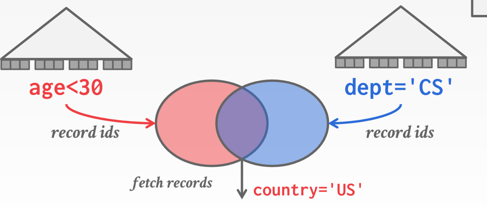
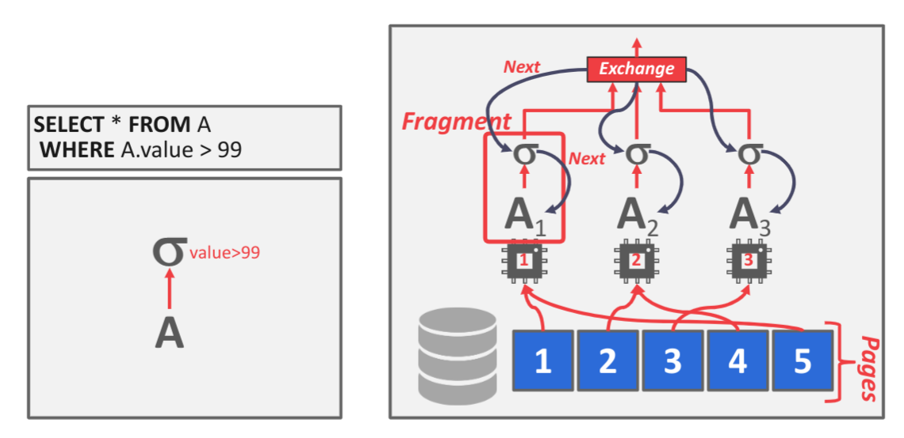
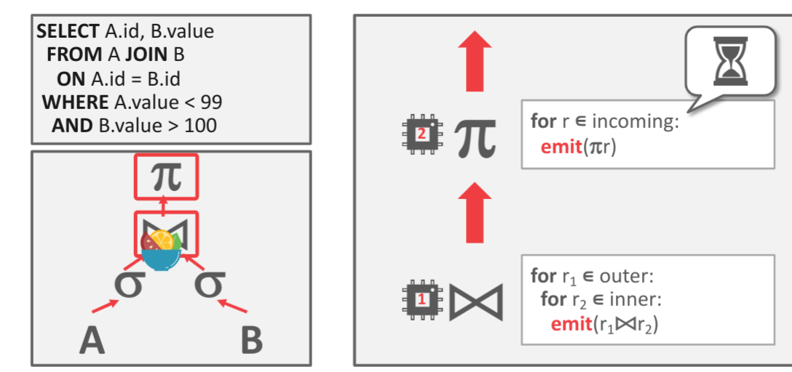

- Processing Models
	- Iterator Model：每次处理一个tuple 
	- Materialization Model：每次处理全部 
	- Vectorized / Batch Model：每次处理一个block 
- Access Methods：该处应该是指解析树的叶子节点访问数据的方式
	- Sequential Scan：顺序的读取全部文件 
		- 一些优化策略
			- Zone Map 
				- 保存一些数据的元信息帮助筛选（max/min/avg等）
				- 插入删除等会增加额外的开销，所以不适合OLTP
			- Late Materialization 
				- 在列存储时，我们可以只读入一个筛选的attribute来确定输出
				- 在到达树的顶端时，再读入真正输出的元素
	- Index Scan：借助index筛选
	- Multi-Index / "Bitmap" Scan 
		- 当存在多个index时，可以全部使用构成一个bitmap
		- 在将多个bitmap组合，（and：交，or：并）
- Modification Queries
- Expression Evaluation
	- 遍历AST需要更多的调用，消耗更多的时间
	- 可不可以将其编译为一个更短的指令
- 并行执行器
	- Inter parallerlism：多个sql命令并行的执行，可能会有事务隔离的问题
	- Intra parallerlism：将一个sql内部并行的执行
		- Intra-Operator Parallelism (Horizontal) 
			- 将对一整块数据，分治为不同块数据，然后并行执行
			- 需要一个exchange 模块
				- 汇总数据
				- 对数据预分块
				- 向上distribute 数据
		- Inter-Operator Parallelism (Vertical) 
			- 每个operator都有一个线程执行/ 流水线
			- 流系统中广泛使用
	- I/O 并行
		- Multi-Disk Parallelism： RAID raid0
		- Databast partition：分布式数据库中常用
			- 水平分片：按照tuple
			- vertical分片：按照attribute