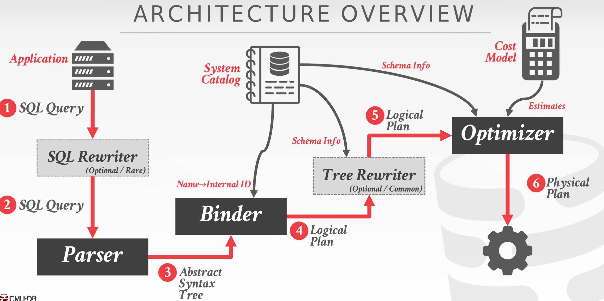
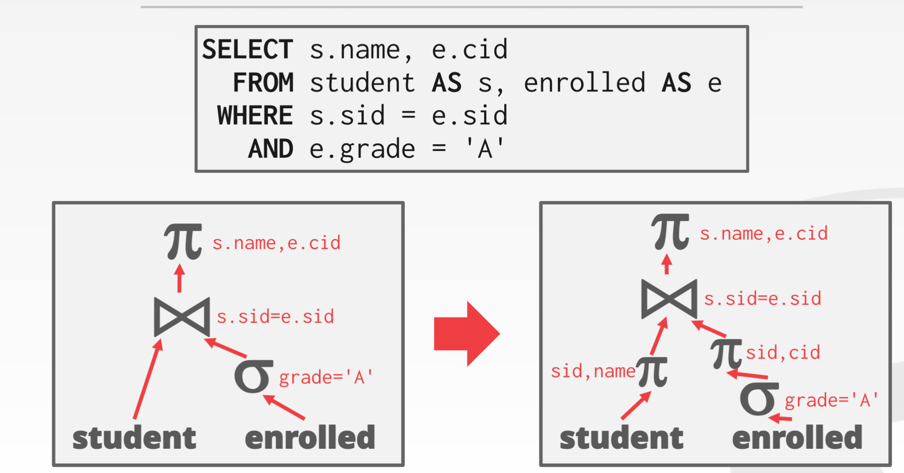
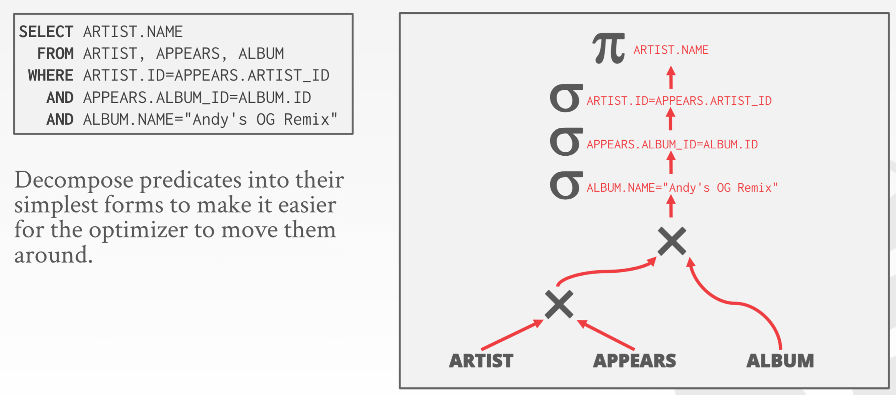
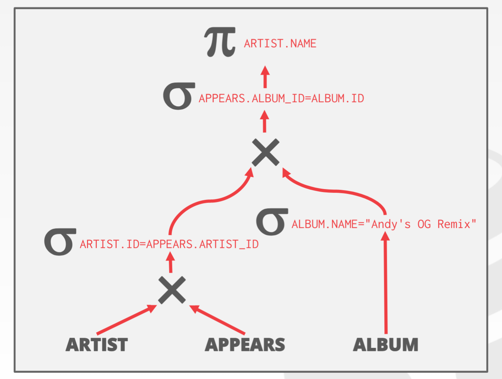
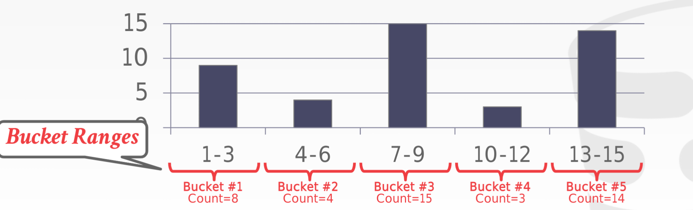
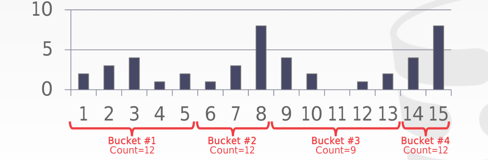

- Pipe line 
- Rule
	- 关系代数的一些运算律：
		- 谓词内推：​​​​​​​​​​​​​​​​​​​​​​​​​​​​​​​​​​​​​​​​​​​​
		- 谓词分解：​​​​​​​​​​​​​​​​​​​​​​​​​​​​​​​​​​​​​​​​​​​​​​​​​​​​​​​​​​​
		- 连接的结合率：​​​​​​​​​​​​​​​​​​​​​​​​​​​​​​​​​​​​​
		- 连接的交换率：​​​​​​​​​​​​​​​​​​​​​
	- 一些静态规则：当符合某个pattern的时候就下推
		- 投影下推： 
		- 谓词分解： 
		- 谓词下推 
		- 将带​​​​​​的笛卡尔积转化为内连接 
		- 子查询优化
			- 重新展开
			- 分解为两个查询
		- 重写表达式
			- 将一些一定为真或为假的表达式删除
			- 纯逻辑上的错误
				- 1 == 0
				- ​​​​​​​​​​​​​​​​​​​​​​​​
			- 利用catalog发现的错误
				- primary key = NULL
				- group by unique key
				- ......
- Cost估计
	- 统计数据：
		- `N`：每个relation总共的tuple数量
		- `V(A, R)`：关系R在attribute `A`中的元素数量
	- Selection Statistics：我们需要估计所selection的元素数量
		- Uniform：平均估计
			- ​​​​​​​​​​​​​​​​​​​​​​​​​
			- ​​​​​​​​​​​​​​​​​​​​​​​​​​​​​​​​​​​
			- ...
		- 等宽直方图：维护麻烦
			- 数据在整体上不是uniform的但是局部是的 
		- 等深直方图：维护麻烦
			- 直方图的深度相等：不知道能解决什么问题 
		- 抽样：通过样本估计整体
			- 维护简单
			- 但是需要遍历整个小样本
- 搜索
	- 单个relation：启发式的，贪婪的选最好的
	- 多个relation，比如​​​​​​​​​​​​​​​​​​​​​
		- 搜索的空间
			- 连接的顺序
			- 连接的方式：sort/hash
		- 通过动态规划
- 还有很多搞不清楚