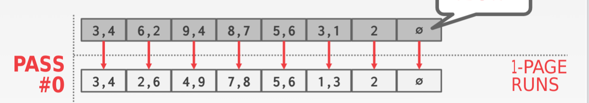
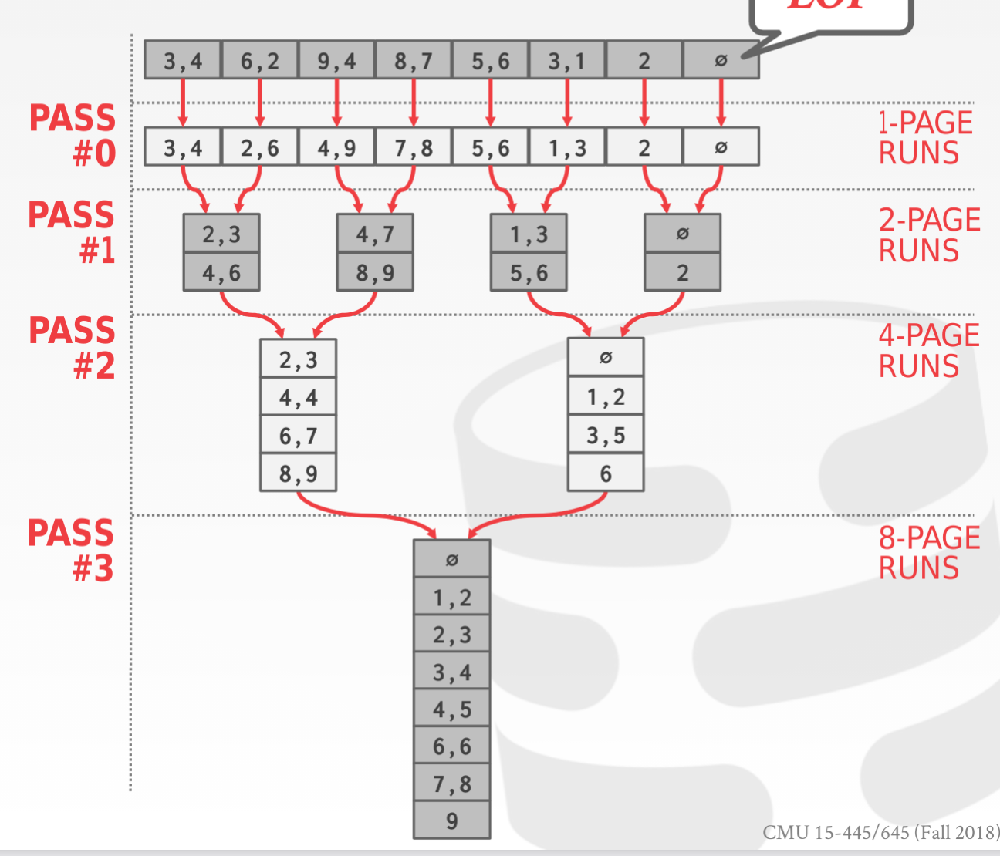
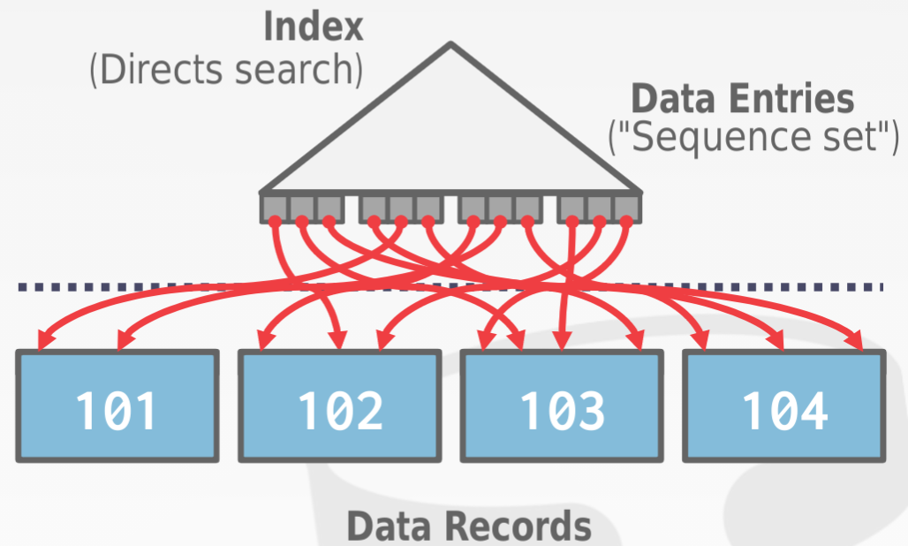
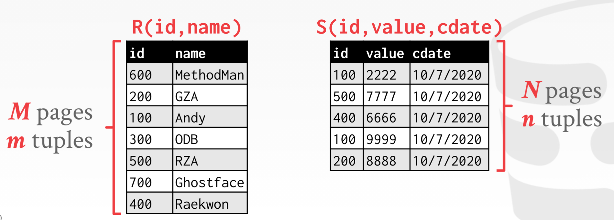
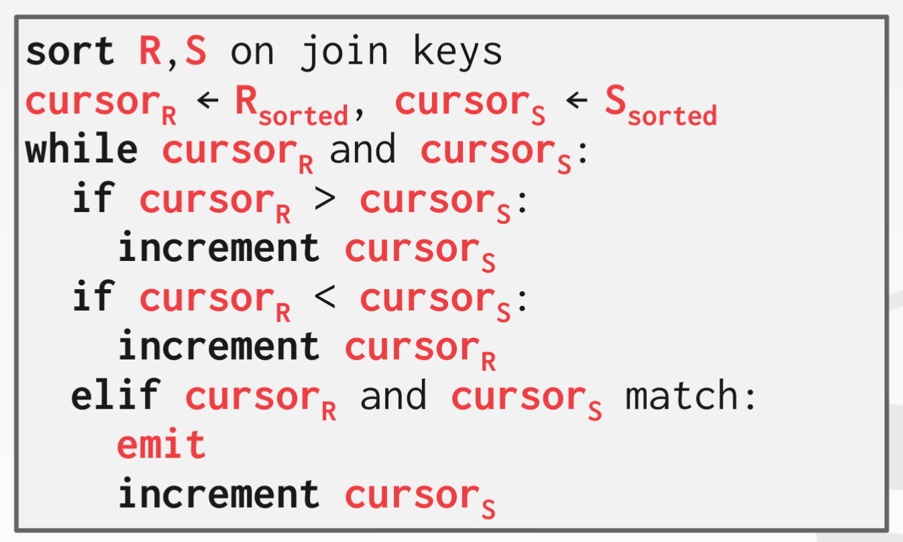
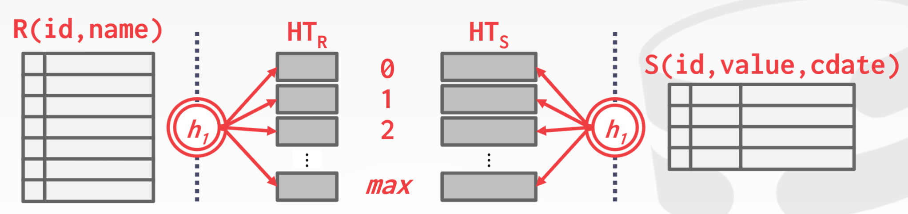
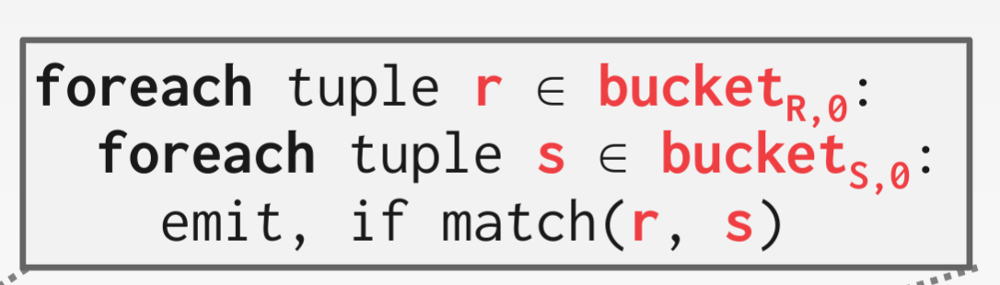
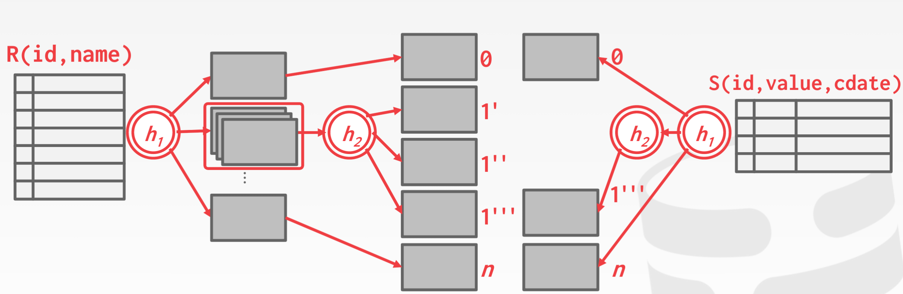
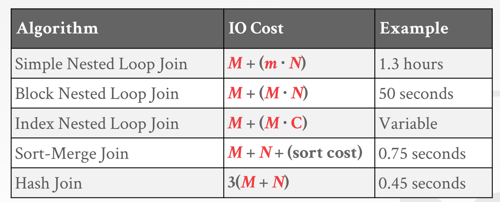

- <a  href="https://www.xsegment.cn/2020/08/15/Datebase-%E6%9F%A5%E8%AF%A2%E6%89%A7%E8%A1%8C/">查询执行</a>
- 核心
	- 如果一剑解决不了
	- 那就再来一剑
- 核心问题：面向disk的数据库不能保证所有的数据都能装入内存
- 排序算法：数据库的大部分复杂查询都可以通过排序解决
	- 思路：分治 & 合并
		- 假设内存大小为​，总的数据大小为​（单位为page）
		- 首先我们将其分为​​​​​​​​​​​ 块，然后对每一块单独进行排序
			- 这里的排序可以使用任何内存中的排序算法
			- 每次排序时可以prefetch其它的数据来构成流水线
			- 例子：​​​ 
		- 然后每次合并​​​  的数据：​​​用来存储input，​ 存储output
			- 每次读​​​块数据，选取其最大、最小的数据写入output
			- 如果output满了则写入磁盘
			- 例子：​​​ 
	- 时间计算
		- pass：读取多少遍数据
			- 第一次分治：1 pass
			- 然后合并：​​​​​​​​​​​​​​​
		- I/O次数：每个pass 有两次I/O，一次需要读取全部数据，一次写全部数据
			- ​​​​​​​​​
		- 如果考虑流水线应该更短
- 利用B+树的排序
	- B+树的已经按照某个key排序，可以利用
	- 只能针对聚簇索引
		- 非聚簇索引可能需要针对每个record 都做一次I/O 
- Hash算法：
	- 思路：分治 & 合并
		- 假设内存大小为​
		- 将数据hash到​​​个bucket中（one for output）
		- 然后针对这bucket数据单独处理：假设每个bucket都能装入内存
	- 处理数据大小：​​​​​​​
- Aggregations：将多个record 聚簇为一个
	- 特点
		- 常见操作：去重、求和、平均数等
		- 需要将相同的record 放在一起
	- 实现
		- sorting
			- 将所有数据排序（此时相同的record相邻）
			- 对排序后的数据顺序聚合
		- hash（有时更快，因为不需要做内存中的排序操作）
			- 将所有数据hash到不同的bucket（相同的record肯定在一个bucket中）
			- 然后针对每个bucket做对于aggregation操作
- Join：正则化的逆向操作
	- 假设：用于时间计算 
	- Loop
		- 暴力循环 
			- 此时针对R每个tuple，都要遍历一遍S
			- 此时I/O：​​​​​
		- 基于block的循环：循环单位不再是tuple，而是block 
			- 此时针对R每个Block。都要遍历一遍S
			- 时间：​​​​​
		- 如果存在index，那么可以直接在index中查询 
			- 此时，核心操作就是查询索引以及读对应的tuple（index应该聚簇？不然爆炸）
			- 时间：​​​​​，​是查询索引的时间
	- Sort：该join是基于上述的排序做的 
		- 首先，对R和S排序：​​​​​​​​​​​​​​​​​​​​​​​​​​​​​​​​​​​​​​​​​​​​
		- 然后，顺序读取R和S，进行Join：​​​
		- 时间总和为：​​​​​​​​​​​​​​​​​​​​​​​​​​​​​​
	- Hash：该join是基于上述分治 hash做的
		- 1.5 pass
			- 执行流程 
				- 先将R分治，建立hash表（该hash表必须要全部装入内存）
				- 然后读取S，进行查找
			- 注：hash表必须全部装入内存，不然可能会随机I/O，就像非聚簇的索引一样
		- hash分治
			- 分别对每个表都进行hash 分块 
			- 将相同的块读入内存处理（因为相同的tuple肯定被装入相同的块中） 
			- 一个块可能装不进内存？grace hashing：递归的分块 
			- 时间消耗
				- 建立hash表：​​​​​​​
				- join：​​​
		- 一些优化
			- 布隆过滤器
				- 为R建立hash表的时候，创建一个布隆过滤器
				- 为S建立hash表的时候，可以先模糊查询是否存在
	- 总结
		- 时间开销 
		- 结论
			- 总是使用hash join
			- 如果有很多冲突（non-uniform 分布），那么sorting join可能更好