- A：all or none
	- logging：通过日志来回退操作
	- shadow page：每次写入的时候会拷贝一个page，当事务commited后才修改数据库的引用使其可见
		- 问题：很慢很慢，因为有大量的随机写
		- 而且每次只允许一个事务，是non-steal的
- C：一直都要是对的
	- DataBase Consistency：数据的约束，在插入的时候需要进行类型检查
	- Transation Consistency：事务的一致性，这个需要在应用那一层的角度来保证
	- 分布式.....
- I：每次就好像只运行了一个事务
	- 串行化概念
		- 目标：找到一个调度序列
			- 串行调度：所有的事务只能一个串行运行
			- 可串行化：某个调度序列执行和串行调度相等
				- 相等的定义是：如果两个序列的执行结果一样，那么这两个序列相等
		- Conflict Serializability：考虑每个事务只有R，W operation，和可串行化相等（引入Insert/Delete 会造成幻读的问题）
			- 冲突的操作：不同的事务对同一个对象的操作会造成错误（和隔离级别有什么关系）
				- R，W(“Unrepeatable Reads”) 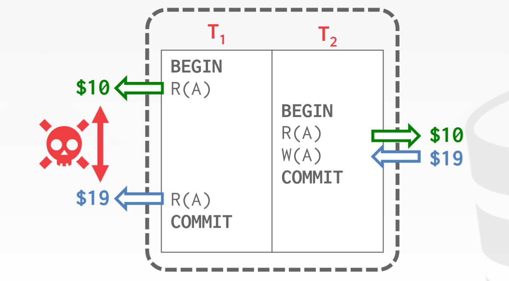
				- W，R(“Dirty Reads”) 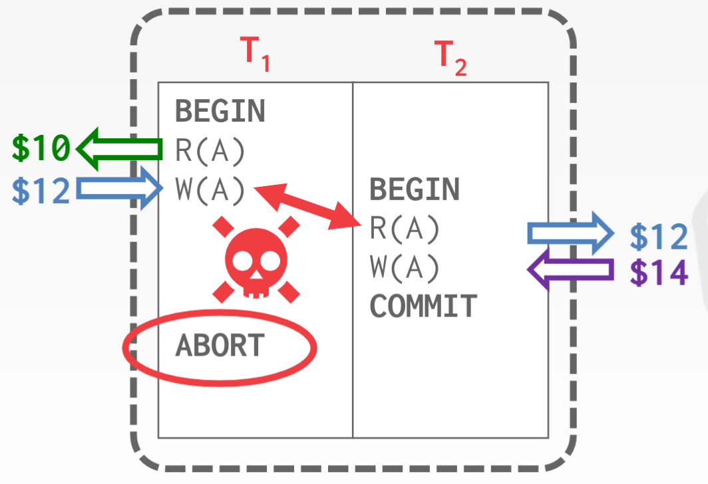
				- W，W（Lost Updates） 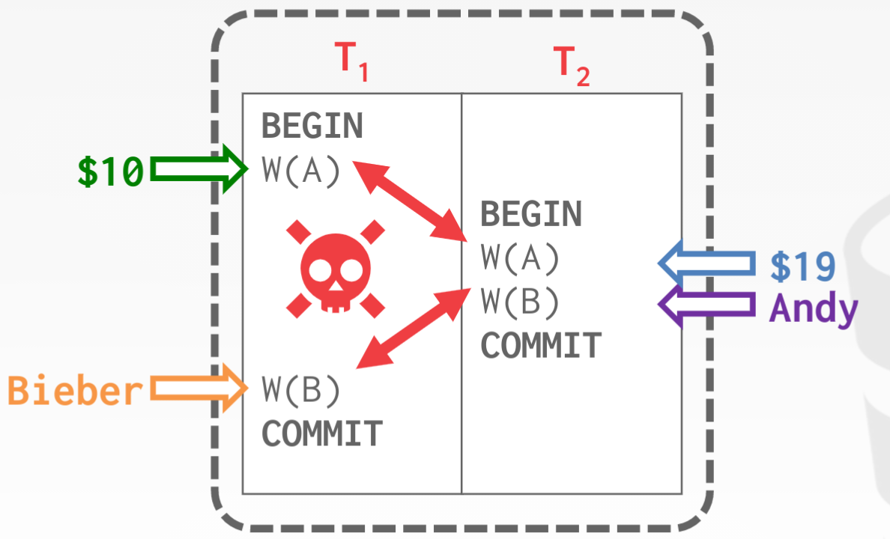
			- 可冲突的串行化
				- 所有的冲突操作，都有相同的顺序
				- 既以冲突操作构建一个图，这个图不能成环
			- 串行化的scope 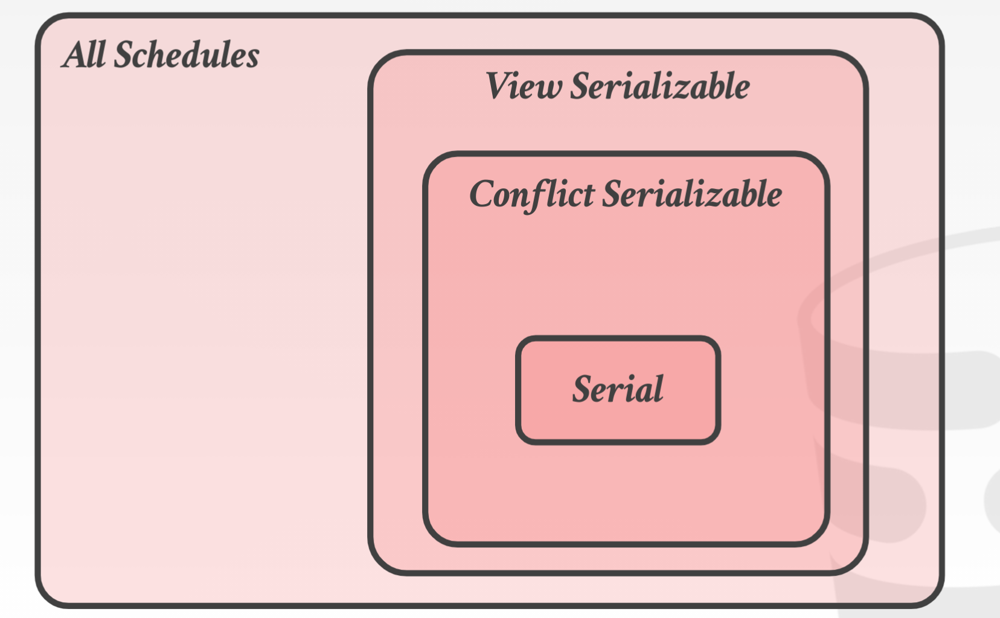
		- view serializability：在应用层上看起来和串行化一样的，理论上的概念
	- 实现
		- 悲观：2PL
			- 2PL
				- 锁的种类 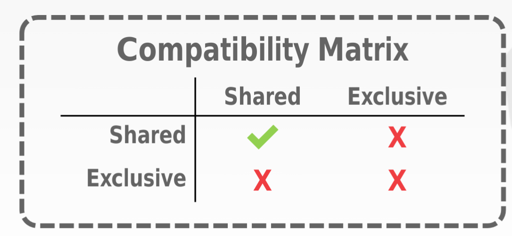
				- 定义 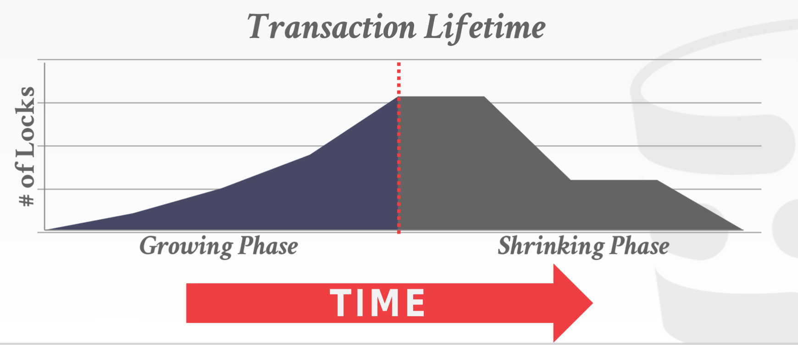
				- 存在的问题：读未提交和级联abort
			- 更严格的2PL
				- 定义：只允许在commit的时候瞬间释放锁 
				- 可以避免级联回退和读未提交的问题，但是减少了并发
			- 死锁：由于每个transaction 持有锁的顺序不同，所以可能会产生死锁
				- 破坏死锁
					- lock manager构建一个资源等待图 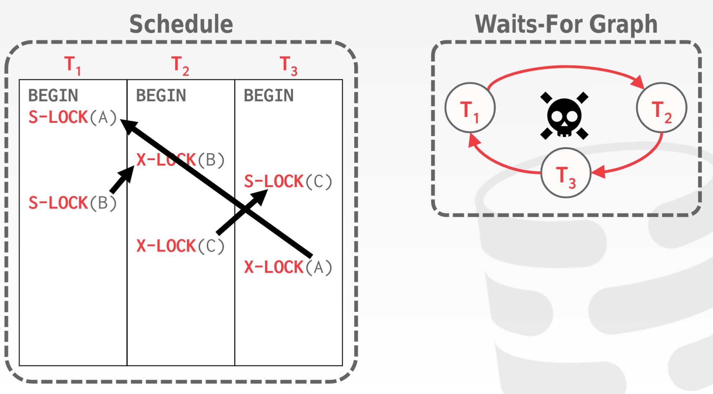
					- 若该图存在一个环（循环等待、不可抢占），便说明出现死锁
					- 需要选择一个事务回滚
						- 如何选择事务回滚 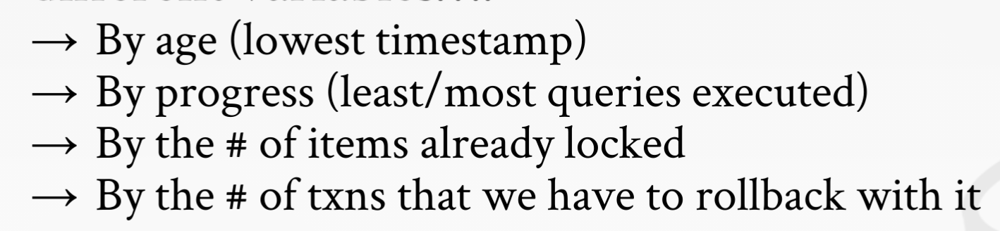
						- 回滚到哪里 
				- 预防死锁：设置优先级，老事务优先级更高（执行的时间更长），破坏不可抢占的条件 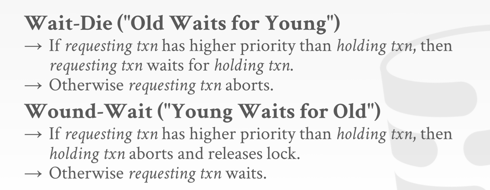
			- 锁的粒度
				- 并发性vs锁的开销
				- 设置级联的锁，意向锁：我的理解是意向锁既是表示**部分被加锁**，I/X表示**整体被加锁**
					- Intention-Shared：更低的节点存在一个shared 锁（既若一个节点有shared锁，其父节点应该有IS锁）
					- Intention-Exclusive：更低的节点存在一个exclusive锁（既若一个节点有exclusive锁，其父节点应该有IX锁）
					- Shared+Intention-Exclusive (SIX)：该节点是share锁，更低的节点有exlusive锁（S+IX）
					- 由此可以得到互斥矩阵 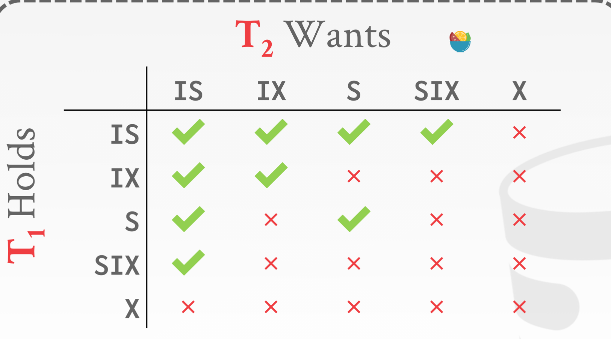
						- IS：部分S只和全部X 排斥，（可以部分共享，另一部分互斥）
						- IX：部分互斥和全部S排斥，和全部X互斥
						- S：全部S和部分X互斥
						- 等等
		- 乐观：timestamp
			- Basic TimeStamp 协议
				- 基本定义
					- 每个事务设置一个timestamp
						- 如何设计timestamp：逻辑/物理？
						- 在什么阶段计算times                                                                                                                                                                                                                                                                                                                                                                                                                                                                                                                                                                                                                                                                                                                                                                                                                                                                                                                                                                                                                                      tamp：开始/commit
					- 每个tuple有记录两个timestamp：R-TS、W-TS
				- 规则
					- 不能读到未来写的数据 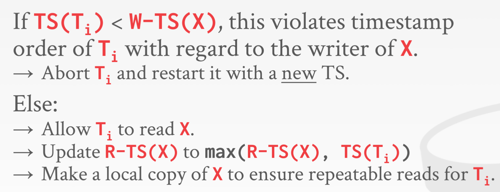
					- 不能覆盖未来的读/写 的数据 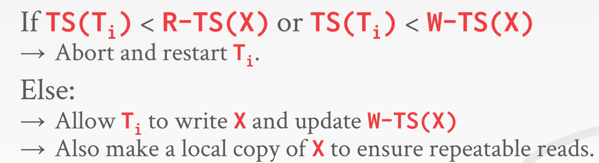
				- 缺陷
					- 时间戳的开销大
					- 不能recoverable：既不能读到未提交的内容
						- 示例 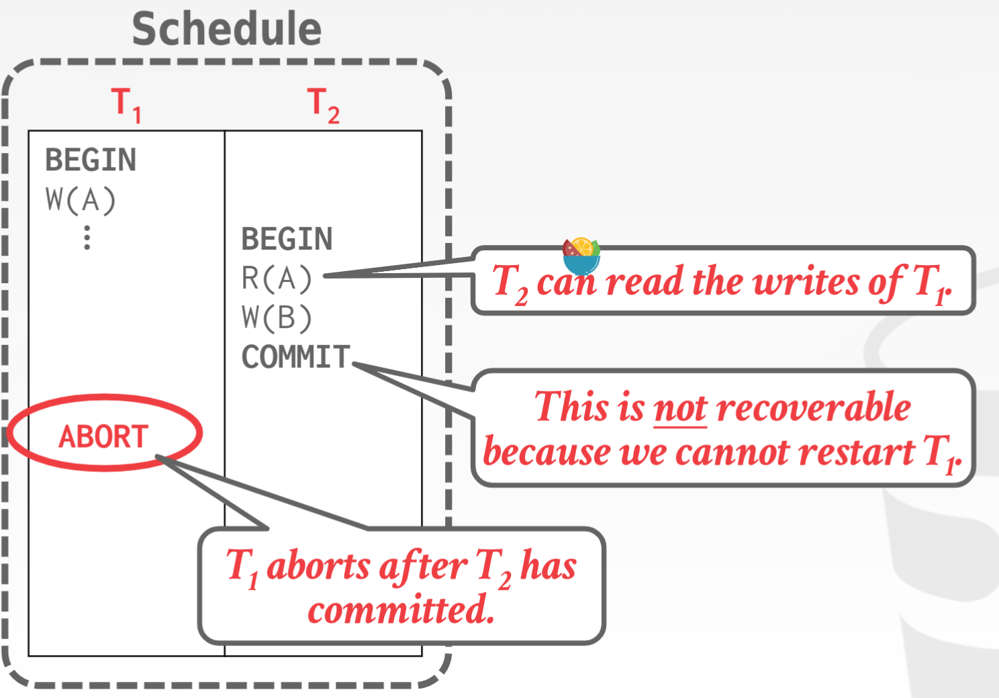
						- Strict 2PL 解决了这个问题
					- 长事务的starve现象：长事务总是被后到但是先执行完的短事务abort
			- Optimistic Concurrency Control：更快、更乐观
				- 基本思想：
					- 每个事务都将数据读到本地
					- 在本地进行修改
					- 最后验证事务是否冲突，如果不冲突则commit+写入
				- 实现步骤
					- Read Phase：将数据读入本地，并进行修改
					- **Validation Phase：验证是否冲突，TimeStamp在此时赋值**
						- 验证的方向
							- 向后验证 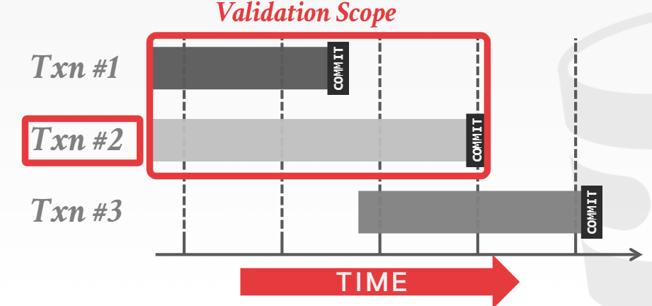
							- 向前验证 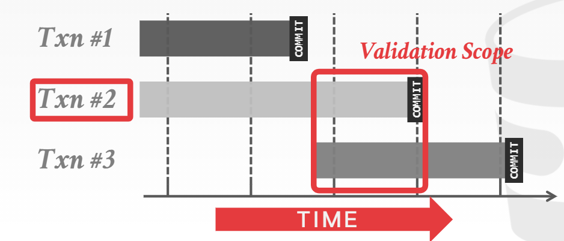
						- 验证的条件：forward：​​​​​​​​​（感觉有点像在读的那一刻，瞬间完成所有操作）
							- ​​​​​​​​​​​​​​​​​​​​​​​​​​​​​​​​​​​​​​​​：即两个事务没有交集
							- 为什么不​​​​​​​​​​​​​​​​​​​​​​​​​​​​​​​​​​​​​​​​​​
								- 如果是forward的，读不会对之后产生任何影响，因为读的内容肯定是​​​没写过的
								- 如果是backward，读感觉会有影响，因为不清楚到底读是读的之前的事务写后的还是写前的。
							- 为什么不​​​​​​​​​​​​​​​​​​​​
								- forward：​​​的写会对​​​的读产生影响，这会导致​​​错过​​​的写，而是读的更老的版本，可是这没有问题啊？我觉得可能有未来的写，因为读了代表将来可能有写
					- Write Phase：如果不冲突，则写入
				- 缺点：
					- 拷贝的开销大
					- 如果需要abort ，abort的代价也比较大
					- 长事务的饥饿问题
		- 理解
			- 乐观和悲观本质上就是回滚的时间不一致，回滚的时间越早越悲观
			- 锁是在执行前，就互斥了，相当于执行前
			- Basic Timestamp是在执行时回滚
			- OCC：是在提交时回滚
	- 隔离级别
		- 问题：
			- 脏读：读到一个事务未提交的数据
			- 不可重复读：由于并行事务的提交，导致事务读的数据前后不一致
			- 幻读：由于插入，导致数据的aggregate操作不一致
		- 隔离级别 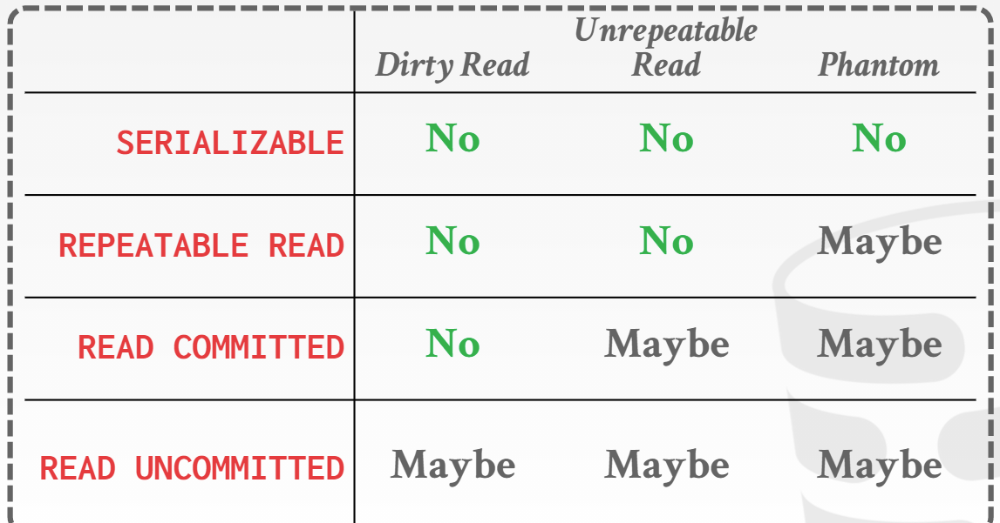
			- 读未提交：。。。
			- 读已提交：解决脏读问题
			- 可重复读：通过严格的两阶段锁
			- 串行化：通过index锁或重复扫描等技术
		- 对应的解决方案：感觉读已提交就必须通过严格的两阶段锁 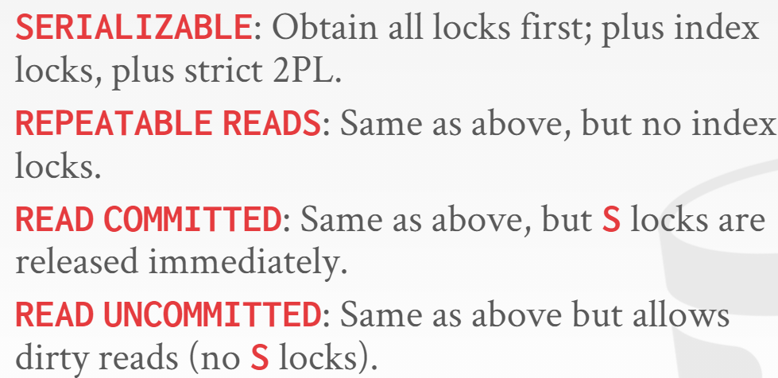
	- **MVCC：Advanced**
		- 每个数据都有多个物理版本
		- 解决的问题：读写冲突，读可能是老版本的。若是同一个版本，还是需要用到之前的并发控制协议 
		- 版本的组织形式
			- Append-Only Storage：组织成一个链表，每次插入
				- O2N：头是老版本
				- N2O：头是新版本，每次插入的时候可能要更新索引
			- Time-Travel Storage：将老版本移到Time travel table。带Time Travel table的N2O？ 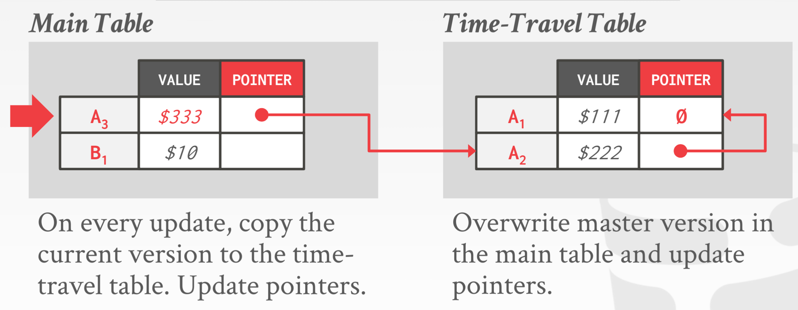
			- Delta Storage：只保存更新的Time Travel Storage 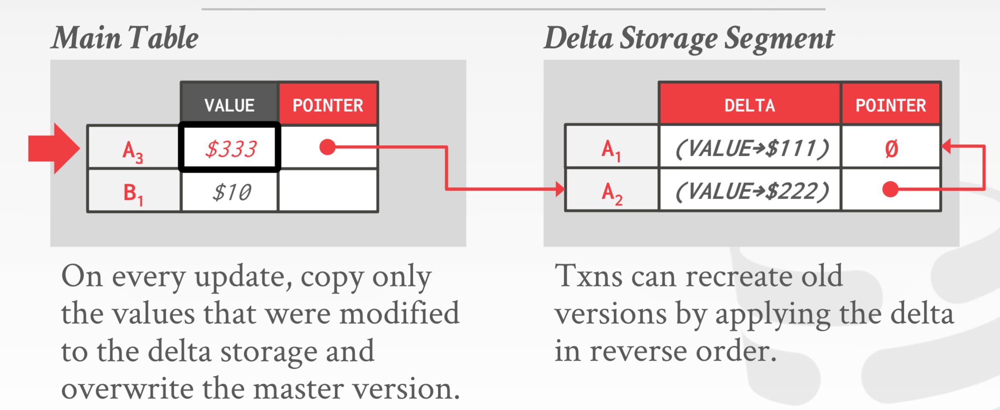
		- 垃圾回收/旧版本回收
			- 不用的旧版本
				- 对当前所有的active的事务都不可见的tuple
				- 这样对之后的事务肯定也不可见
			- 查询方式
				- Tuple-level
				- trasaction-level
		- 索引
			- primary index：每个新版本都会插入？还是只保存头部
			- secondary index
				- 像primary index一样
				- 或者指向primary index
- D：持久化（和原子性）：commit的持久它，abort的删除它
	- memory 策略 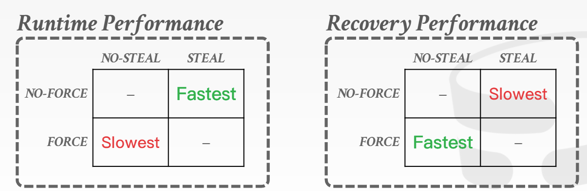
		- 每次commit的时候是否强制flush：force / no force
			- 如果每次commit的都flush的话，会引起写放大
			- 如果每次commit不flush的话，如何保证持久化
		- steal：是否允许非commit的事务的更改写回磁盘
			- 允许：如果abort如何undo
			- 不允许：如何在flush的时候抛弃掉非commit的更改（只允许一个事务？shadow page）
	- log：顺序写远快于随机写，只需要写一次
		- 1
			- redo：用于恢复操作的
			- undo：用于撤销操作的
		- 2 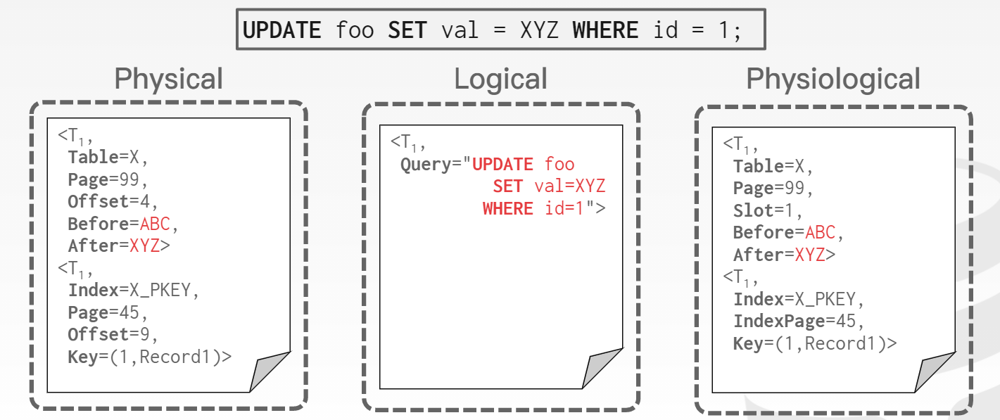
			- physical：记录RID的更改
			- logical：记录更上层，sql语句上的更改
	- Steal-force策略
		- WAL：
			- 每次commit的时候，写入undo + redo log
				- 优化：group commit
			- dirty page可以在之后lazy flush
		- 恢复
			- 从头到底，redo所有
			- 然后undo 没有commit的 事务的操作
	- **ARIES**：fuzz checkpoints的策略
		- observation：如果redo所有回非常吗慢，我们只需要redo那些没有写入磁盘的内容
		- 核心：记录使每个page变为dirty那条log，然后只需要redo这条log之后的log即可，我们将其称为recLog
		- checkpoint：每次checkpoints只需要记录当前的dirty page就好，之后就可以根据dirty page来追寻recLog
		- 具体协议流程：
			- 给每个log编号：LSN，log sequential number
			- fuzz checkpoint：每次checkpoints 记录当前的dirty page table：DPT
				- <checkpoints begin>
				- <checkpoints end, DPT>
			- 恢复： 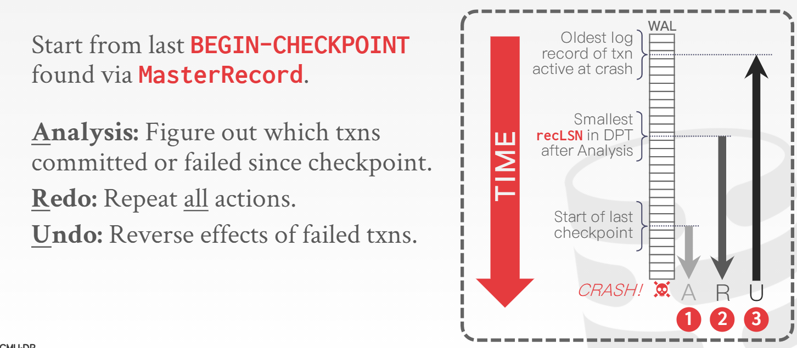
				- Analysis：重建DPT，dirty page table
					- 首先回溯到checkpoints的那条log，找到DPT
					- 然后向前分析，重建完整的DPT（有update就是Dirty page）
					- 然后再DPT中找到最早的recLSN
				- Redo：重建ATT，active transaction table
					- 从最早的recLSN开始，redo所有log
					- 并将所有未end的事务放入ATT
				- Undo：撤销所有未commit的事务
					- 根据上述的ATT，undo所有的log
					- 注意，若再内存就有事务undo某个，我们称其**CLR(Compensation Log Record)**，对于CLR，不能undo
						- CLR的引入是为了防止重复undo
						- 比如undo了一半，就崩溃了
						- 那么对于已经undo的CLR操作，我们需要redo它
						- 而未undo的下一半，才是undo