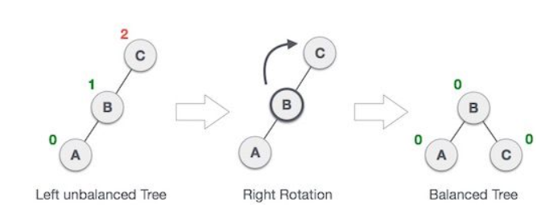
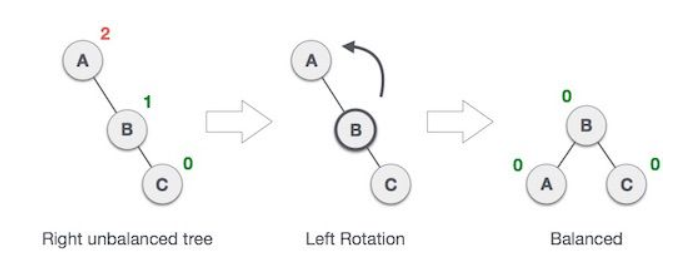
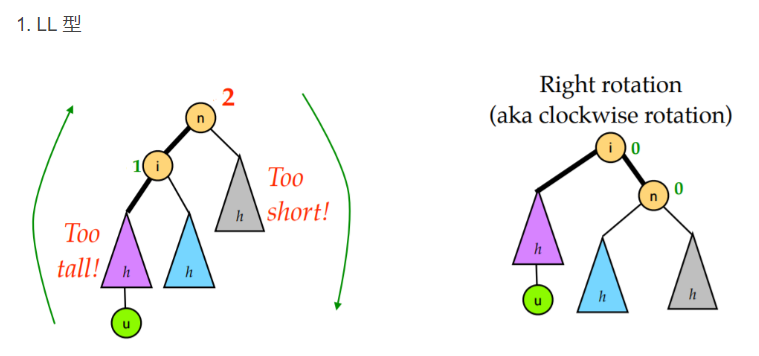
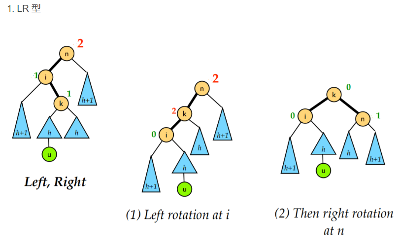

- 定义
    - 左右子树的高度差小于等于 1
    - 其每一个子树均为平衡二叉树。
- 树的平横化
    - 右旋 
    - 左旋 
- 需要平横的四种情况
    - LL：左孩子左子树插入的节点导致不平衡 
    - RR和上述对称
    - LR：插入左孩子的右子树导致不平衡 
        - 1、对多孩子进行右旋变为LL
        - 2、再左旋
    - RL与上述对称
