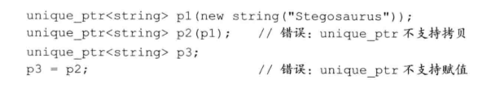

- 智能指针：是一个模板
    - 智能指针
        - shared_ptr：允许多个指针指向同一个对象
        - unique_ptr：独占所指的对象
        - weak_ptr：
    - shared_ptr
        - 每个指针有一个计数器
        - 计数为0自动销毁
        - 初始化
            - 和new组合使用 
            - 使用make_shared 
    - unique_ptr
        - unique拥有其变量，所以不能够拷贝或赋值（这会使得计数+1） 
    - weak_ptr
        - weak_ptr 指向 shared_ptr管理对象，但其不会改变shared_ptr的引用计数
- 动态数组
