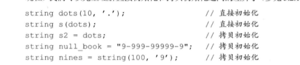

- 拷贝控制操作
    - 拷贝 赋值 销毁
        - 拷贝构造函数
            - 拷贝构造函数：参数是引用类型（因为如果不是，则需要调用拷贝构造函数，而目前还没有定义），用它来构造函数
            - 合并拷贝构造函数：编译设定（即使我们定义了其它构造函数，也不影响，和合成默认构造函数不同）
            - 例子 
            - 可能发生情况 
        - 拷贝赋值函数（注意深拷贝，浅拷贝）
            - 重载赋值运算符
            - 编译器会默认生成一个合成拷贝赋值运算符
        - 析构函数
            - 定义： 
- 动态内存管理类
