- 动态规划
    - 刻画一个最优解的结构特征
    - 递归定义最优解的值
    - 计算最优解的值
    - 利用计算的信息构造最优解
- 钢条切割问题
    - 给出长度为n的最佳切割方案，使得价格r_n最大（长度与价格表如下） 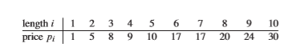
        - 动态规划求解
            - 最优子结构（optimal structure）性质： 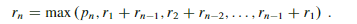
                - 问题的最优解由相关子问题的最优解组合而成
                - 这些子问题也可以独立求解
            - 防止重复求解
                - 带备忘录的自顶向下（使用备忘录记录已经求的解），递归从n递归到1，再向上求解
                    - 主函数：初始化备忘录 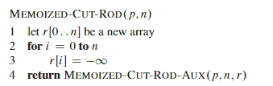
                    - 求解函数 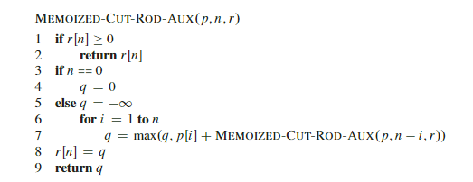
                - 自底向上( 按照子问题的规模，规模小的求解 )：从1开始求解，直到求到n 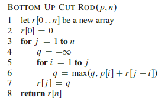
            - 子问题图
                - 在求解动态规划问题时，我们需要了解子问题之间的依赖关系
                    - 钢条问题的子问题图 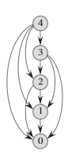
                - 其中自低向上的问题，便是在求解子问题之前，求解邻解它的子问题
- 矩阵链乘法
    - 在矩阵运算A1*A2*...*An，求加括号的方式，使得运算次数最少
        - 假设A(p,q) * B(q,r) * C(r,z)
            - A*B的运算量
                - A*B总共p,q个元素
                - 每个元素通过q次乘法得到
            - (A*B)*c:(p*q*r)*r*z
            - A*(B*C):p*q*(q*r*z)
    - 动态规划
        - 结构化特征
            - 对于矩阵Ai***Aj的计算量m(i,j),需要从k处分开
            - m[i j] = m[i k] + m[k+1 j] + pi-1pkpj
        - 递归求解方案 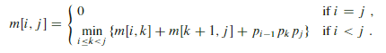
        - 计算最优代价//备忘录 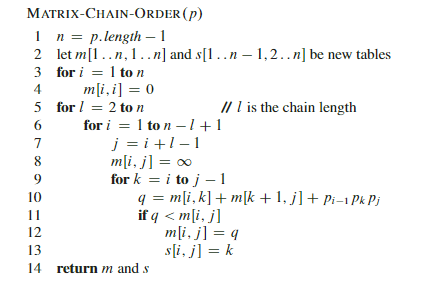
            - 三重循环，故为O(n^3) 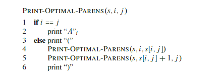
        - 构造最优解
            - 输出最优解的括号方案
- 动态规划原理
    - 动态规划问题需要两个要素
        - 最优子结构（第一步）
            - 最优子结构性质：一个问题的最优解包含其子问题的最优解
            - 发掘子结构的通式，详见p216
                - 1. You show that a solution to the problem consists of making a choice, such aschoosing an initial cut in a rod or choosing an index at which to split the matrixchain. Making this choice leaves one or more subproblems to be solved.
                - 2.  You suppose that for a given problem, you are given the choice that leads to anoptimal solution.  You do not concern yourself yet with how to determine thischoice. You just assume that it has been given to you.
                - 3.  Given this choice,  you determine  which subproblems  ensue  and how to bestcharacterize the resulting space of subproblems.
                - 4.  You show that the solutions to the subproblems used within an optimal solutionto the problem  must themselves  be optimal  by using a “cut-and-paste”  tech-nique.   You do so by supposing  that each of the subproblem  solutions  is notoptimal and then deriving a contradiction.   In particular,  by “cutting out” thenonoptimal solution to each subproblem and “pasting in” the optimal one, youshow that you can get a better solution to the original problem, thus contradict-ing your supposition  that you already had an optimal solution.  If an optimal solution gives rise to more than one subproblem, they are typically so similarthat you can modify the cut-and-paste argument for one to apply to the otherswith little effort.
                - 思考剩余
                    - 选择：问题的解包含做一个选择（钢条问题需要选择切割等），如此相当于把问题切割成多个子问题：？？？？？
                        - 最长子序列和做出的选择是当新增一个元素，是否包含这个元素得到最优解
                        - LCS做出的选择是xn != xm,和xn == xm的情况
                    - 对于一个给定的问题，假设已经得到一个最优解的选择
                    - 在进行最优解的选择后，需要确定产生的子问题，并刻画子问题空间
                    - 
            - 子问题的无关
                - 在发掘最优子结构时候，需要注意子问题的最优解是否无关：（同一个子问题的解不影响另一个子问题的解）
                    - 例如：最长路径（非环） 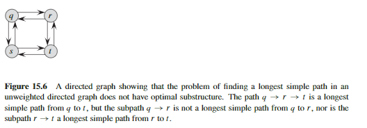
        - 子问题重叠
            - 其中，每一步都产生不同的子问题的是分治
            - 动态规划避免重复解决重叠子问题
                - 合理的安排求解顺序(自底向上)
                - 备忘录
    - 大致了解两点
        - 对于子问题而言，它们必须无关
        - 在动态规划分题，常规解法一般会重复求解一些子问题，而这正是动态规划所需要优化的
    - 详细参见P215
- 最长公共子序列
    - 子序列
        - 给定序列X = {x1,x2...xn}
        - 存在一个**严格递增**的下标序列{i1 ... im}
        - 使得Z = {x_i1 ... x_im}
        - 则Z是X的一个子序列
    - 问题：给定序列X，Y求出X、Y的最长子序列
    - DP求解
        - 刻画最长公共子序列的特征
            - 一般求法：遍历X所有的子序列2^m，查看它们是否是Y的子序列
            - 前缀队列：X序列中前k个元素组成的序列Xk，称为第k前缀
            - 最优子结构： 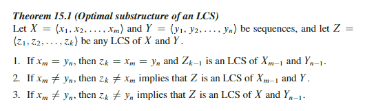
        - 一个递归解
            - 则由最优子结构可得
                - 当xm = yn，需要求Xm-1，Yn-1的LCS
                - xm  != yn
                    - 求Yn和Xm-1的LCS
                    - 求Yn-1和Xm的LCS
                - 递归式如下 
        - 计算LCS长度       //自低向上 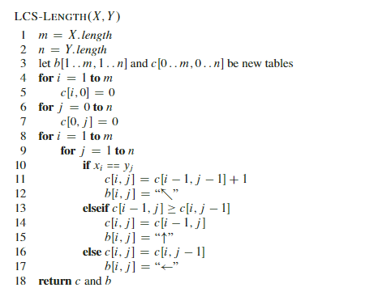
            - line13-15：c[i j] = c[i-1 , j]；c[i,j-1] > c[i-1,j]
            - line16-17：c[i j] = c[i , j-1]；c[i,j-1] < c[i-1,j]
        - 构造LCS 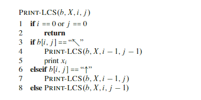
- 最优二叉搜索树（待看）
