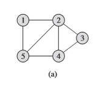
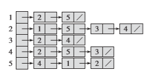
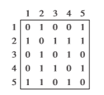

- 图的表示G =  (V,E) 
    - 邻接链表-------稀疏图 
    - 邻接矩阵-------稠密图（快速判断两个节点是否连接） 
- Breadth First Search（Prim\Dijkstra使用了该思想）
    - 广度优先搜索
        - 从源节点s，搜索s可以到达的所有节点
        - 按照广度优先（类似层次遍历，只有遍历完第k层的，才会去遍历第k+1层）
    - 广度优先搜索流程
        - 先将所有节点初始化白色
        - 当算法发现一个节点，染成黑色，并将其可与其连接的点染成灰色
        - 使用队列管理
        - 附：这里算法导论的描述只是为了便于理解，实际直接可以按照队列来遍历，不区分灰色和黑色
- Deepth First Search
