- 2.1 信息存储
    - 计算机存储信息的方式（字节/byte；位/bit）
    - 字长：计算机总线带宽的基本长度
    - 寻址：计算机将内存以byte为单位，以数组方式编码，每一个byte有一个地址，寻址范围和字长大小有关
        - 大端：高有效位是低位地址（附：正常思维，大的放前面，即小地址）
        - 小端：反过来
    - 一些基本运算
        - 位运算（非，与，或，异或） 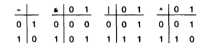
        - C语言的位级运算：  &&    ||      ！（附：当&& 左边位真时便不会计算右边）
        - 移位
            - 左移(x << k)：x左移k位，丢弃最高的k位，右边补零
            - 右移
                - 逻辑右移：x右移k位，丢弃最低的k位，左边补零
                - 算术右移：x右移k位，丢弃最低的k位，左边补最高位（这是为了维持补码的性质，详见后面补码的扩展）
- 2.2 整数表示
    - 无符号数：二进制数转无符号数，即是将对应位的2进制数与对应权重相乘，并累加即可 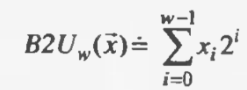
    - 有符号数：需要表示负数
        - 源码：正数转负数：最高位变为1
            - 将最高位作符号标志位，1为负，0为正
            - 计算公式： 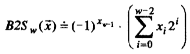
        - 反码：正数转负数：将最高位变为1，其余取反
            - x ∈ [00...0]_w ~ [01...1]_w：正数，和无符号数一样
            - x ∈ [10...0]_w ~ [11...1]_w：负数，其含义为：（x - [11...1]_w）/（x - (2^w-1)）
            - 即将最高一位的权重看成2^{w-1}-1 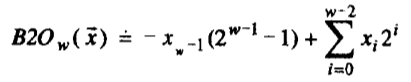
        - 补码：正数转负数：将最高位变为1，其余取反，再加1
            - 反码和源码都有一个正0，负0
            - x ∈ [00...0]_w ~ [01...1]_w：正数，和无符号数一样
            - x ∈ [10...0]_w ~ [11...1]_w：负数，其含义为：x - 2^w
            - 即将最高一位的权重看成2^{w-1} 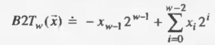
    - 有符号数和无符号数的转换（补码形式） 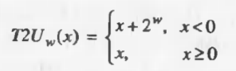
    - 数扩展与截断
        - 扩展
            - 无符号数扩展直接高位补0
            - 补码扩展 高位 补原最高位（类似于右移）
                - 当是正数时直接补零
                - 当是负数时
                    - [1...]_w = -1*2^{w-1}+*
                    - [[1..1]_k     1...]_w+k = -1(2^{w+k-1} - ... 2^{w-1}) + * =  -1*2^{w-1}+*
        - 截断
            - 无符号数截断到k位：x % 2^k
            - 补码截断后需要将最高作符号位，重新计算值
- 2.3 整数运算（溢出）
    - 加/减
        - 无符号加法：无符号加法，溢出后类似于截断到w位；由于最多只溢出1位，所以%2^w 可以换位 - 2^w 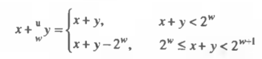
        - 补码加法（附：[x+y]补 = [x]补+[y]补） 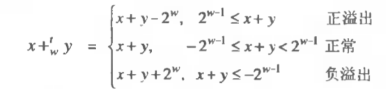
            - 这里p63 可见公理化的推导
            - 比较直觉的思考：
                - 正溢出
                    - 正溢出后肯定向下修正，所以-2^w
                    - 正溢出，即最高位变为了1
                        - x+y中最高位的权重是2^{w-1}
                        - 补码中最高位的权重是 **- 2^{w-1}**
                        - 所以修正便是 - 2^{w}，使得最高位的权重变为补码的权重
                - 负溢出
                    - 正溢出后肯定向上修正，所以+2^w
                    - 负溢出，向上进1位，变成了1，最高位没有进位，变为0
                        - 此时，x+y将最高位扩展了一位
                        - 而补码中最高位是0
                        - 所以修正便是+2^{w}，消去扩展的一位
    - 乘
        - 无符号乘法 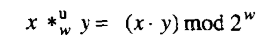
        - 补码乘法（位级等价性） 
            - 位级等价性推导：x' 和 y'是 补码转的无符号数 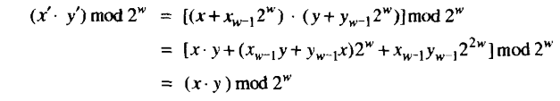
    - 乘/除 以 常数
        - 转化为移位（乘为左移，除为右移）的方式
            - 例如x * 7 = x*4+x*2+x*1 = x<<2 + x<<1 + x
        - 在补码移位除法中是向下舍入的，需要加上一个偏置使其向上舍入（详见p73）
- 浮点数
    - 二进制小数
        - 仿照十进制小数：设置不同的权重（2^k ... 2^0 , 2^-1 , 2^-2 ... )
    - IEEE标准
        - V = (-1)^s  * M * 2^E
            - 符号数（s）：确定正负
            - 有效数（M）：它的范围在   1~2-ε   之间，由于这些数为1.00... ~ 1.11...，其中首位1是固定的，所以一般省略
            - 阶码（E）：它的作用是对浮点数加权
        - 浮点数的四种形式（图片参p78）
            - 规格化值：指数域不全为0或1，此时指数域的值为 x - Bias
            - 非规格化值：指数域全为0，指数域的值为1-Bias（1-Bias使得更平滑化）
            - 无穷：指数域全为1
            - 八位浮点数的例子： 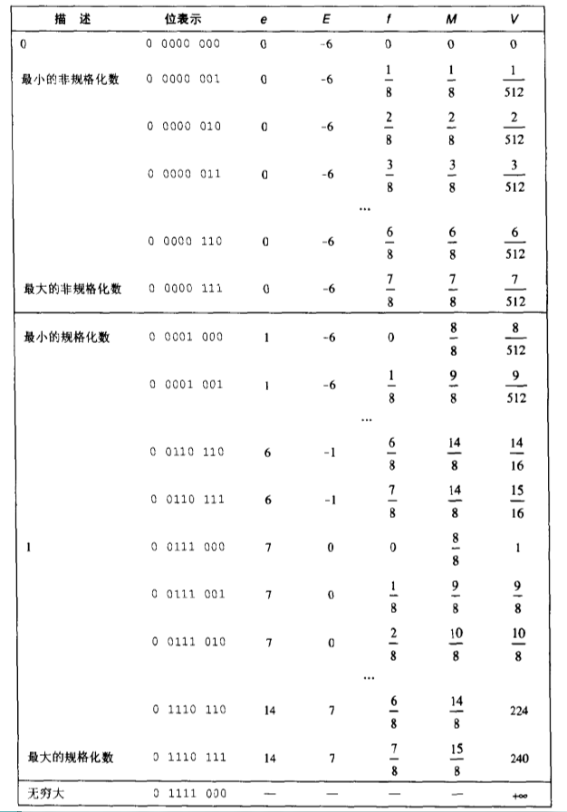
    - 舍入
        - 非中间值：向离他最近的舍入
        - 中间值：四种方法 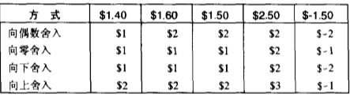
            - 向偶数舍入，使得0.5的可能性向下舍入，0.5的可能性向上舍入，误差分布更均匀
            - 向偶数舍入有一个更简单的实现方式，即保证最低位为0（详见P84）
    - 浮点运算
        - 在程序中，由于舍入的方式不同，所以结合的方式不同会导致结果不一样。
        - 具体参见书上P85页
