- 本节内容
    - 定义Y-86-64
    - 第一步设计处理器
    - 加入流水线
- Y86-64 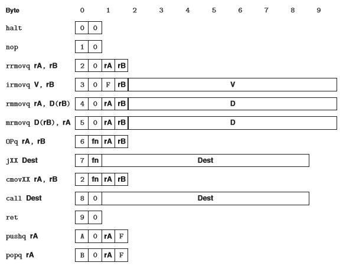
    - 指令编码
        - 第一个字节表示指令：前半个表示大的指令种类，后半个表示条件
        - 第二个字节表示原操作和目的寄存器（F表示没有寄存器）
        - 可选：后8个表示立即数
    - 寄存器编码 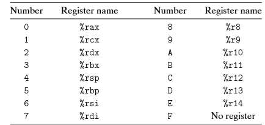
- 顺序实现
    - 将处理过程 组织成各个阶段，每个阶段一般一个时钟周期
        - 取指（Fetch）：取回指令，包含指令（icode【指令代码】；ifun【功能代码】）、寄存器代码（rA、rB）、立即数（valC）；计算新的PC值（根据指令种类确定更新后的PC）
        - 译码（Decode)：根据寄存器编码得到寄存器的值（valA <- rA；valB <- rB）
        - 执行（Execute）：执行计算命令，并更新条件码，得到条件判定的结果（是否成立）
        - 访存（Memory）：可以将数据写回内存或读出
        - 写回（Write Back）：将结果写到寄存器
        - 更新PC（PC update）：将F阶段更新的PC传入到寄存器
    - 一些通用指令的流程
        - 数据操作流程（寄存器间的操作）：注意一般valE是负责写回寄存器，rB是目标寄存器的编码 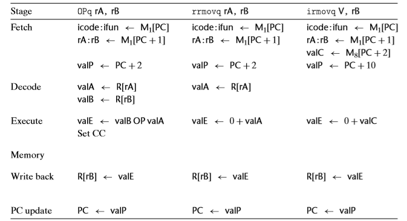
        - 内存与寄存器的操作：此时valE作为地址或写回内存的数 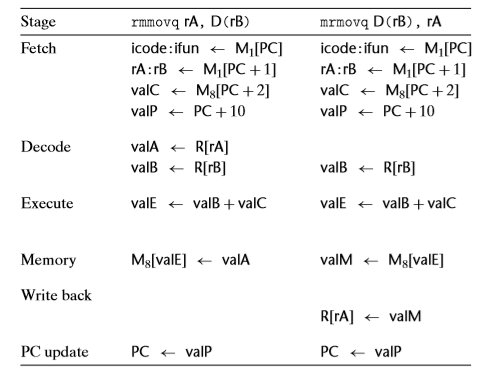
        - 栈操作（内存操作+sp寄存器操作） 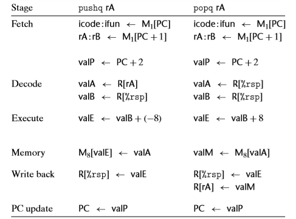
        - 跳转指令 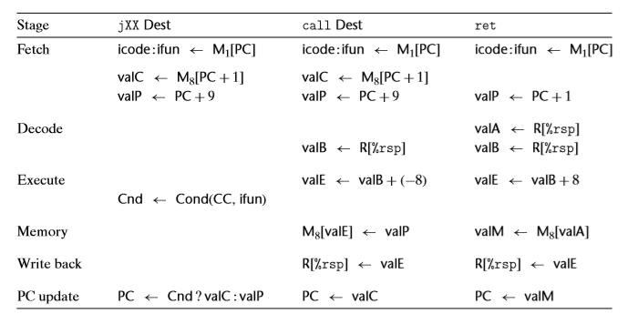
        - 附：在执行阶段都是valA valB执行或valC valB（部分情况会变成+-8）
    - 硬件设计
        - 数据流 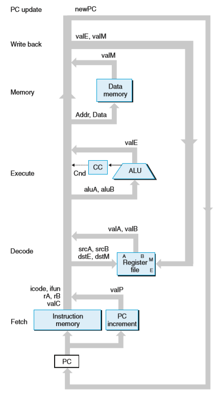
        - 总体设计（一些细节没画）:从不回读原则：处理器不需要为了完成一条指令的执行而去读由该指令更新的状态（即指令更新状态是在下个周期初上升沿的时候，本指令更不无法去读） 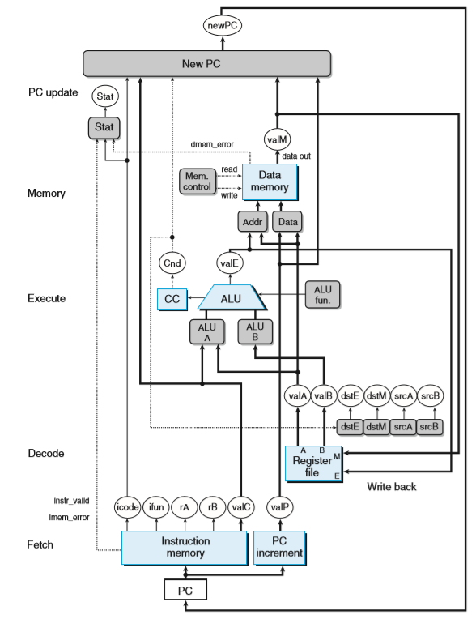
            - 灰色：一些选择硬件单元，后来详细用HCL描述
            - 白方：时钟寄存器，电路上升沿时更新
            - 白圆：表示线路传送信号的名称
            - 蓝方：表示一些基本黑盒子单元
        - 五个阶段的周期：表明了5个周期，是在周期初上升沿更新寄存器，并开始本阶段的操作 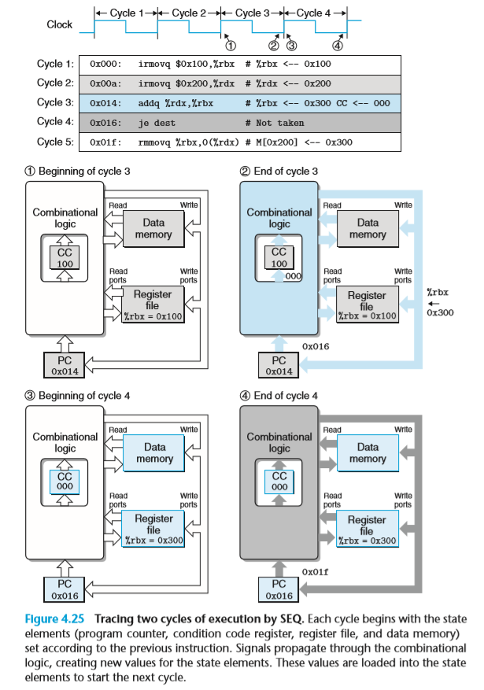
        - 取指阶段 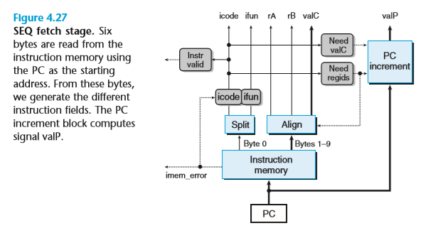
            - 取值阶段是一开始直接取10个字节（图示是32位的，所以有问题），然后根据命令更新PC（指令：PC+1；寄存器：PC+1；立即数：PC+8）
            - need_regids的HCL（既需要寄存器的指令）： 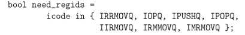
            - need_valC略
        - 译码和写回阶段（由于它们都是对寄存器文件的操作，所以合并） 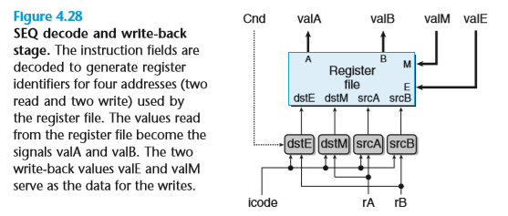
            - srcA和srcB是标识译码的寄存器源，并读出对应的valA，valB；当其为F时，表示无此寄存器（不使用）
            - dstE（可能是rA）和dstM（可能是rB）是标识valM（内存中读出的），valE（执行后的结果）的目的地址
            - srcA的HCL描述 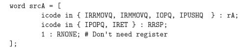
            - dstE的HCL描述 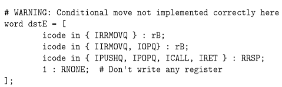
        - 执行阶段 
            - ALUA可能是valC，valA，+-8，由命令决定，其HCL描述为 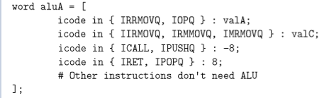
            - ALU fun即根据ifun确定ALU的执行种类（加 减 与 或）
            - Cond是根据执行的结果确定的条件码，根据条件码得到Cnd（是真是假）
        - 访存阶段 
            - 虚线表示一位，read/write表示是写还是读，或是都没有
            - dmem_error，表示地址错误，不能访存
            - mem_addr的HCL 
        - 更新PC阶段 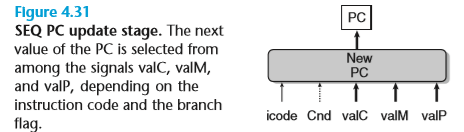
            - 一般是valP，call jxx是valC，ret是valM，具体的HCL略
- 流水线通用原理
    - 流水线操作 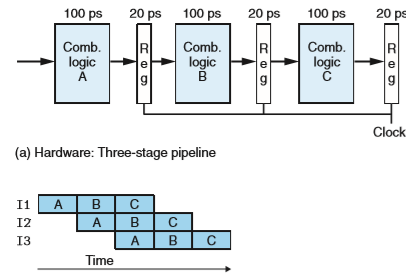
        - 将一条指令分成几个阶段，每一阶段结束的结果存在寄存器中
        - 流水线画的执行每一个阶段
    - 流水线的局限
        - 阶段的划分：流水线需要划分好几个阶段，然而如何合理的划分（即尽量保证每一个阶段耗时相同，因为流水线的周期取决最长的阶段）是一个难题
        - 对于流水线而言，越深的流水线（划分阶段）效率越高，但是流水线划分过深，会导致写入寄存器的时间占整个周期的大部分时间（即周期花费与执行命令的时间变少了）
    - 带反馈的流水线系统
        - 数据上的难题：流水线中还没到1指令更新%rax，2指令便需要用到%rax 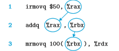
        - 控制上的难题：当面临条件判定是，流水线可能会取出和判定不一致的命令（流水线取命令为真的情况，实际是假） 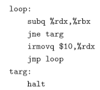
- Y86-64的流水线设计
    - SEQ+：重新安排阶段（将PC更新从PC更新的末尾放到取指阶段的开始，即不需要寄存器在周期末尾更新寄存器），为了平衡个阶段的延迟 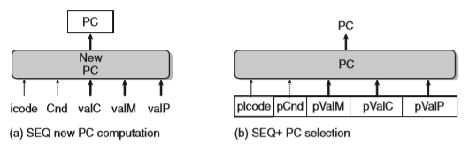
    - 在每一个阶段安插寄存器（主要有5个节点） 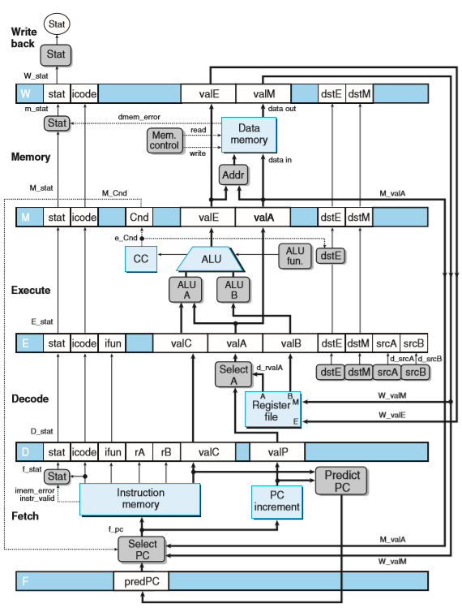
    - 流水线冒险
        - 冒险种类
            - 数据冒险：参见数据上的难题
                - **程序寄存器**：在D阶段读出，在W阶段写回，**可能造成数据冒险**
                - **程序计数器**：这里的数据冒险实际就是**控制冒险**，不能很好的预测下一条指令
                - 内存：对内存的读写都是在M阶段，所以**不可能造成冒险**
                - 条件码：
                    - 数据操作会在执行阶段末写寄存器
                    - jxx会在访存阶段读Cnd，movxx会在执行阶段读cnd
                        - jxx会在M阶段初期读Cnd
                        - 而jxx下一条指令会在周期末写Cnd
                        - 此时jxx已经执行完了，不存在冒险
                    - 当整数操作完，紧接着就算下一条，根据其条件码执行
                - 状态寄存器：每一个阶段都有自己的状态，并和异常有关系，详见异常
            - 控制冒险
                - jmp：不能完全预测下一条指令
                - ret：只能在M阶段才能得到下一条指令
        - 冒险避免
            - 数据冒险
                - 判端冒险：将D阶段寄存器ID和各个阶段的目的寄存器比较，当发现相同时，说明会发生数据冲突
                - 用暂停来避免数据冒险
                    - 暂停：让一组指令暂停在其对应阶段，即不能更新任何寄存器 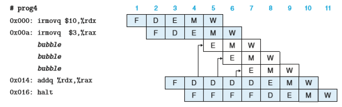
                    - 当程序在第五个周期发现可能会有冒险，插入一个bubble（E阶段目的基础器和D阶段的源寄存器冲突）
                    - 第六个周期发现有冒险，插入bubble（M阶段目的基础器和D阶段的源寄存器冲突）
                    - 第七个周期发现有冒险，插入bubble（W阶段目的基础器和D阶段的源寄存器冲突）
                - 用转发避免数据冒险
                    - 转发：当出现冒险时，直接将更新阶段的值转发到译码阶段
                        - W阶段转发 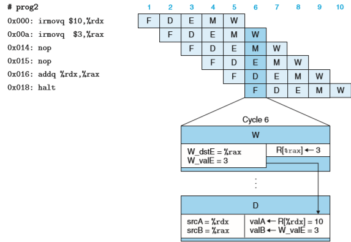
                        - M阶段转发 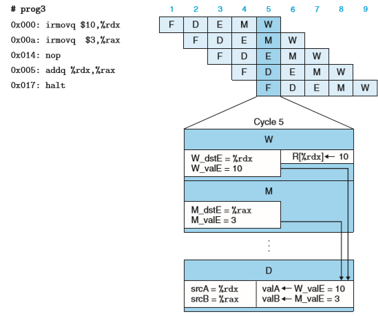
                        - E阶段转发 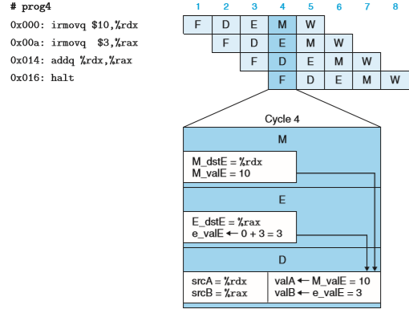
                    - 转发后更新的硬件图：多了FwdA和FwdB即转发 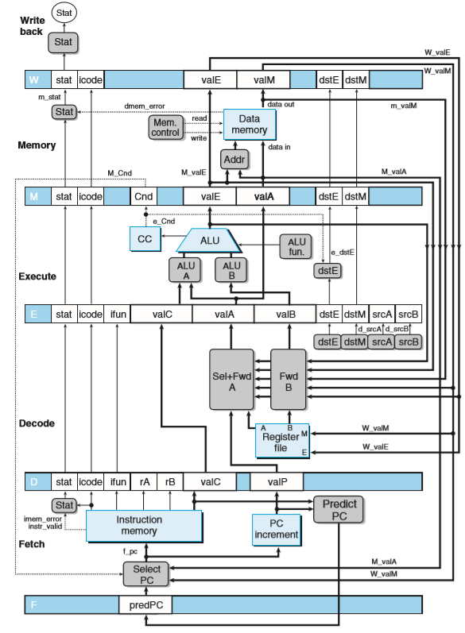
                        - 五个转发源
                            - W阶段：W_valM，W_valE
                            - M阶段：m_valM，M_valE
                            - E阶段：e_valE
                        - 两个转发目的地：valA，valB
                    - 加载/使用数据冒险 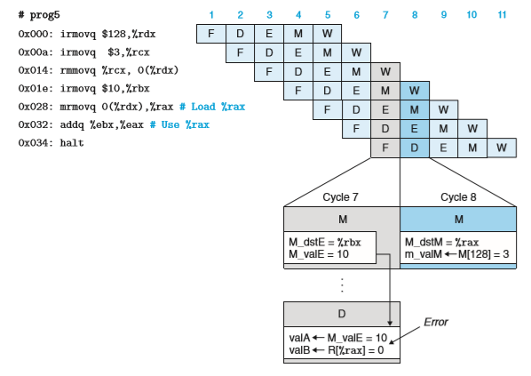
                        - 流水线上，两条指令只差一个周期
                        - 该条指令得到数据（M阶段）和下一条指令使用数据（D阶段）差两个周期
                        - 不可能直接转发，需要插入一个bubble
            - 控制冒险
                - ret指令 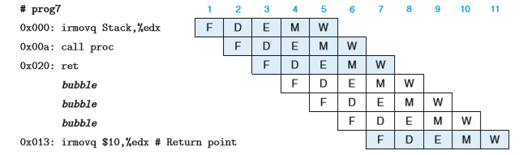
                    - 在F阶段即可以发现冒险
                    - 插入两个bubble
                - jxx指令 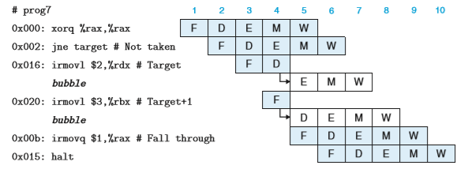
                    - 在M阶段发现冒险
                    - 发现冒险后插入bubble
    - 异常处理
        - 异常种类
            - halt指令
            - 非法指令
            - 非法地址
        - 处理异常的问题
            - 多个异常的优先级：异常越深（即指令执行的越早），异常优先级越高（报告给操作系统）
            - 由于控制冒险，导致异常指令被取消 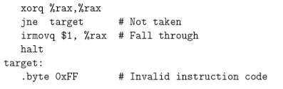
            - 在流水线时，在某个阶段发生了异常，而同一个周期的上一阶段指令改变了某个寄存器（违法了发生异常后所有指令都不能改变系统状态）（M阶段发生异常，同时E阶段改变的条件寄存器） 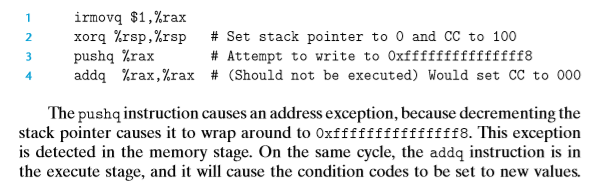
        - 流水线传播异常
            - 当发生异常时，会更新状态码，状态码会沿着流水线传播
            - 为了解决问题3：当W或M阶段发生异常时会禁止更新条件码、内存和寄存器；在E阶段的Set_CC逻辑会以W_stat和m_stat输入，控制是否更新条件码，参见实现细节执行阶段
            - 为了解决问题2：当取出某条指令，之后又取消了（控制冒险），之后所有关于这条指令的异常状态也会随着流水线取消。而取消之前，其后的命令不能改变程序可见状态
    - 各阶段实现细节
        - PC选择和取指 
            - 当预测错误时，会从M_valA（即jxx命令的valP）读出下一条指令
            - ret进入W阶段时，会从（W_valM）读出下一个地址（即sp指明的内存）
            - f_PC的HCL：控制冒险的问题 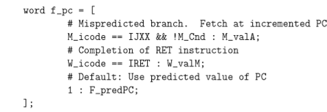
            - f_predict的HCL：是跳转还是下一条指令 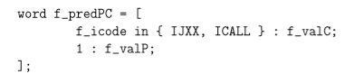
        - 译码和写回 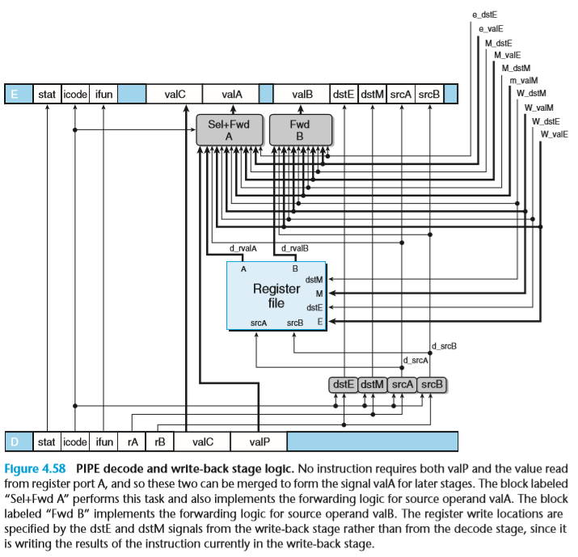
            - 写的目的寄存器地址是W_dst，表明是由W阶段的命令指出
            - valA和valP的合并逻辑为：只有call指令需要valP，而它不需要valA；其他只需要valA
            - d_valA的HCL：注意处理的顺序；先处理时序上离当前命令近的 
            - 写回阶段和译码阶段有的区别是多了个stat逻辑 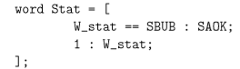
        - 执行 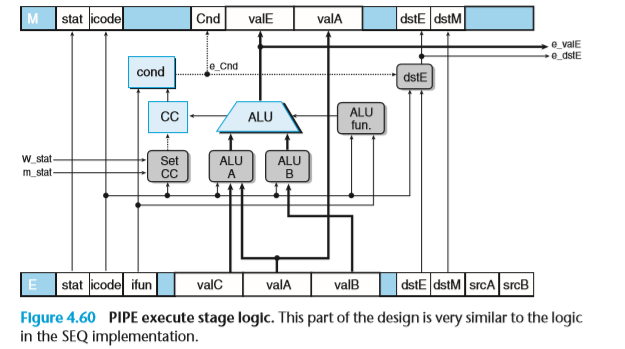
            - 执行阶段和顺序执行并无太大区别（由寄存器读出），需要关注的是Set_CC逻辑，它以m_stat，W_stat阶段的状态码作为输入，指示是否更新条件码；该逻辑细节在下一节指出（流水线控制逻辑）
        - 访存 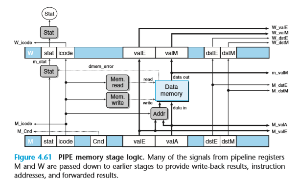
    - 流水线控制逻辑
        - **转发+流水线** 逻辑不能处理的四种情况：
            - 加载/使用冒险：插入2个bubble
            - ret：插入3个bubble
            - 预测错误分支：插入2个bubble
            - 异常：异常处理逻辑（Set_CC等）以及异常随着流水线流动
        - 触发特殊控制条件 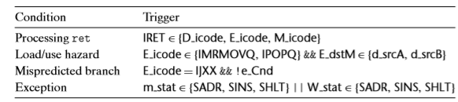
            - 异常：检测D，E，M阶段的指令
            - 加载/使用
                - 检查执行类型：**MR** MOV/POP（这两个命令会在 M阶段读出 需要的值）
                - 并检测目的基础器
            - 预测错误分支：jxx命令并Cnd错误
            - 异常：m_stat，W_stat
        - 流水线控制机制：时钟寄存器有三个状态 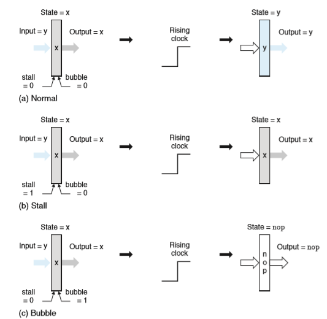
            - 正常：在上升沿更新寄存器
            - 暂停：在上升沿保持原状
            - 气泡：清空寄存器，以nop覆盖之前状态
        - 各个阶段的操作 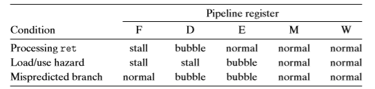
            - ret：当D、E、M阶段出现ret指令，F指令保持不变，D阶段置为bubble；可以模拟一下D阶段发现ret，E阶段发现ret，M阶段发现ret然后更新F的PC的状态（相当于暂停在F阶段三个周期）
            - Load/use：在E阶段末期发现L/U错误，于是暂停FD，置空一个E（对此时M阶段指令无影响（造成L/U）），相当于暂停在D阶段一个周期
            - Mispredicted branch：在E阶段末期发现M错误，此时jxx命令进入M阶段，置空D，E（即错误分支的两条命令），然后将新的PC更新在F周期
        - 各个阶段的组合
            - 各个周期的可能组合 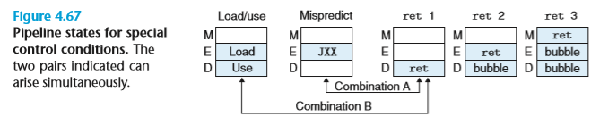
                - ret之间不可能有组合（因为ret之后都是bubble）
                - M和L/U不可能组合，因为L/U E阶段的命令只可能是RMMOV和POP，不可能是JXX
                - 可能组合只有两种
            - 组合A：由于JXX之后就跳到另一个地址，所以ret不起什么作用，此时可以按照M异常处理，不过不再取指了（ret后无地址） 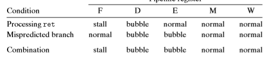
            - 组合B：E阶段的L/U会使得F，D停止；而ret指令会置空D，相当于将ret后一条指令置空了，和L/U冲突（L/U指向后两条指令暂停，ret将后一条指令置空） 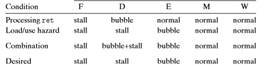
                - 一般延迟一个周期ret命令
                - 但是我觉得，这样也可以
                    - L/U指令前一条是ret和xx
                    - L/U想暂停保存，ret和xx的状态；而ret是置空xx的状态；所以冲突
                    - 而xx命令是不可能执行的所以可以不管xx，而当ret暂停三个周期后，此时L/U命令早已更新了寄存器，此时就不存在L/U
        - 控制逻辑的实现 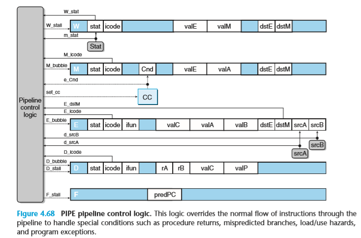
            - F_stall的条件 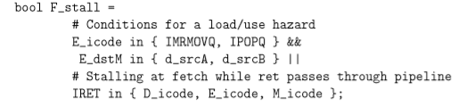
            - D_bubble的条件 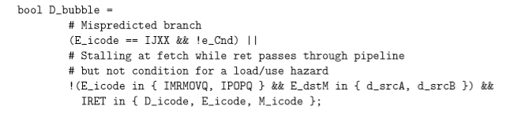
    - 性能分析（略，P322）：即流水线的效率主要拖累于（预测错误，L/U，ret） 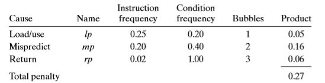
    - 未完成的工作
        - 多周期命令
            - 有些命令（乘、除、浮点数操作）的操作在执行阶段不能以一个周期完成
            - 解决：采用独立于流水线的单元，将这些操作转发到这些单元，而流水线处理命令
                - 数据间的同步
                - 数据的冒险
        - 与存储系统的接口
            - 从存储器中读取数据需要很多周期
            - 多级存储器结构
