- 序
    - 本节先介绍了编译器的局限，即为什么程序需要优化程序；
    - 制定了一个评判程序运行速度的指标CPE
    - 本节以一个程序为例，展现优化的过程
        - 首先，本节介绍了一些普遍性的优化方法
        - 然后，本节构建了一个机器模型（基于Intel和Amd），然后给出更多的优化方法
- 优化编译器的能力和局限性
    - gcc的优化选项
        - -Og
        - -O1
        - -O2
    - 优化的局限
        - 考虑之下的两个程序 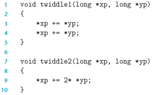
            - 程序2需要3次内存引用（读*xp，读*yp，写*xp）；程序1需要6次引用；程序2是一个更好的优化版本
            - 当*xp和*yp指向同一个地方时，程序2的功能和程序1不一样（程序1增加4倍，程序1增加两倍）
            - 编译器不能确定两个指针是否指向同一个位置，所以编译器需要假设所有的可能，而这限制了编译器的优化策略
- 表示程序的性能
    - 每元素的周期数（Cycles Per Element，CPE）：对于一个程序，每增加一个元素的操作，程序运行时间需要增加多少个周期
    - 例子：考虑两个将n个元素累加的程序
        - psum1：直接累加 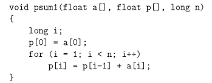
        - psum2：将两个循环合并为1个 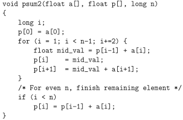
        - psum1和psum2的运行周期图 
            - Circles(psum1) = 368+9.0*n（CPE=9）
            - Circles(psum2) = 368+6.0*n（CPE=6）
- 优化
    - 程序示例（之后优化都是以此为例子）
        - 结构体：一个结构，包含一个数组的首地址，和该数组的长度 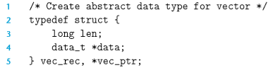
        - 一些基本函数
            - 取值 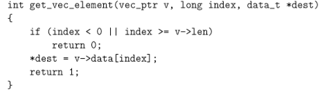
            - 得到数组长度 
        - 程序：使用某种运算，将一个向量中所有元素合并为一个值（累加，累乘）
            - 不同的宏定义：
                - 累加 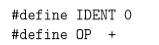
                - 累乘 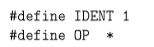
            - 程序 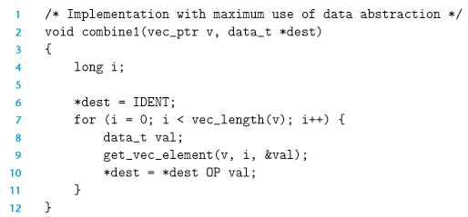
            - 起点：基础的CPE（作为对比，未优化【是直接翻译汇编，-Og应该也是有少量的优化?】的和-O1的） 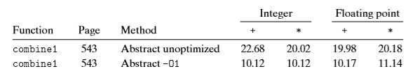
    - 一些基本的优化
        - 消除循环的低效率
            - 优化版本combine2中，将vec_length(v)赋给一个length，作为边界条件（在combine1中，每次循环都需要调用vec_length(v)） 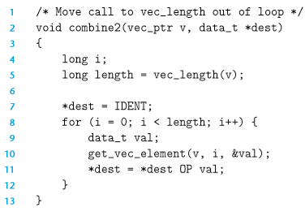
            - 优化结果 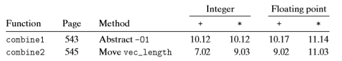
            - 这种优化方法称为代码移动：识别需要执行多次（循环）中结果不变的计算。将该计算移动到不会被多次求值的部分（循环外）
        - 减少过程调用
            - 优化版本combine3：减少对get_element的调用，使用一种数组的方式读出值 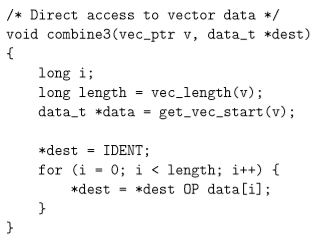
            - 优化结果：由于其他瓶颈的存在，所以CPE没有提升太多。（详细讨论在理解内存性能） 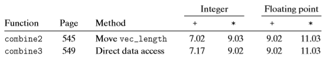
        - 消除不必要的内存引用
            - 对于combine3的汇编代码 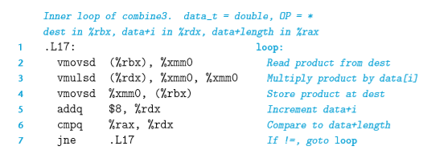
                - 对于：*dest = *dest OP data[i]；即汇编第2、4行，会在循环中对内存反复引用
            - 优化版本combine4：在循环中，将结果存放在寄存器中，不用反复读写内存
                - 汇编版本 
                - 程序版本：这里的局部变量是以寄存器存储的 
            - 优化结果：CPE大幅度下降 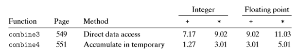
            - 一些问题：
                - 考虑以下调用 
                    - combine3会把 累加结果写进 数组中
                    - combine4不会，它只是结合最初始版本的数组的元素 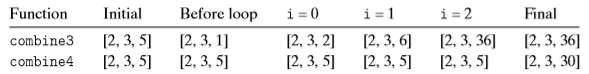
                - 对于编译器而言，它会做更保守的优化（读写内存）；所以需要程序员根据需求做优化
    - 基于处理器建模的一些优化
        - 理解现代处理器
            - 现代处理器架构 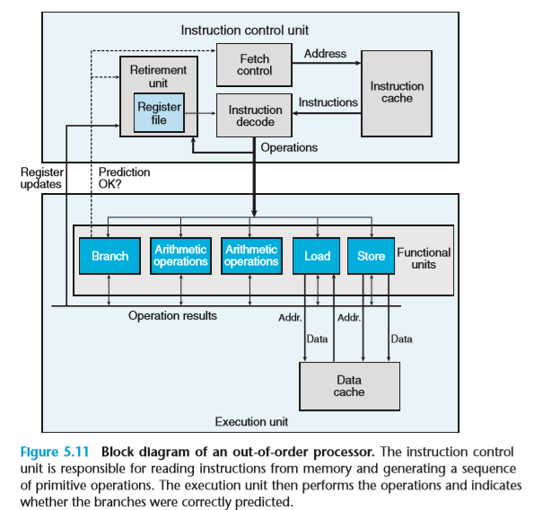
                - ICU
                    - ICU会在执行指令很早之前取指，这样它才有足够时间译码，并将其发送给EU
                    - ICU有一个重要部分是退役单元（Retirement unit）
                        - 寄存器文件（AVX、SSE和整数寄存器）是退役单元的一部分
                        - 指令译码时，关于指令的信息被放入一个队列中
                            - 当指令完成，而且所有引起这条指令的分支也被预测正确，那么该条指令退役，对寄存器的更新就可以执行了
                            - 当分支预测错误，该条指令会被清空，丢弃所有计算出来的结果
                - EU
                    - EU包含一组功能单元
                        - 计算功能：加法、乘法，浮点数
                        - 内存读写：加载、存储
                        - 控制：分支
                    - EU执行单元间数据传送
                        - 当一条更新寄存器r的指令译码时，产生标记t，得到一个指向该操作结果的唯一的标识符
                        - （r,t）被加入到一张表中，该表维护这 寄存器r 和 会更新该寄存器操作的标记t之间的关联
                        - 当以r寄存器作为操作数的指令译码时，发送到执行单元的操作会包含t作为操作数的值
                        - 当某个执行单元完成一个操作时，会生成一个结果（v,t），指明标记为t产生的结果v
                        - 所有等待t为源操作数都能使用v作为源值
            - 功能单元的性能 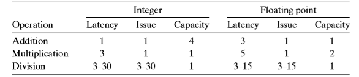
                - 延迟（Latency）：表示完成运算所需要的时间
                    - 加法完成每个运算只需要1个周期
                    - 浮点数完成需要三个周期
                        - 处理指数值
                        - 处理小数值
                        - 将结果进行舍入
                - 发射时间（issue time）：表示两个连续的同类型的运算之间   间隔 需要最小的周期数
                    - issue为1，说明是完全流水线化的，每个周期都能执行一条该运算
                    - 除法的发射时间等于延迟，说明开始一条新除法运算之前，上条除法运算必须完成
                - 容量：表示执行该运算功能单元的数量
                - 最大吞吐量
                    - 对于每个功能单元而言，吞吐量即为1/I，即每个周期可以执行1/I命令（完全流水线化的为1）
                    - 对于C个功能单元而言，其吞吐量C/I
                - 吞吐量延迟（即每个操作花费的时间，即吞吐量的倒数）和延迟决定了CPE的两种下限（处理器的操作模型      提高并行性） 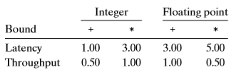
                    - 整数加法为0.5的原因为处理器只有两个加载单元，所以每周期只能执行两个加法
            - 处理器操作模型
                - combine4的CPE（CPE和latency相近，下面的数据流图分析表明这不是个巧合） 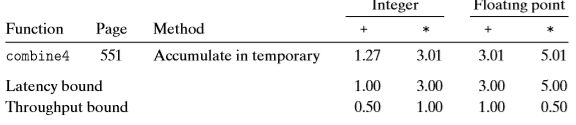
                - 从机器代码到数据流图（以COMBINE4为例子）
                    - 汇编代码 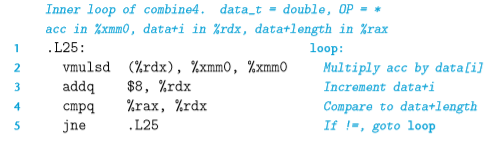
                    - 寄存器读写流程 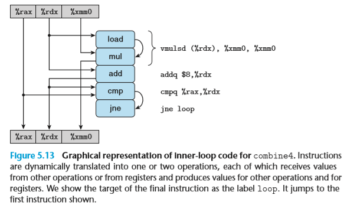
                        - 顶部表明一开始的寄存器的值
                        - 底部表示最后寄存器的值
                        - 弧线表示数据传递（执行单元间的？）：load从内存读出结果传入mul，cmp会更新条件码，jne会测试条件码
                        - 四类寄存器
                            - 只读
                            - 只写
                            - 局部：在循环内部被修改和使用
                            - 循环：寄存器即作为源值，又作为目的，被反复读写
                    - 数据流图：循环寄存器之间的操作链决定了限制性能的数据相关（假设条件选择分支不影响，因为只在最后一次会预测错误，其它都会预测正确） 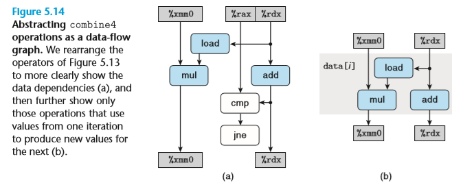
                    - combine4的数据流图和关键路径 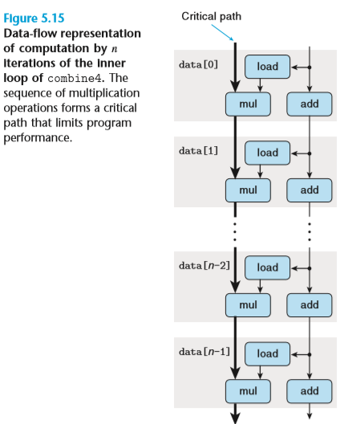
                        - 关键路径决定了CPE的下限（还可能有其它因素限制）
                        - 关键路径长为L*n，L即为关键路径全部操作（合并运算）的延迟
                - 例子：求多项式结果（这个例子体现了流水线的重要性，可参考提高并行性）
                    - 方法1： 
                        - 代码：CPE为5 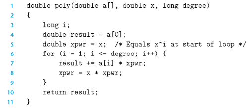
                    - 方法2： 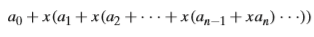
                        - 代码：CPE为8 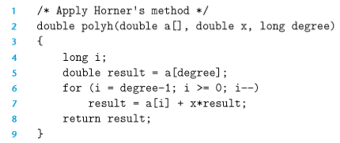
                    - 为什么方法2的计算更少，CPE却更高
        - 循环展开
        - 提高并行性
    - 小结
- 一些限制因素
- 理解内存性能
- 性能提高技术（小结）
- 优化基本策略：确定和消除性能瓶颈
