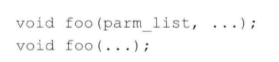
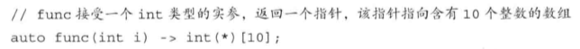
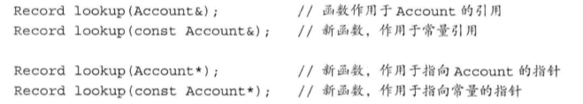

- 参数
    - 当实参初始化形参会忽略顶层const（const好麻烦）
    - 参数的引用参数尽量使用常量引用
        - 可以标明不允许修改
        - 可以使用常量实参初始化
    - 可变形参
        - 传入initializer_list类型的容器（如果类型不同，可用可变参数模板） 
        - 省略符（略） 
- 值的返回
    - 使用返回值去初始化调用点的一个临时变量
    - 不要返回局部对象的引用或指针
    - 尾置返回类型S 
- 函数重载
    - 7顶层const不做区分，底层const做区分 
- 默认实参
    - 局部变量不能作为默认实参（局部变量可能销毁）
- 内联函数
    - 内联函数是编译阶段替换，编译器做检查
    - 宏是预处理替换，不做检查
