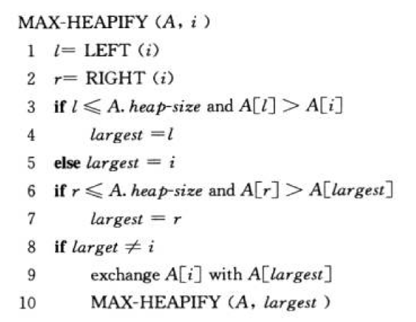
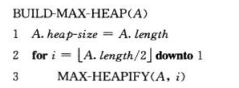
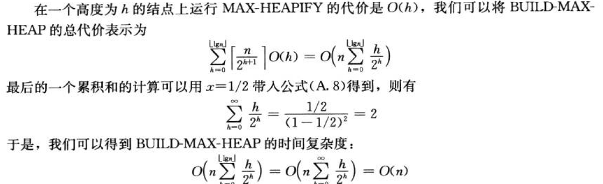
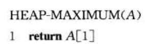
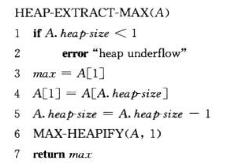
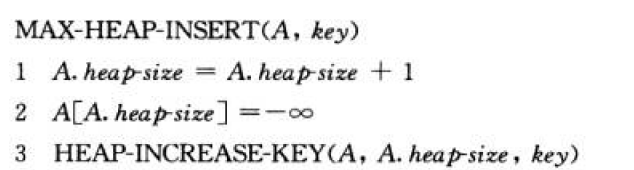

- 堆的性质介绍
    - 完全二叉树：通过数组形式保存
        - 对于节点i，存储序号从1开始（1、2、3......）
            - 父节点Parent：i/2 下界
            - 左孩子Left：2*i
            - 右孩子Right：2*i+1
        - 性质
            - 最大堆：A[Parent( i )] >= A[ i ]  （一般应用与排序？？）
            - 最小堆：A[Parent( i )] <= A[ i ]  （一般应用于构造优先队列？？）
        - 常用接口函数
            - MAX-HEAPIFI：见维护堆的性质
            - BUILD-MAX-HEAP：
            - HEAP-SORT：对一个堆进行排序
            - MAX-HEAP-INSERT，HEAP-EXTRACT-MAX，HEAP-INCREASE-KEY，HEAP-MAXIMUM
- 维护堆的性质：MAX-HEAPIFI
    - MAX-HEAPIFI:对于节点 i ，其左子树和右子树均为最大堆，逐级下降节点 i 以维持最大堆的性质
        - 输入：数组A，索引i
        - 过程：
            - 找到，A[ i ]，A[ LEFT[ i ] ]，A[ RIGHT[ i ] ]中最大的值，并保存索引于largest中
            - 如果 i == largest，程序结束
            - 否则，swap( A[ i ], A[largest] )
            - 将largest作为i，递归调用上述过程
            - 伪代码：主要时间开销为，调整 i 与largest值，这和树的高度成正比，故时间复杂度O（h） 
- 建堆：BUILD-MAX-HEAP
    - 方法：自低向上维护最大堆的性质
        - 初始：子节点符合最大堆的性质
        - 保持：当 i 的左右子树保持最大的堆的性质，可以通过MAX-HEAPIFI，使得加入节点 i 的子树也保持该性质
        - 终止：当 i 为根节点的时候终止
    - 伪代码 
    - 时间复杂度O（n） 
- 堆排序：HEAP-SORT
    - 方法
        - 取出根节点（最大值），即将根节点末与树的最后的叶子节点交换
        - 维持最大堆的性质
        - 递归调用上述过程
    - 伪代码 
    - 算法复杂度O( nlgn )：每次维护堆的性质都要O( h ) <= O( lgn )，需要维护n次
- 个人附：算法导论，没有介绍堆的插入操作这里个人借用后文优先队列的插入
    - 过程
        - 将插入的数放入队列末尾，索引为i，在尾部新建的节点，A[ Heap.size ] = x
        - 将节点i 与 PARENT( i )值比较
            - 当A[ i ] <= A[ PARENT( i ) ]，结束
            - 当A[ i ] > A[ PARENT( i ) ]，swap( A[ i ] , A[ PARENT( i ) ] )，并把i = PARENT( i )
        - 递归调用上述过程，直到 i 为根结点
- 优先队列：优先队列是堆的一个应用，可以用在作业调度中
    - 介绍
        - 维护一个（key-value）的集合S，其中key作为最大堆排序比较的依据，value作为索引
        - 常用操作
            - MAXIMUM( S )：返回 S 中key最大的元素
                - 伪代码：返回堆顶 
            - EXTRACT-MAX( S )：返回S中可以最大的元素，并将其删除
                - 伪代码：返回堆顶，把堆顶和末尾叶子节点交换，并维护堆的性质（排序操作的套路） 
            - INCREASE-KEY( S, x, key )：修改S中x的key( 即S[ x ] )为传入的参数 新key，附x[ i ] < key 
                - 伪代码：修改索引x的值为key，并递归的和父母比较，交换（参见插入操作） 
            - MAX-HEAP-insert( A, key )：插入key到集合S中
                - 伪代码：在尾部新建一个索引为负无穷的节点：A[ size ] = -∞，并调用INCREASE-KEY将索引修改为key 
