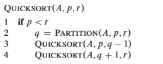
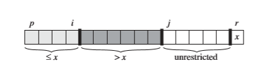
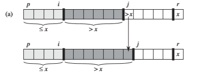
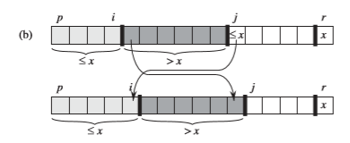
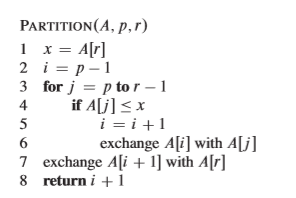
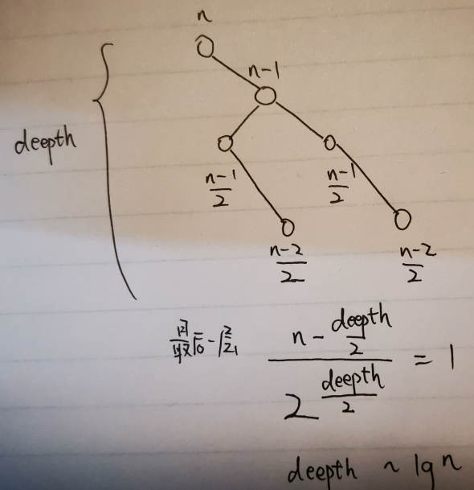

- 算法描述
    - 分治思想
        - 分解：将数组A[ p , r ]划分为A[ p, q -1]，A[ q , r ]
            - A[ p, q -1] < A[ q ]
            - A[ q+1 , r ] > A[ q ]
        - 解决
            - 递归的调用分治算法
        - 合并
            - 子数组原址排序，直接就是有序的
    - 算法步骤
        - 主体（递归调用分治的部分） 
        - **划分：循环不变式**
            - 在划分时将数组划分为四个区域，选取 A[ r ]作为基准 
                - [ p , i ]：小于基准x
                - [ i , j ]：大于基准x
                - [ j , r ]：未确定区域
                - [ r ]：基准x
            - 在j向前扩张的时候，有两种可能（保证性质不变）
                - A[ j ] > x:直接扩张 
                - A[ j ] < x:将A[ j ]与A[ i + 1]交换，i++ 
            - 终止条件，j == r
            - 代码 
- 性能分析
    - 最坏
        - 每次都产生最坏划分：对于n个元素的数组，划分为 0 元素和 n-1元素的
        - 对于最坏划分
            - 划分耗时O( n )
            - 故对于元素为n的耗时：T( n ) = T( n-1 ) + O( n )
            - 递归求和得到 耗时：T( n ) = O( n^2 )
        - 附：如何划分选取最后一个元素，那么对于已排序的数组，耗时都是O( n^2 )
    - 最好
        - 每次划分都是均匀的：对于n个元素数组，都划分为 n/2 元素
        - 对于均匀划分
            - 划分耗时O( n )
            - 故对于元素为n的耗时：T( n ) = T( n/2 ) + O( n )
            - 解得：T( n ) = O( nlgn )   
            - 注：这里得出直观想法是在分治那一节中通过画出分治树，求和得到结果，一共有lgn层，每一层的算法复杂度为O(n)
    - 常数比例划分
        - 在每次划分中，只要划分比例是一个常数：a：1
        - 那么总耗时T( n ) = T( n/a ) + T( n*(a-1/a) ) + O( n )
        - 用画出分治树的方式可得：T( n )  = O( nlgn )
    - 平均情况的直觉分析
        - 一般来说，好坏是交替出现的，不可能全是好的，也不可能全是坏的
        - 分析好坏交替的情况
            - 对于分治排序而言，影响其算法复杂度的主要是其分治树的深度
                - 当最坏是，深度为n
                - 当划分比例常比例时，深度为lgn
                - 当划分比例最好和最坏交替进行;
                    - 经过分析，深度还是lgn级别。故算法复杂度还是O( nlgn ) 
- 期望运行时间：太难，未看
