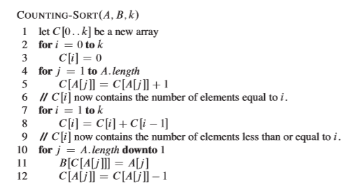

- 决策树模型
	- 比较排序：数字排序次序依赖于对数字的比较
	- 可以抽象成一个决策树
	- 决策树的最坏深度 nlgn
- 计数排序
	- 假定输入的数组在 0-k 之间
	- 思想：对于某个数x，确定数组中小于x数的个数（计数），即可以得到 x 的排名次序
	- 实现
		- 利用一个A[0 ... k]的数组，来标记 含有 x （既是索引，也是排序数组中的值）的个数
		- 遍历整个数组，累加 < x索引中的数（即确定数组中小于x数的个数）
		- 排序到原数组
	- 代码 
- 基数排序，*此处参见p110，书上说的较好
	- 卡片排序
		- 一种卡片，有80列（80位），每一列可以选择12位中打孔（12进制）
		- 根基穿孔的位置把卡片分到12个容器中
		- 按照每一列来对卡片进行分发到容器中，以此来进行排序
	- 基数排序是根据有效位分别排序
		- 例如按照进制数，从高位到低位，依次排序
		- 对于日期排序，按照年，月，日依次排序
		- 有效位次序
			- 最高有效位排序
				-
			- 最低有效位排序
- 桶排序