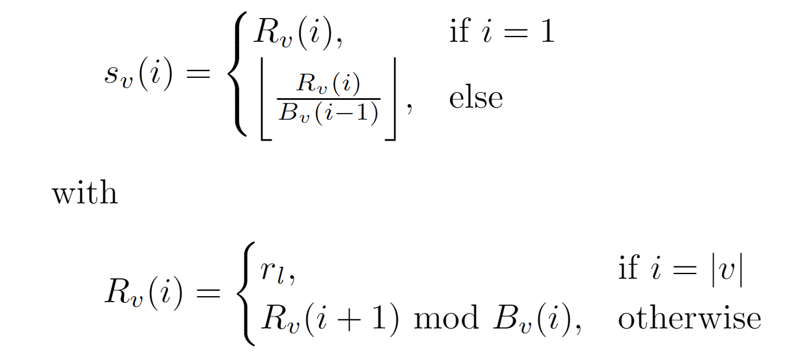
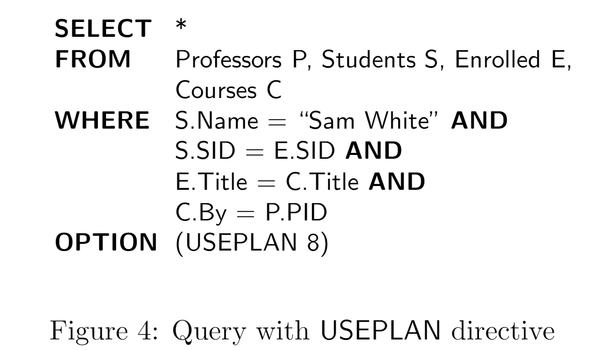

- 问题
  collapsed:: true
	- 测试优化器的核心是在计划空间中均匀采样
- 核心
  collapsed:: true
	- Ranking
		- ranking：将一个计划映射到一个整数
		- unranking：从整数构建一个计划
	- Memo 中已经包含所有的logical plan
		- 如果我们保存所有的physical plan，就可以得到了完整的搜索空间（也许可以基于概率，或者基于cost分布保存）
		- 我们可以建立一个映射来映射计划
- 算法
  collapsed:: true
	- Counting：计算所有的空间
		- 对于一个expr，以其为根节点的所有可能的组合为其所有child group计划数之乘，记为$N$
		- 对于一个group，其所有可能的组合为其所有expr的计划数之和，记为$B$
		-
	- Ranking
		- 假设总的计划数为$N(v)$
		- Ranking
			- 将计划按照顺序编号$0...N(v)$
		- Unranking
			- 对于一个编号r，计算流程如下
				- 从根group开始，遍历每一个 v，计算local rank
				  $$r_l = r -\sum_{i} N(v_i)$$
				- 对选定的expr的k个孩子，我们计算第i个孩子的rank为$s_v(i)$
				  {:height 204, :width 431}
					- 本质上是一个编码，每个rank的权重是其孩子group数量
					- 使得根据sub_rank算出来的rank为r_l
				- 计算孩子group对应的plan
- Application
	- Verifying Query Processors
		- 根据上述算法，我们可以使用一个query，执行不同的plan来提高测试率
		- SQLServer的语法
		   {:height 222, :width 370}
		- 优点
			- 简单，只需要几条语句
			- 结果方便验证，因为都一样
	- Cost Distributions：待研究
	-