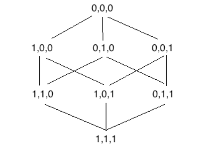
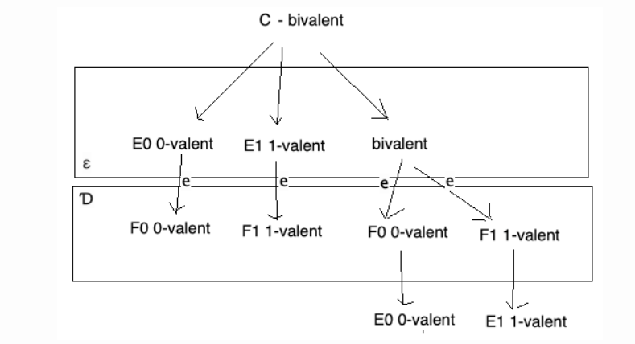
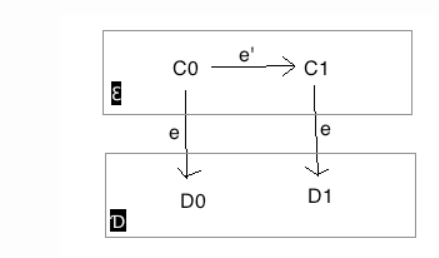
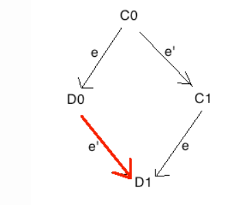
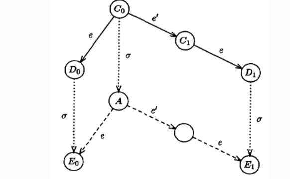

- 内容
    - 在一个异步的共识模型中，只要有一个机器crash，那么共识便无法达成
- 证明
    - 思路：数学归纳法
        - 存在一个初始混沌状态S（即没有达成共识）
        - 一个混沌状态转移的下一个状态仍然可能是混沌状态
    - 证明
        - 建模
            - 一个系统有n个进程
            - 每个进程有两个状态：0 和 1，系统也可能存在两个deterministic状态 0 和 1
            - 异步消息是通过全局message buffer 传输
            - configuration
                - 整个系统的状态
                - 包含所有进程的状态和message buffer的内容
                - 可以是deterministic 或者 非 deterministic
                - 举例：假设三个进程：{000}，{001}，{010}，{100}...
        - 证明 1：存在一个初始configuration使得系统状态混沌
            - 反证法
            - 假设所有初始系统状态都是deterministic
            - 那么所有deterministic 的系统状态都可以组成一个图
                - 节点是所有的deterministic状态
                - 状态之间若只有一个进程状态p不同，那么它们相邻，即有一条边 
            - 那么肯定存在一个相邻的两个系统状态，一个系统状态是0，一个系统状态是1
                - 比如{001}是0，{011}是1
            - 当这两个系统状态中进程状态不同的那个进程崩溃，那么这两个状态的configuration是一样的，最终决定的系统的状态也是一样的
            - 这显然8行
        - **证明2：一个混沌状态的下一个状态也有可能是混沌状态** 
            - 假设一个存在混沌的系统状态，其configuration 是C 
                - **ε是C所有没有接收e事件的状态？？？**
                - D是ε接收了e的事件的状态
            - 那么在ε中，我们找到两个相邻的configuration，使得接受e后 
            - **case1：**如果e’和e作用于不同的进程，那么代表D0通过e'也能到达D1 
            - **case2:****当不同，那么** 
