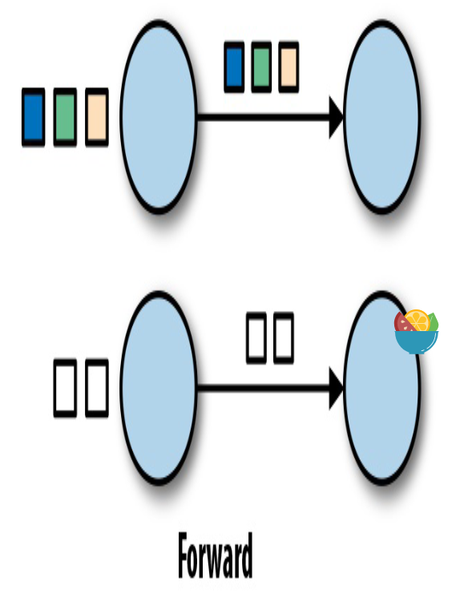
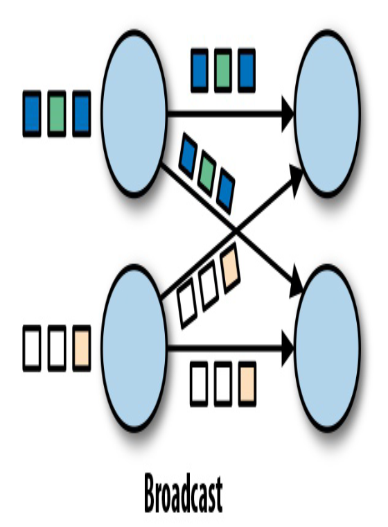
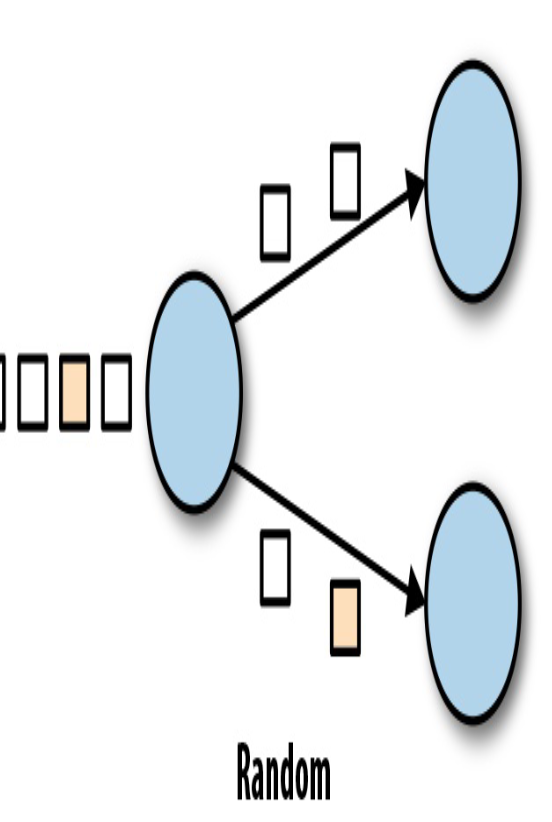
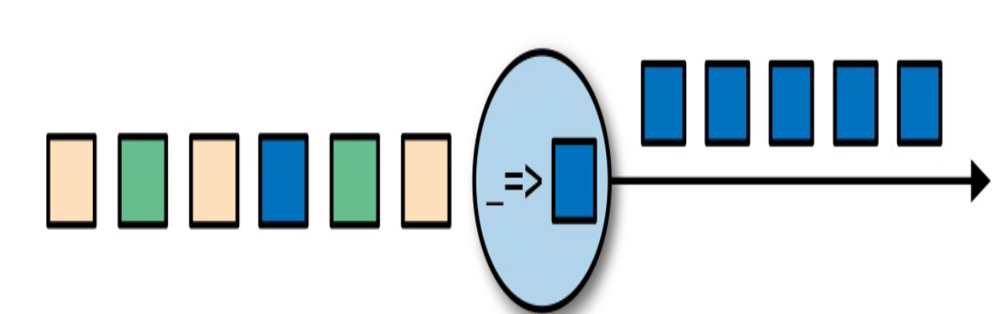
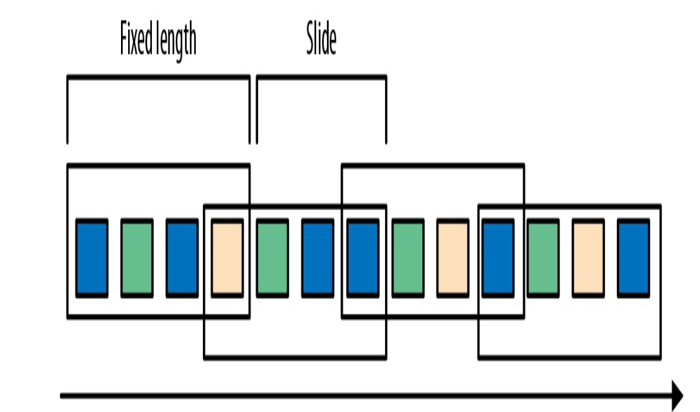
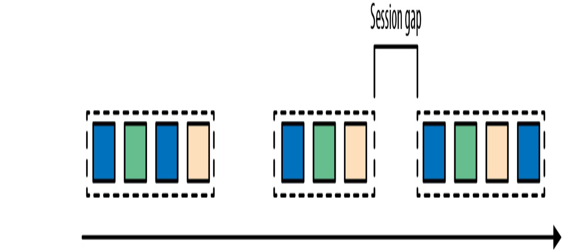
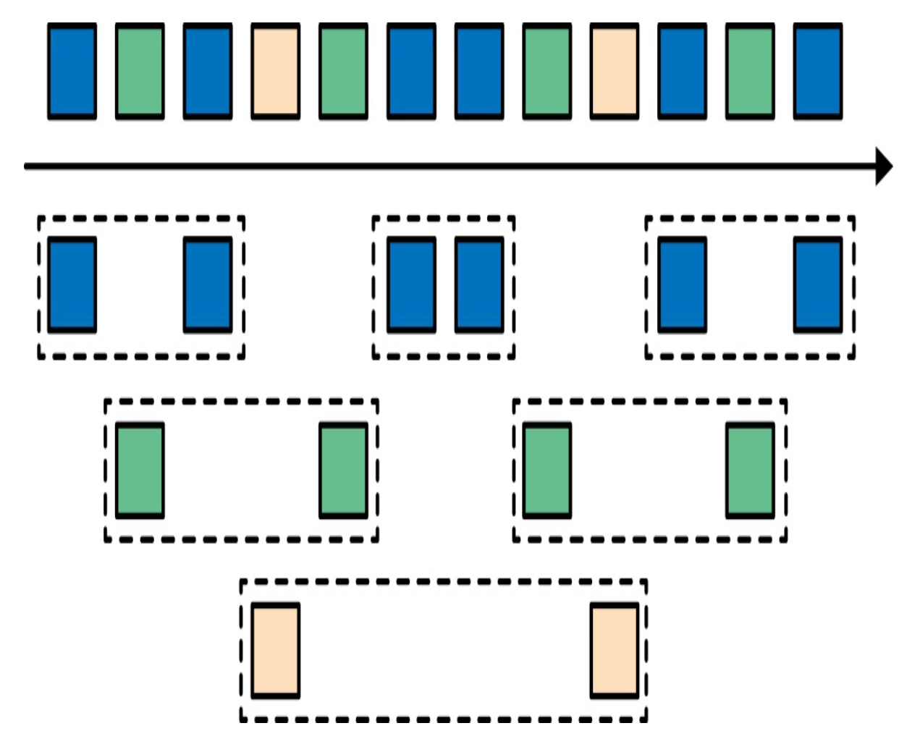

- Dataflow Programming
    - dataflow: 有向图
        - 分布式的：一种sharding计算的有向图；mapreduce
    - 并行
        - 数据并行：partition数据给不同的任务，针对大量数据
            - 每个计算节点分别处理一部分数据，完成整个任务
        - 任务并行：每个任务由并行的计算组成，需要合理的组织计算步骤
            - 针对全部数据，并行的计算任务的不同部分
    - 数据交换策略：如何将数据分配给任务节点
        - Forward 
        - Broadcast 
        - key-based 
        - Random：uniformly distributed 
- Processing Streams in Parallel
    - basic concept
        - latency
            - time interval for processing a event
            - average, max, percentile(long tail，长尾效应)
        - throughput
            - capacity: how many events it can process per time unit
            - rate of date > capacity , buffer will bomb
- Data operations
    - ingestion egress
        - ingestion: source
        - egress: sinks
    - transformation 
    - rolling aggregation
        - max/min/sum ......
        - stateful
    - windows operation
        - like streaming join ir holistic aggregate such as median
        - bucket: collect some finite event sets
            - base on properties
            - base on time
        - window policy
            - tumbling window: no overlap, can base on time 
            - sliding window 
            - session window
                - some events are not unform in time
                - Session windows group events in sessions based on a session gap value that defines the time of inactivity to consider asession closed 
            - parallel window: different type of event s stream. a window process a type of stream 
    - event delay and out of order?????
- time
    - Process time: time when arrive at server
    - Event time: event actually happend
        - decouple the net latency
        - can use event time timestamp to deal with in case of out of order 
    - watermarks
        - how do we decide when to trigger an event-time window
            - how long to wait for next event
            - how long the data will be delayed
        - 规定一个watermark 时间，表示在此时间前，所有事件都被收到
        - 如和确定watermark
            - 太短，会导致有很多事件超出watermark
            - 太长，会加长延迟
        - e如何处理watermark后的事件
            - 和对应application有关
            - ignore/ log/ recompute correct results
        - 
- State and Consistency Models
    - challenges
        - Statet management: cocurrent updates
        - State partitioning: parallerlization by partitioning
        - State recovery
    - Task Failures
        - Task process steps:
            - receive the event, and compute (will event get lost)
            - update internal state (will the state will be chaneged again?)
            - produce an output (profuce duplicated output)
        - result guarantees
            - at most once: some events lost can be accepted
            - at least once: prevent for losting events: some events processed more than onece 
            - exactly one once: strictest
            - end to end exactly once: at the global flow in steaming processing
