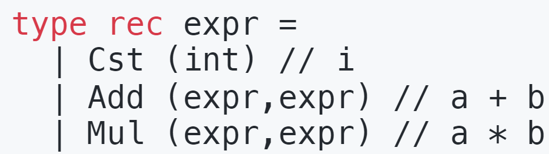
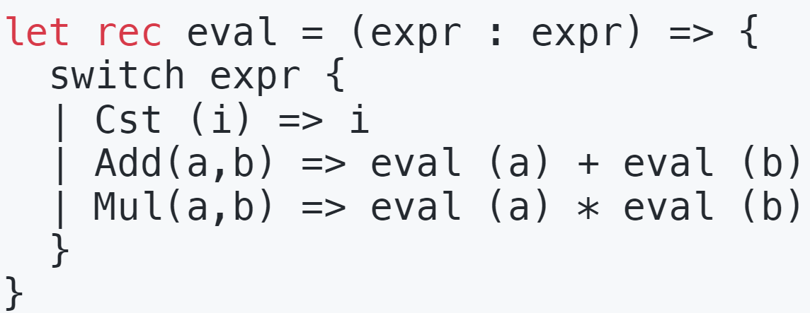
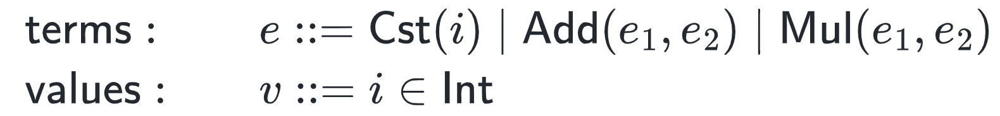
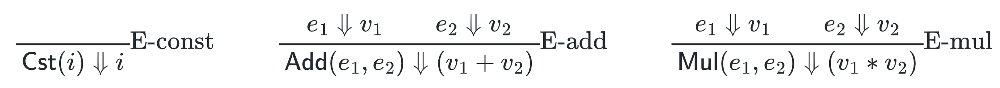

- 从设计一个语言开始，表达式evaluation 语言
	- Tiny Language 0：我们使用Add来构建抽象语法树，避免具体的语义
	  {:height 147, :width 499}
		- 如果我们想要解释它的话，可以使用模式匹配来递归执行
		  {:height 135, :width 383}
		- 上述的执行语义可以转为数学符号描述，formalization
			- 定义基本的term：符号，和值范围values
			  {:height 68, :width 523}
			- 对于上述的三条执行规则，我们可以用数学语言描述
			  
		- 上述的执行过程依赖于一个语言栈，即我们需要保存临时变量
	- Lowering to a stack machine and interpret
	-
		-
		-
		-
		-