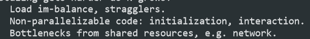
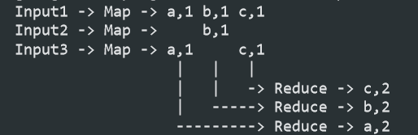
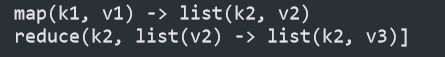

- 分布式 主要 是对三种资源的 抽象
	- Storage
	- Communication
	- Computation
- 分布式系统概述
	- Performance
		- 目标：可以很方便的扩展（当需要扩容的时候，只需要增加一台机器）
		- 当扩展到N台的时候 的 问题 
			- 负载均衡
			- 一些无法并行的任务
			- 一些共享资源的瓶颈（网络通信，存储）
	- 容错性
		- wanted 
			- Availiability：当犯错的时候 整个系统依然 可以正常运行
			- Durability：当错误被修复，机器依旧可以执行任务
		- Big idea，基础思想：replicated servers
			- 当server crashes，client 可以选择其它的server
	- 一致性
		- 每一个client 和 server 都有一个数据的拷贝
		- 当client 或者 server crash 后，如何保证新的clien 和 新的 server和原来的 **数据**的一致
- 例子：MapReduce
	- 概述
		- 程序员定义Map 和 Reduce 函数（其余的交给框架做）
		- MR框架完成任务分配：由分布式机器对 对 大数据 进行处理，Map 和 Reduce任务
	- 简单的MR流程 
		- Map：输入数据集合k1，v1， 得到键值对列表
		- Reduce：合并相同 key 的键值对 
	- 一些painful details ？？？
		- starting s/w on servers ？
		- tracking which tasks are done ？
		- data movement：数据从Map worker 向 Reduce Worker传输的
		- recovering from failures：参见一致性