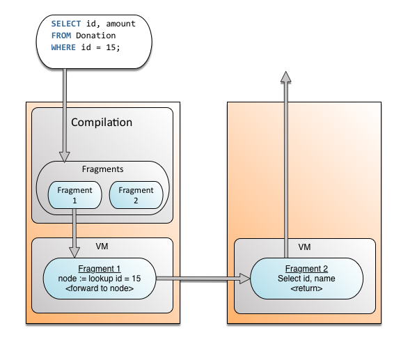
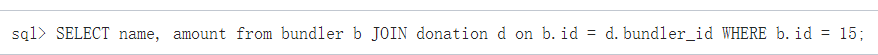
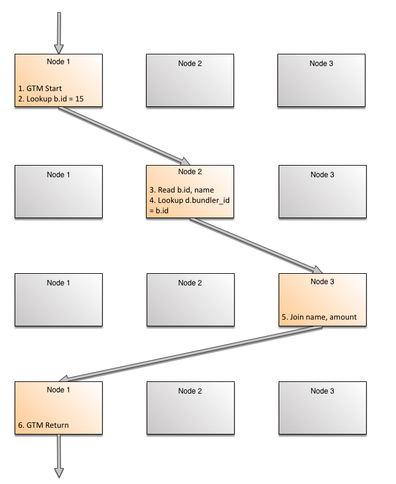
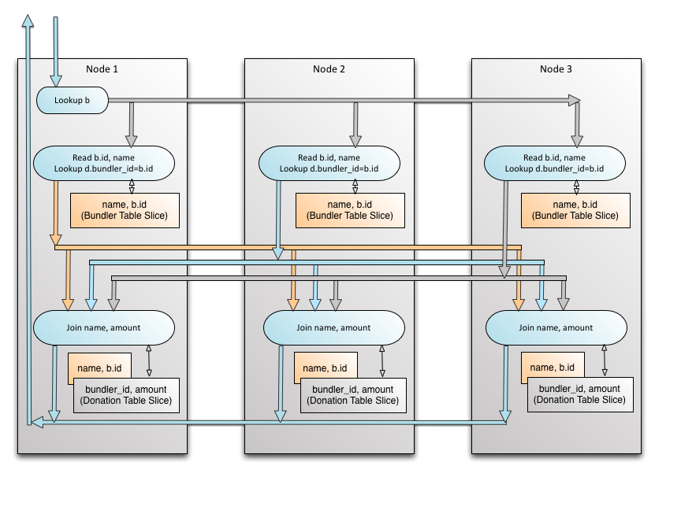
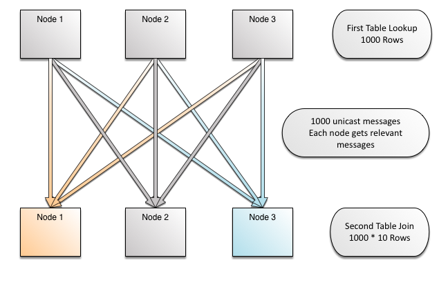
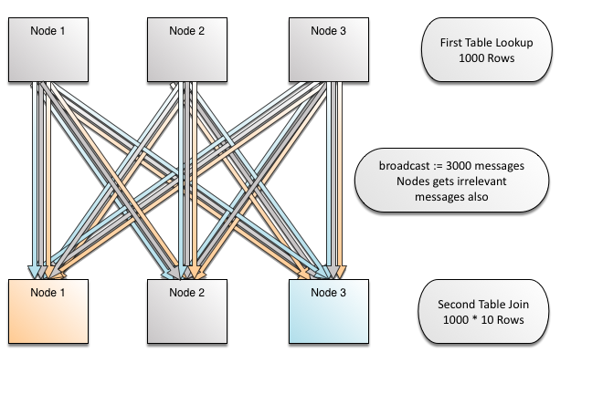
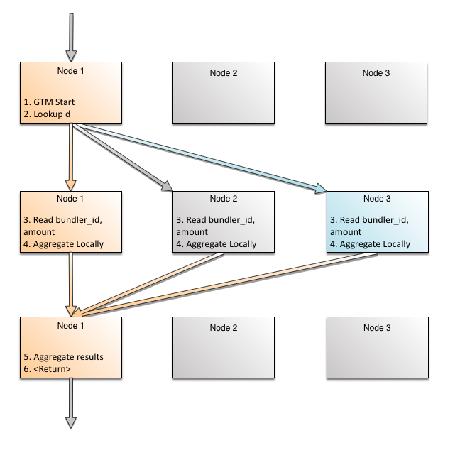

- 文档链接[<a  href="https://docs.clustrix.com/xpand/latest/distributed-database-architecture]">https://docs.clustrix.com/xpand/latest/distributed-database-architecture]</a>
- Evaluation model
    - Query 分成多个fragment
        - 查询query 分成两步 
            - 查询数据所在节点
            - 在对应节点读取数据
        - Scaling Join
            - 对于Join语句，其执行步骤如下 (`SELECT name, amount from bundler b JOIN donation d on b.id = d.bundler_id WHERE b.id = 15;`) 
                - 从GTM节点（Global Transaction Model，唯一的主节点）开始
                - 找出满足条件（b.id = 15）的节点，并跳去该节点
                - 读取该节点的数据
                - 找出满足条件（d.id = 15）的节点并跳去该节点
                - 对上述数据Join
                - 从GTM节点返回
                - 如上步骤示意图如下 
            - 对于另一个语句（无b.id = 15），其并发执行步骤如下（`SELECT name, amount from bundler b JOIN donation d on b.id = d.bundler_id;`）
                - 示意图 
            - MPP中的Join（面向多个col）
                - 如果只是针对单个col的条件且针对其hash分布，那么每个节点上的数据都是统一的 
                - 如果非对应hash的col，或者遇到合取谓词，则需要广播全表 
        - Scaling Agg
            - 两阶段聚合 
