- 初始化
    - 初始化m_slice_dop:calc_default_dop_for_pq_planning() 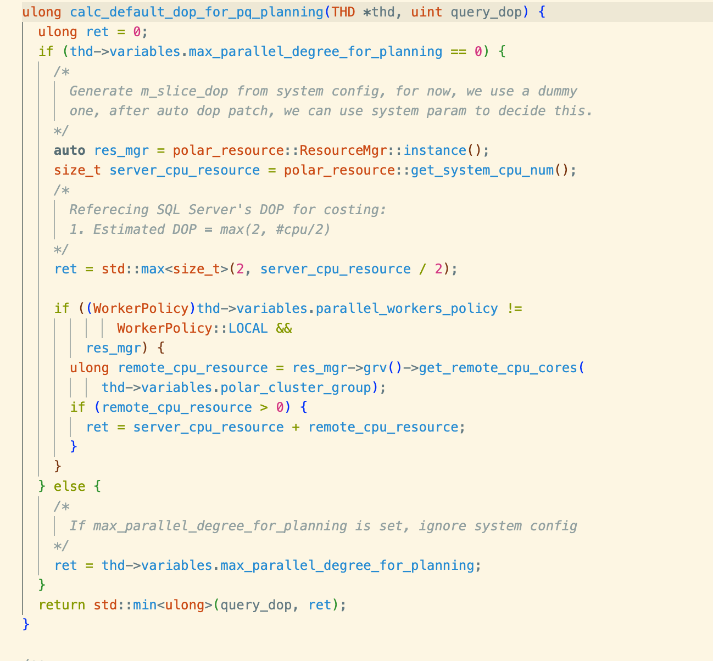
    - 
- CheckPQApplicable：验证可以下推到算子，通过标记实现
    - PreCheck：检查是否可以进行并行化
        - Coordinatoe 必须被启动（是单独的一个进程
    - CheckForceTwoSliceMode：检查是否可以多阶段并行化 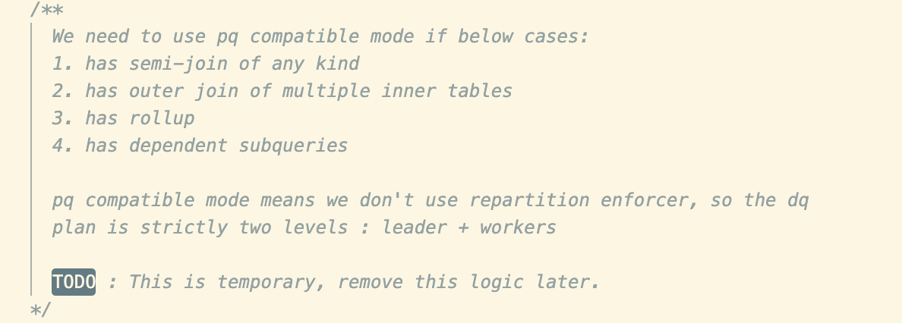
    - 。。。。
- Extract Group：没有处理子查询
    - Group
        - 相邻Group，父母孩子兄弟节点 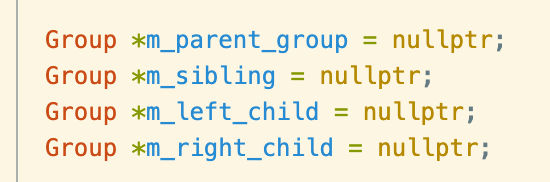
        - expr 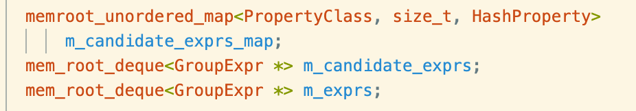
    - CreateGroup
        - ？？？ 问题
            - GroupExpr = Operator + possible enforcer
        - Operator（一个物理operator）
            - 每个operator包含了执行信息
            - ACCESS：Base table/derived table/Materialization
            - JOIN：
            - GROUP BY：
            - ORDER BY：2-phase
            - LIMIT：2-phase
        - TableGroup
            - 针对每个QEP_TAB
                - 确定dop，在构建Planner的时候初始化 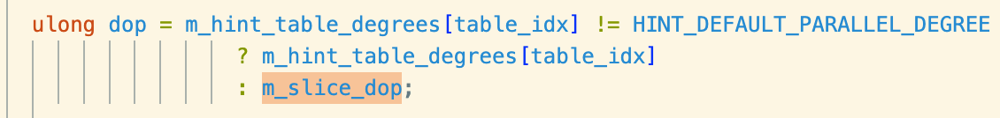
                - 加入access_ope类型 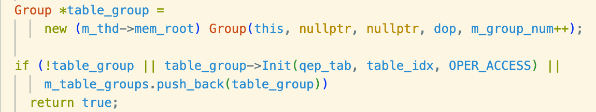
                - Init
                    - 
            - 初始化一些节点 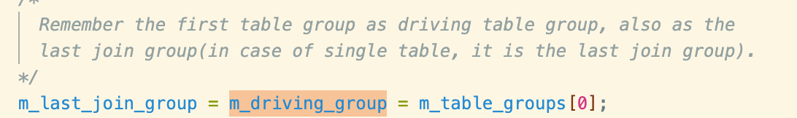
                - m_last_join_group：上一个join group，也就是左深子树的最左边的输入
                - m_driving_group：第一个join的左输入
        - JoinGroup
            - 构建一个left-deep tree，就是构造一个root，然后将root作为下一次的左输入
                - root初始化是在构建table group的时候
                - 递归
                    - 左孩子是上一次的roo 
                    - 右孩子是对应的table 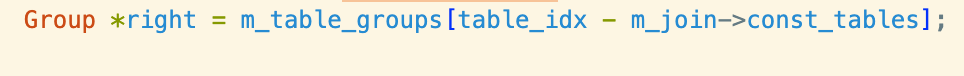
                    - 构建节点 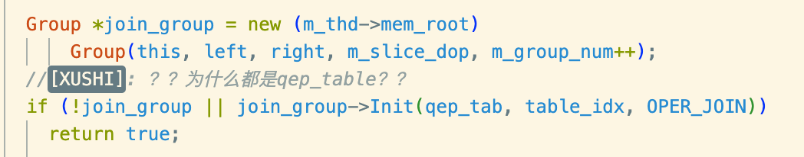
            - dop是m_slice_dop
        - ComplexGroup
            - group by：dop是m_slice_dop
                - 构建group
                - 将root 作为左输入，右输入为空
                - Group中包含的QEP_TAB为恐慌
                - 如果有having，记录一下在having之前的group 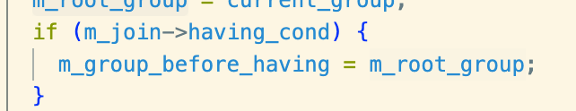
            - windows function：dop是m_slice_dop
                - 针对每个windows func，初始化一个group，注意dop还是m_slice_dop
                    - 其左输入为root，右输入为空
                    - Init为空？
                - 记录下第一个windows，有什么用
            -  distinct：dop是m_slice_dop
                - 创建一个distinct group 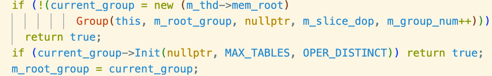
            - 如果没group，且有having，还是要记录下，having必须是最后执行的且before order？感觉没区别
            - Order && Limit
                - 同理，创建order by group / Limit
                - 输入是root
    - SetupGroupRequirements：构建每个group的required property
        - 
    - ConstructRepartitionOptions：枚举所有可能的repart key（自低向上）
        - 对于每一层节点构建兄弟的repartition options
            - Join
                - Order Property Requirement
                - Distribution Property Requirement
            - Group By
            - windows function
- Enumerate：枚举可能的执行计划，如何定义规则，如何匹配规则，如何转换
    - 总结
        - 对每个operator，构建出一个group
        - 针对不同的输入输出，构建出多个group expr
        - 计算cost
    - 自低向上的枚举 
    - 规则的匹配和执行
        - 问题
            - 为什么总是要插入一个file sort
                - 为什么Join operator只有一个qep_tab
        - 一些基本概念
            - DIST定义 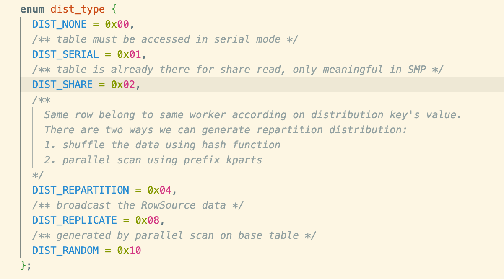
                - DIST_SERIAL：表示该源必须串行读取
                - DIST_SHARE：？？？？
                - DIST_REPARDITION：hash分片
                - DIST_REPLICATE：广播给所有节点
                - DIST_RANDOM：？？？
        - Rule
            - Pattern
                - Input Distribution
                - operation
                - [addition cond]
                - Output Action
            - 匹配
                - Precondition
                    - 只是匹配本节点的类型
                    - 做兼容性检查
                        - 。。。。。。。。。。。
                - CreateNewExpr：创建一个新的group expr，继承当前group的父子兄弟
            - Apply
                - 计算dop
                - 在不同的规则中，将Enforcer加入各种算子（为什么每个都要加一个FileSort）
                    - AddBaseFileSort
                    - AddRepartitionEnforcer
                        - 生成Repartition的desc，GenerateRepartOption
                            - 为什么只检查一个desc？？
                            - 为什么对于Join的，需要++item_idx？？
                        - 
                - 判断是否需要递归的处理语句
                    - 如果结束返回APPLY_DONE：**条件**
                    - 否则APPLY_CONT
                - 每个group expr包括operator+数个enforcer（多个enforcer可能会形成一个链表，在m_prev中保存 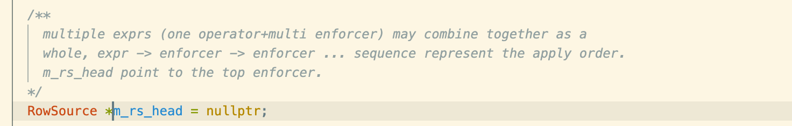
                    - 其中链表由m_prev,m_next管理
                    - 根据 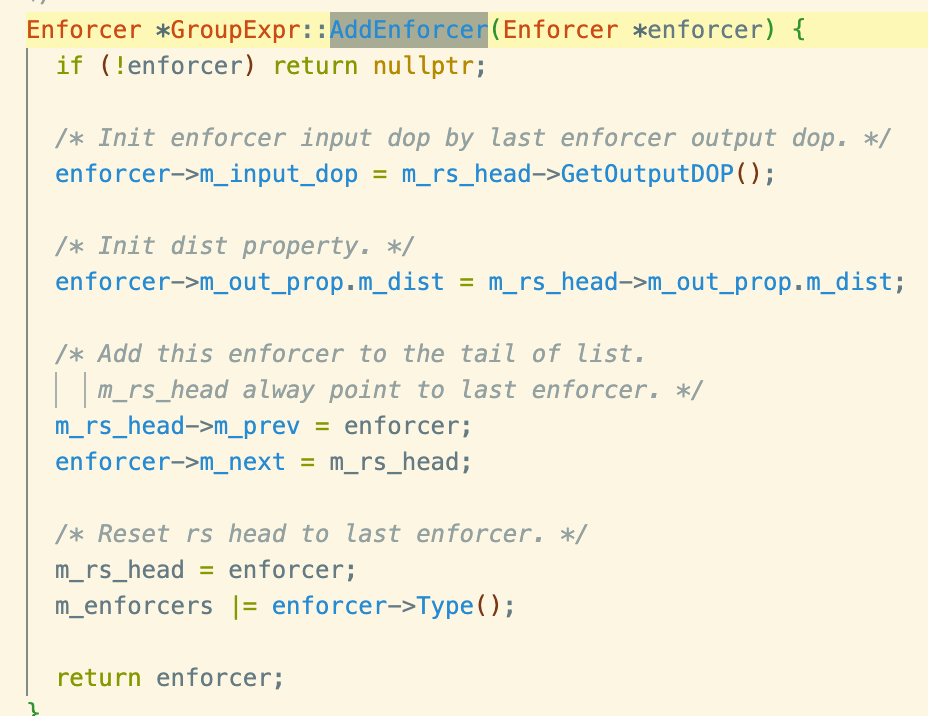
                        - 顺序是enforcer->enforcer->enforcer->expr（注释错误）
            - 一些规则
    - 枚举：Enumerate
        - 匹配规则且应用
            - 针对每一个规则
                - 匹配且APPLY
                - 计算新expr的cost
                - 更新候选集 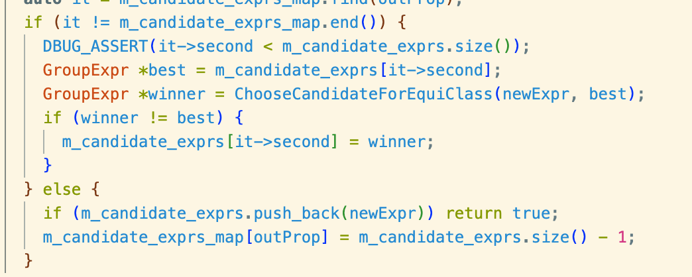
                    - 选择最佳的那个
                        - 1考虑hints first（什么是hints 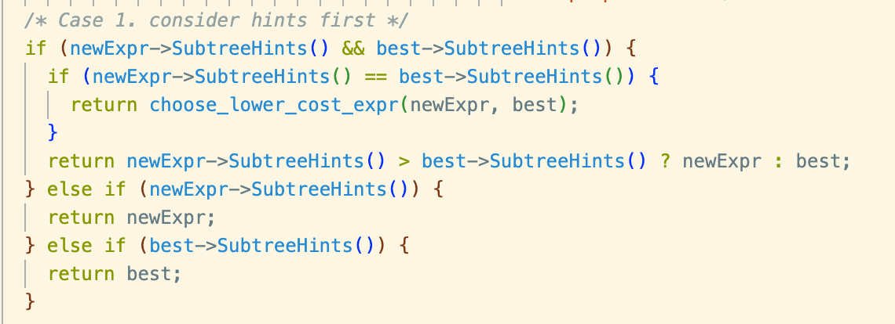
                        - 。。。。。。。
        - 枚举不同的节点
            - 枚举 OPER_ACCESS
                - 针对普通table
                - 针对drving table（子查询） 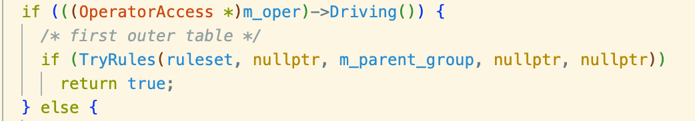
            - 枚举 OPER_JOIN
            - 枚举 Complex group
- ChooseBestPQPlan：选出最佳的执行计划
- SplitSubPlans：切分SubPlan，其核心是slice group
    - AnalyzeGroupExpr：自下而上分析每个节点（包括enforcer和operator）
        - 遇到exchange算子，就进行切分（GATHER，REPLICATE，REPARTITION）
            - 如果是expr内部的enforcer，则split in expr
            - 如果是读完了整个expr，则split over expr（标记为到了链表的头部）
    - SplitSubPlan：根据结果切分plan
        - 如果不切分
            - 对于右孩子（无兄弟节点
                - 递归的处理父节点 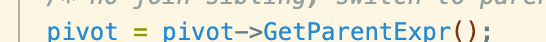
            - 对于左孩子
                - 将兄弟节点切为新的slice 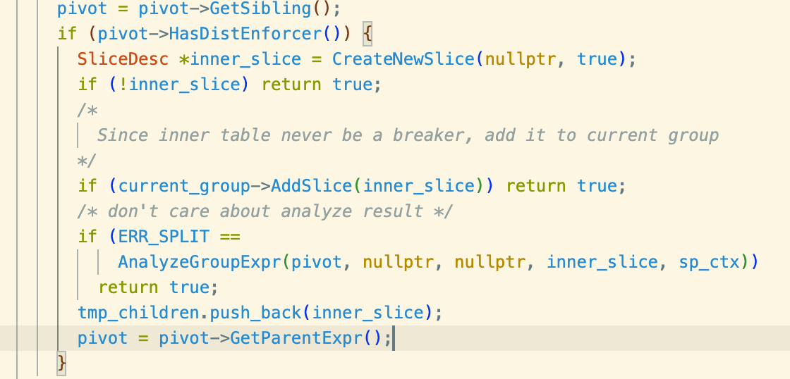
                    - 只有兄弟节点有DistEnforcer，才切出新的slice？为什么
        - 如果切分
            - 切出一个新的slice
            - 递归到下一个节点（兄弟或父亲
                - 如果下一个节点是个pipeline breaker，切出新的group
                - pipeline breaker
                    - OperatorDistinct
                    - EnforcerFileSort
                    - EnforcerMaterialize
                    - OperatorGroupBy 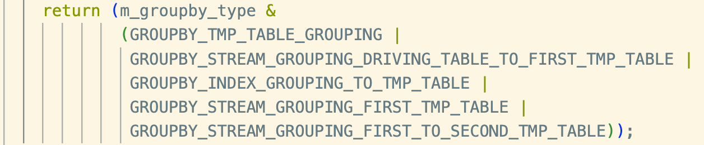
    - 后处理略
- PostCheckForResources：检查source是否超出限制
    - 问题
        - 为什么roll up不可调整
    - dop系统
        - Planner初始化的时候
            - 会传入max_degree_degree,作为query最大的degree，又叫做statement_dop
            - 计算slice_dop，作为所有slice的初始化dop（在创建expr_group，会传入它，表示为该operator的最大并发度，也就是slice的最大并发度）
                - 如果传入了max_parallel_degree_for_planning，则初始化为它
                - 否则计算
                    - 计算公式为​​​​​​​​​​​​​​​​​​​​​​​​​​​​​​​​​​​​​​​​​​​​​​​​ 
        - 在Precheck的时候
            - 如果只能local执行 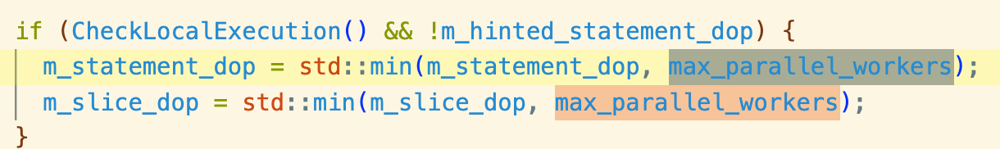
    - 核心函数：AdjustStatementDop
        - 查看每个group是否超限，超限就退回串形 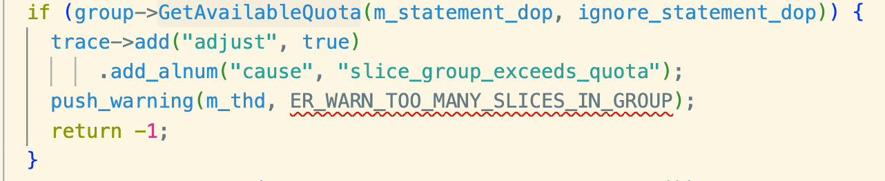
            - 如果 超限则需要回退到serial
            - 同时记录可调整的额度，​​​​​​​​​​​​​​​​​​​​​​​ 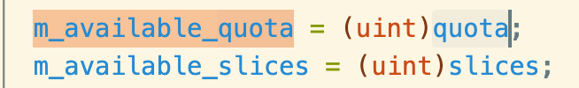
                - 记录可调整的slice数量
                - 纪录剩余的额度
        - 确定每个slice的dop
            - 对于不可调整的，则其dop和planning的相同
            - 对于可调整的，调整其dop
                - 对于parallel scan的，将dop设为其partition数量
                - 将其余的设为剩余worker/slice，也就是avg_dop
            - 如果最后还剩下额度且标记了Force
                - 强行加到parallel scan上去，就算空转也没有关系
- 
