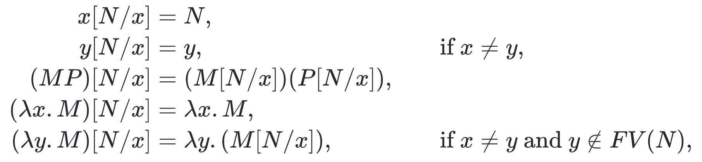
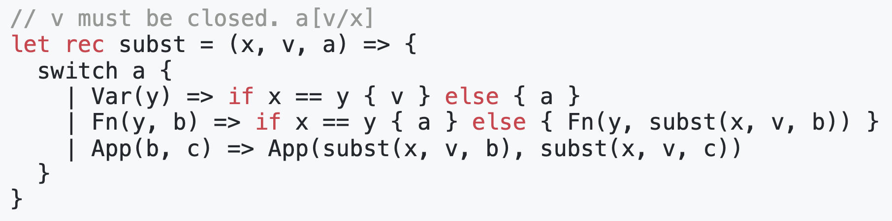
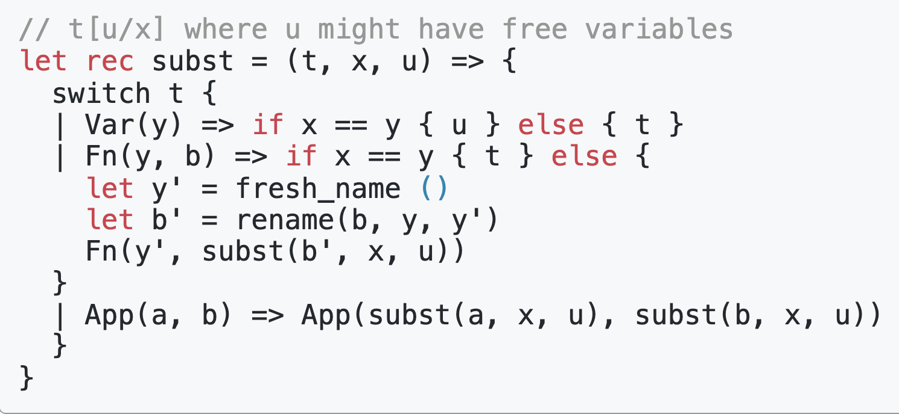
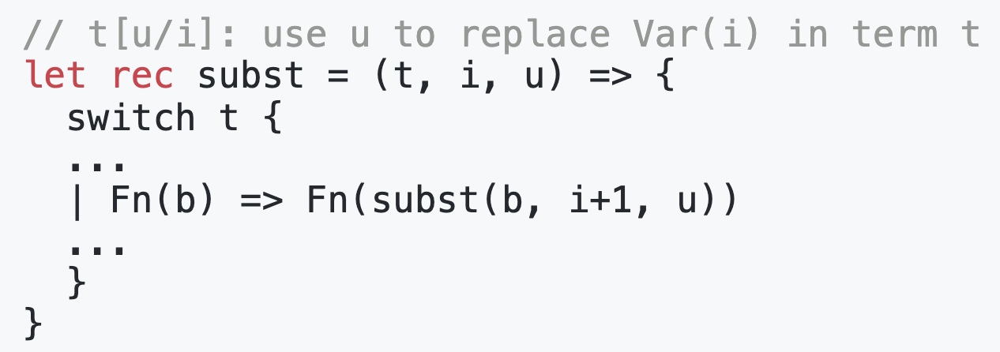
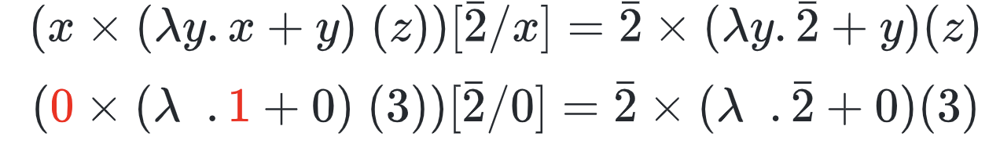
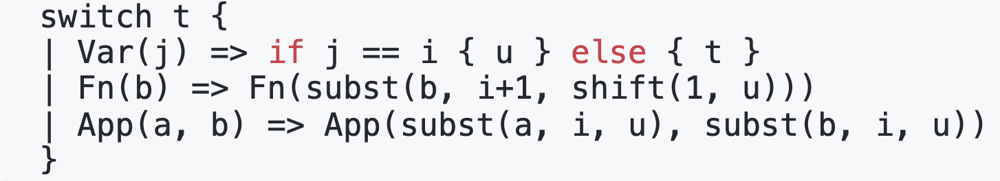
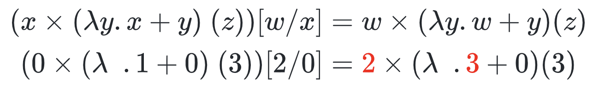
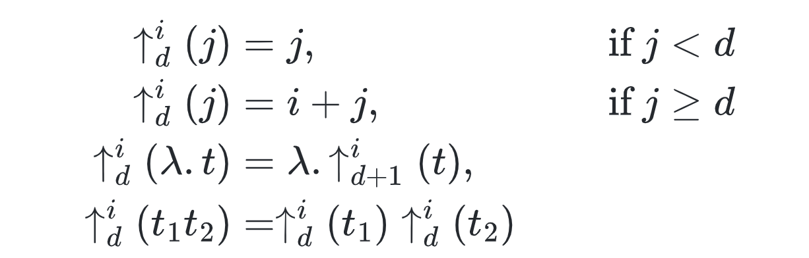
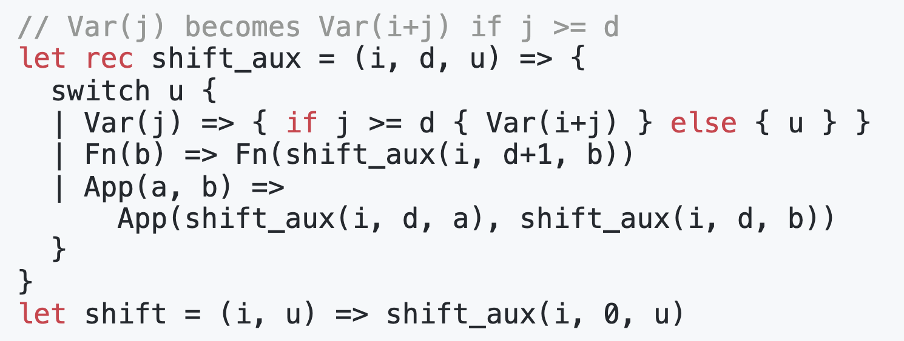

- $\lambda$ 演算有两个基本的规则
  collapsed:: true
	- α-conversion:改变bound的元素，以$M[N/x]$为例，我们对M的类型讨论
	  
		- 如果M是一个变量/term
			- 如果M等于x，那么直接替换为N
			- 否则返回它本身
		- 如果M是一个函数Apply过程，那么分别对函数进行替换
		- 如果M是一个函数，（curry化后的）
			- 如果M bound的元素和x相同，那么函数不变（本质对应的就是变量rename）
			- 如果M bound的元素和x不同，且x中不包含自由变量（free variable）y，那么替换函数body中的x
				- 注意这里M中不包含自由变量y很重要，比如下述替换
				  $$\lambda y. 2N [N/(y)]$$
				- 下述替换中，y本来不是被y bound的，但是在替换后，由于变量名相同，所以造成替换的y被新的函数bound的错误
	- $\beta$ reduction：apply 函数的规则
- 如何实现
  collapsed:: true
	- 考虑下述替换a[v/x]的实现，如果v所有变量都是closed，也就是说没有自由变元x
	  
	- 当存在自由变元的情况时
	   
		- 我们可以将替换体里的所有同名变量都换一个新的
		- 即将上述b里面的y都用y' 表示
- De Bruijn index
  collapsed:: true
	- 上述用名字绑定的方式会造成严重的歧义，所以我们可以用数字的方式表示，即德布朗指数（类似之前的nameless expr)。注意下述数字头上都有一横，参数没有
	  $$\lambda x.x => \lambda . 1 $$
	- 数字定义：The number $i$  stands for the variable bound by the  $i$-th binder $\lambda$
	  collapsed:: true
		- 例子
		  $$\lambda f.(\lambda x.f(xx))(\lambda x.f(xx)) \rightarrow \lambda .(\lambda .1(00))(\lambda .2(00))$$
		- 对binder的理解
			- binder的本质是将变量名和实际值绑定
			- 根据Nameless的推导，我们可以认为实际值是保存在栈中的
			- 德布朗索引本质上就是栈道索引（栈顶索引为0
			- 所以每经过一层绑定索引，理论上都会向栈中push一个值（即Nameless的全局变量
	- 对德布朗索引的替换
	  collapsed:: true
		- 替换变量的索引是变换的
		  
			- 在替换的时候，没经过一层binder，替换的索引需要加1
			- 例子
			  
				- 可以看到在最外面替换的索引是0
				- 在里面函数替换的索引是1
		- 替换的数字也是需要变换的
		  
			- 例子
			  
			- 当替换的u里面含索引的时候，每经过一层binder，u里的索引也要变换
				- 当u里的索引是在u里面绑定的，那么索引保持不变
				- 当u里的索引是未绑定的（在外部绑定），那么每经过一层binder，索引需要+1
			- shift的具体实现
			  collapsed:: true
				- 引入一个helper函数`shift(i, t) = shift_aux(i, 0, t)`
				- shift_aux的第二个参数的含义是经过多少层绑定，用$d$表示
				  collapsed:: true
				  
					- 对于索引
						- 如果$j < d$，表示j是在当前这个函数体内绑定的，所以不变
						- 反之，+i
					- 对于函数
						- 进入函数d+1
					- 对于函数apply
						- 递归的分别处理即可
				- 实现代码为
				  
			- 上述我们讨论了shift 1的情况，但shift本质上是一个通用函数，第三个值也可能为其它值，比如进行函数apply之后，里面的索引需要-1
		-
			-
			-
	- 德布朗索引表示的中间IR可以让语言变得很简洁，但是其每次替换变化的时候都需要改变索引，所以不利于优化
-