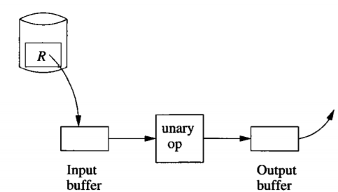
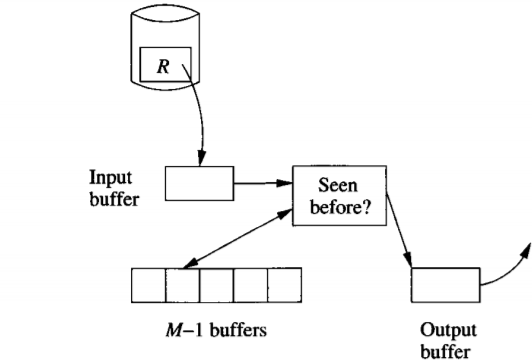
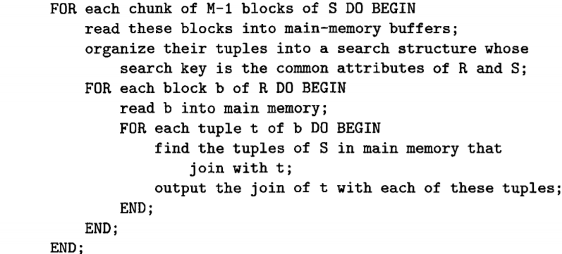
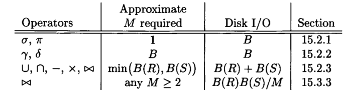

- Physical query are built from some operators
	- basic operators: sort、scan
		- Scan Tables
			- two basic approaches
				- table scan
				- index scan
		- sorting while scanning tables
			- B-tree index
			- sort in main memory
			- merge-sort （attributes are too large to fit in memory）
- How to execute individual physical step （P709）
	- Sorting-based methods
	- hash-based methods
	- Index-based methods
- three degrees of difficulty and cost
	- one pass algorithm：read data only once
	- two-pass algorithm：data is too large，
	- three or more pass algorithm：data has not a limit on size
- One pass algorithm
	- Tuple-at-a-time, unary operations：selection & projection
		- process
			- read a block
			- unary op
			- output
			- 
		- cost
			- B：if tuple is clustered
			- T：if tuple is not clustered
			- even less if has index
	- Full-relation, unary operations；γ(the grouping operator) and δ(the duplicate-elimination operator)
		- Duplicate Elimination
			- process
				- if first time to see，copy to output and buffer
				- else throw it
				- 
					- buffers data structure：search-tree or hash table，search faster
		- Grouping
			- every time process a block
			- update aggregations for each group
	- Full-relation, binary operations：union、products、intersection、difference、joins
		- assume there are two relations：R and S，接下来流程如下：
			- read a smaller relation S into memory，and build search structure
			- As for large relation，read and process a block a time
		- 具体操作略（P715）
- "One and half" pass
	- 和 full-relation ， binary operation类似，但是没有了大小的限制
	- 流程如下（有点像双重for 循环的优化，最大化的利用buffer） 
	- cost 计算
		- 需要B(R)/(M-1)次循环
		- 每次循环B(S) + M - 1次读取disk
- Summary 
- Two pass Algorithm：为了进一步突破buffer 大小限制
	- Two pass
		- read into main memory
		- processed in some way
		- write out to disk
		- reread from disk to complete the operation
	- Two pass based on Sorting
		- TPMMS：Two-Phase，Multiway Merge-Sort
			-
	- Two pass based on Hashing