- Intro
  collapsed:: true
	- 建模
	  collapsed:: true
	   {:height 287, :width 548}
		- 基本思想：将经济学抽象为一个数学模型
		  collapsed:: true
			- 基础假设
				- 基本价格假设
				   {:height 55, :width 551}
					- market clearing：在长期市场，价格会快速变化（flexibility）使得供需平衡
					- sticky：在短期市场中，价格会保存粘性（即基本不变）
			- 自变量（外部变量）
			   {:height 34, :width 453}
			- 因变量（内部变量）
			   {:height 34, :width 562}
- 宏观经济中的关键数据
  collapsed:: true
	- Gross  domestic  product（GDP）
	  collapsed:: true
		- 存量和流量
		  collapsed:: true
		   {:height 276, :width 462}
			- 流量是当前时间的生产，被算进GDP
			- 存量作为社会的资产存量，存量的转移不被算成GDP。比如拍卖会、二手房、库存
		- GDP 衡量的整个社会的生产力
			- 我们可以通过总收入/总支出来衡量生产力
			- 在一笔交易中，收入和支出只取决于视角（买方支出，卖方收入，所以总收入和总支出本质上相同）
		- 库存对GDP的影响
			- 库存是作为生成者自己买下的
			- 第二年的库存销售作为资产的转移，即支出是库存，收入是买方，相互抵消
		- 实际GDP和名义GDP
			- 一般来说$GDP = Quantity * Price$
			- 名义GDP是用当前物价计算，包含了货币变动的影响
			- 实际GDP会固定某一年的物价计算GDP
			- 名义GDP和实际GDP的系数可以使用GDP Deflator
			  {:height 59, :width 235}
		- 上述计算的问题是没有考虑生产力的提高，比如电脑的价格持续下降
		  collapsed:: true
			- 为了解决这个问题，可以使用chain-weighted 计算
			- 即我们用相邻年份的平均价格，用它们来衡量实际GDP的real growth
				- 因为相邻年份的平均价格可能变化不大，所以可以用来衡量实际GDP的增长
		- GDP的计算
			- 支出法 C+I+G+NX
				- 消费C
				- 投资I
				- 政府投资G
				- 出口NX
		- 其它的指标
			- GNP：GDP + Factor Payments from Abroad - Factor Payments to Abroad
			-
	- consumer price index（CPI）
	  collapsed:: true
		- 衡量物价指数丈夫的指标，将一些商品的价格除以过去商品的价格
			- 由于不同商品的销量不一样，所以权重的价格不一样
		- producer price index：用生产者的价格指数衡量，即工厂消费的商品
		- CPI VS GDP Deflator VS PCE Deflator：都是通胀的衡量因子
			- CPI VS GDP Deflator
			  collapsed:: true
				- 1. GDP 包含所有的商品（比如包含政府消费和工厂消费）
				  2. CPI 只包含消费者消费的数据
				- 1. GDP只包含国内生成的
				  2. CPI也包含进口的
				- 从本质上来看，两者都是 市场上对一组价格的聚合 的比
				  1. GDP对每个商品的权重是不同的（即它的产量）
				  2. CPI一般使用固定权重
					- 例子：比如某年，橘子产量为0，库存的橘子价格暴涨。
					  CPI也会暴涨，因为它的橘子权重不变
					  GDP deflator不变，因为橘子产量为0，所以影响为0
					- 拉式指数（Laspeyres index）：a price index with a fixed basket of goods
					  collapsed:: true
						- 倾向于高估通胀，因为其没有考虑商品的替代（橘子和苹果的替代）
					- 帕氏指数（Paasche  index）：a  price  index  with  a  changing  basket
						- 倾向于低估通胀，因为其没有考虑替代的代价
			- PCE Deflator：使用GDP Deflator的计算方式，不过基于消费数据
				- 使用CPI的范围，比如只包括消费价格，还包括进口商品
				- 使用GDP的计算机方式，拥有可变的basket（即利用生产数据作为权重）
	- unemployment rate
	  collapsed:: true
		- 人是劳动市场中最重要的资源，我们可以将成年人分为以下三种：
			- employed：找到工作的
			- unemployed：想找但是未找到工作的
			- Not in the labor force：不想找工作的且无工作的，比如家庭主妇，学生等
		- 根据上述划分，可以得到两个指标
			- 劳动市场：employed + unemployed
			- 失业率
			   {:height 44, :width 381}
			- 劳动参与率
			  {:height 46, :width 399}
- Classical Theory：The Economy in the Long Run
  collapsed:: true
	- National Income: Where it comes from and where it goes
		- 关于线的循环流动
		   {:height 311, :width 446}
		- 生产的要素（Factor of production）
		  collapsed:: true
			- 资本$K$（Capital）
			- 劳动力$L$（Labor）
			- 产量通过生产方程描述
			  $$Y = F(K, L)$$
			- 当下我们假设资本价格和劳动价格不变，则得到
			  $$\overline Y = F(\overline K, \overline L)$$
			- 有一种特殊的性质，constant return to scale，即无限的扩展性
				- 无论资本或劳动力扩展多少倍，Y也扩展多少倍
				  $$zY = F(zK, zL)$$
		- The distribution of Income
		  collapsed:: true
			- Production
				- 价格由供需决定
					- 供需图可以抽象为
					  {:height 240, :width 411}
					- 由于我们假设需求不变，且价格不变，所以可以得到上述一条竖线，这就是本章讨论的假设
					-
				- 工厂决策：生产规模最大
				  collapsed:: true
				  id:: 639b2805-e2d3-4796-9283-c88e5174cea1
					- 假设
						- Labor的工资（wage）是$W$，则工人的支出是Labor Costs = $WL$
						- 资本的租金（Rent）是$R$，则资本的总支出是Capital Costs = $RK$
						- 没件商品的价格是$P$，则整个生产的收益是$Revenue = PY$
					- 则利润为
					  $$Profit = PY - RK - WL$$
					- 我们希望PY最大，则需要考虑导数，即单位K 或 单位L带来的收益
						- MPL（Marginal Product of Labor）：每引入一个labor带来产品的提高
						  collapsed:: true
							- 定义: $MPL = F(K, L+1) - F(K, L)$
							- 由于资本等其它条件的约束，随着工人数量上升，MPL是边际递减的
							  id:: 639b2805-bd69-4079-b434-84c505e04a01
							  {:height 274, :width 417}
							- 而最大的时候也就是单位工人带来收益正好为0的时候：
							  collapsed:: true
							  $$\Delta Profit = \Delta Revenue - \Delta Cost = P*MPL - W = 0$$
								- 此时$$MPL = \frac{W}{P}$$，这也被称为real wage，即单位是product的工资
								- 随着Labor的变多，实际工资变少
								  {:height 411, :width 569}
								-
								-
								-
							-
						- MPK（Marginal Capital of Labor）
						  collapsed:: true
							- 我们同样可得到规模最大的时候MPK
							  $$MPK*P - R = 0$$
							  $$MPK = R/P$$
							-
						- 同理我们可以定义经济上的利润，即以产品计数，下述公式*P就是上述Profit公式
						  collapsed:: true
						  Economic Profit = $$Y - (MPL*L) - (MPK*K)$$
							- 根据上述公式可得，销售收入Y被分成了三个部分
								- 资本支出
								- 工人支出
								- 利润
							- 当constant return to scale 被满足时，利润倾向为0，上述的优化是扩大规模，即有最大的产出
							- 此时利润为0，我们就可以得到Y的分配 $$Y = MPL*L + MPK*K$$
						- 值得注意的是，上述的推导是非常理想的
						  collapsed:: true
							- 所有的labor共享所有相同的K
							- 工厂作为资产本身的收入怎么算
					- 根据如上公式我们可以得到最大产出为
					  $$Y = MPL*L + MPK*K$$
						- 值得注意的该公式消去了物品价格的影响，只和实际生产力有关，即一个工人能产生多少商品
			- Production Function
				- Cobb-Douglas Production Function
				  collapsed:: true
					- Cobb-Douglas 根据统计信息观察到一个现象，随着经济的发展，资本收入和劳动收入的比例基本不变，由此推出Production function
						- 假设资本和劳动所占比例是$\alpha$
							- 资本收入$MPK*K = \alpha Y$
							- 劳动收入$$MPL*L = (1-\alpha) Y$$
						- 随着Y的增加，$$\alpha$$ 不变，由此得到方程
							- $$Y = A K^\alpha L^{1-\alpha}$$
						- 验证略
						- 通过上述公式我们可以算出
						  collapsed:: true
							- $MPK = \alpha Y / K$
							- $MPL = (1-\alpha)Y/K$
							- 即随着生产率上升，工资也会上升
							- 根据美国数据，可以观察得到类似的结论
							  
							-
					- 然后以更长的角度观察，劳动收入占比逐渐降低
					  {:height 310, :width 431}
					-
		- What determines the demand for goods and services
			- 根据GDP的支出法：GDP = C+I+G+NX，暂时忽略NX。接下来主要探讨C I G和Y(上一节说的商品产出)之间的关系：
			  $$Y = C + I + G$$
				- NX：出口(忽略)
				- Consumption
				  collapsed:: true
					- 消费和可支配收入（disposable income）有关，即收入减去税收T
						- disposable income = Y - T
					- 可支配收入会一部分转为消费，一部分转为储蓄。所以C是一个和Y-T有关的函数C(cosumption function)
					  $$C = C(Y-T)$$
						- 同样我们定义一个MPC（Marginal propensity to consume）：即每一元钱中用于消费钱的比例
						  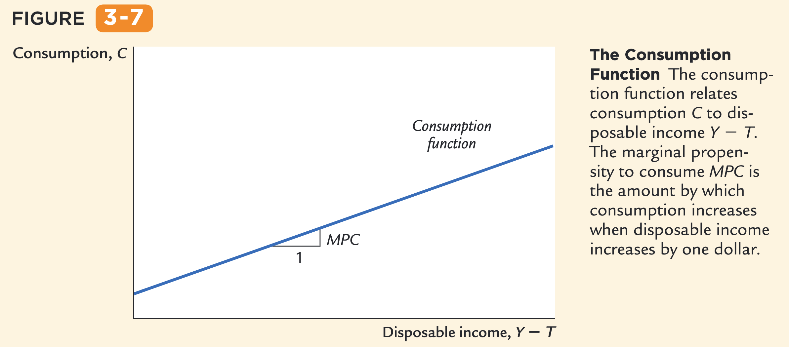
				- Investment
					- 这里投资的定义会用钱扩大生产，即为了资本存量的提高而进行的支出。用于投资的货币的水平和受利率影响
						- 注意：这里的利率不是中央银行决定的利率，是指持有钱的成本。只有你投资的收益大于持有钱的成本，这次投资才是有效的。
					- interest rate：用于衡量用于投资的资金的成本，简单理解就是借钱的成本（借钱的利率）
						- 如果一个投资品需要盈利，那么它未来的收益一定要大于本金+成本
						- r越高，盈利的投资越少，即投资的需求越小
					- 我们用一个函数I表示
					  $$I = I(r)$$
						- 示意图
						  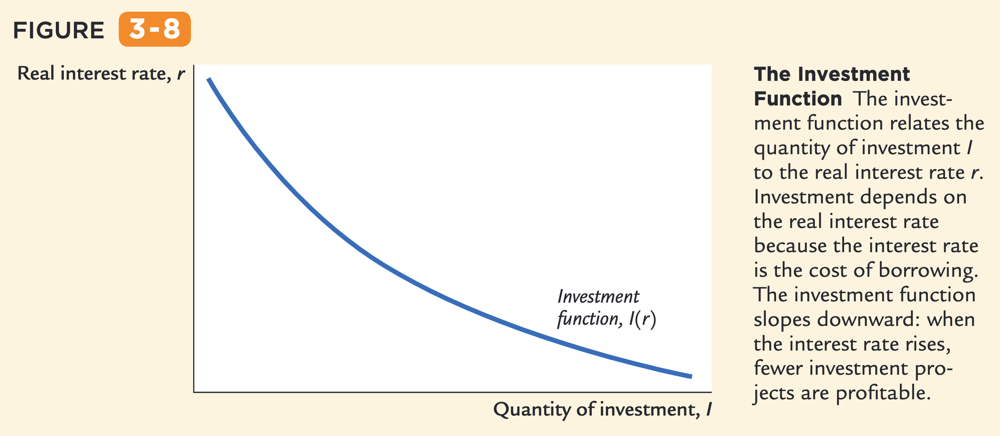
					-
				- Government purchase
				  collapsed:: true
					- 政府的收入是由税收决定的
						- G = T：财政平衡（balanced budget）
						- G > T：财政赤字（budget deficit）
						- G < T：财政盈余（budget surplus）
					- 在当前章节的模型中，G 和 T作为一种政策产物，假设他们不变
						- $$G = \overline G$$
						- $$T = \overline T$$
					-
					-
			- What Brings the Supply and  Demand for Goods and Services into Equilibrium
			  collapsed:: true
				- 在本章节的模型中，interest rate是保证供需平衡的决定因素。我们接下来主要它在产品市场和金融市场的关系
				- Equilibrium in the Market for Goods and Services:   The Supply and Demand for the Economy’s Output
					- 根据上一节，我们可得产品的产出和劳动市场价格L 和 资本市场价格 K 有关
					  $$\overline Y = F(\overline L , \overline K)$$
					- 而产品的消费根据上述讨论可得
					  $$\overline Y = C(\overline Y - \overline T) + I(r) + \overline G$$
					- 根据公式可得，r是本模型的唯一变量，所以r是调整商品的供需的关键。其关键作用在金融市场上
				- Equilibrium in the Financial Markets: The Supply and Demand for Loanable Funds
				  id:: 63b148d0-0117-49e6-b4eb-74cdcf2fb8a5
					- 根据上述公式我们可得投资为：
					  $$I = Y - C -G$$
					- 而上述公式也可以反应出储蓄（saving）
					  $$S = Y -C -T + T -G$$
						- 私人储蓄（private saving）：Y - C - T
						- 公共储蓄（public saving）： T - G
						  id:: 63b14a03-a31d-40f7-a76b-a2d9bb4d0b87
					- 根据模型中的不变量我们可以重写公式
						- $\overline S = I(r)$
						- $\overline Y - C(\overline Y - \overline T) - \overline G = I(r)$
					- 根据上述公式我们可以画出储蓄和r的关系
					  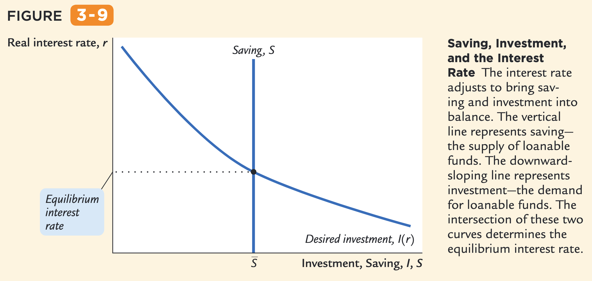
						- 上述图隐含了一个关系，r是由储蓄和投资品的供需关系决定
						  collapsed:: true
							- 供给是储蓄，即可以用于贷款的资金 loanable fund
							- 需求是投资品
							- 价格即是利率 interest rate
						- 当利率低，投资就会变多，由此对资金的需求变大，当loanable funds不够时，利率就会上升
						- 当利率高，投资减少，这时候loanable funds就会供过于求，利率就会下降
					-
			- Changes in Saving: The Effects of Fiscal Policy
			  collapsed:: true
				- 在本模型中，我们讨论政策对经济的影响
				- An increase in Government Purchase
					- 总体收入不变
					- 由于税收T和Y不变，所以消费不变
					- 所以G的增加会减少投资
					- 同时政府的消费消耗的是政府的储蓄，所以政府的saving 减少。导致总的saving 减少，也会导致利率上升
					  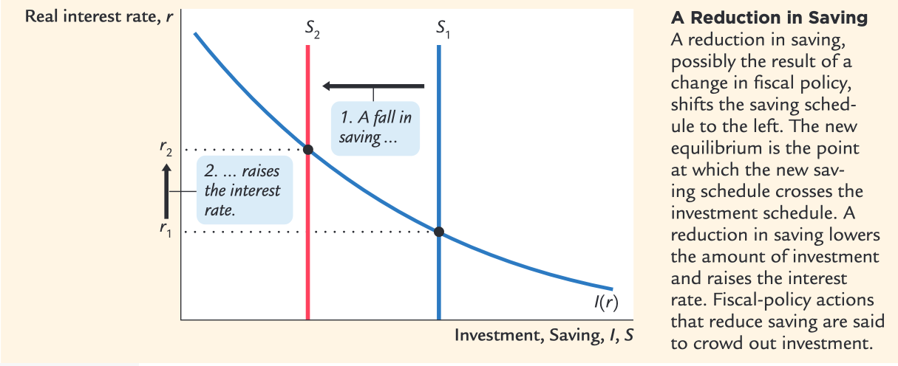
				- A decrease in taxes
					- 减税会增加可支配收入，所以消费增加，增加的量取决于MPC
					- G不变，这是由政策决定的
					- 所以在总支出不变的情况下，投资会减少
					- 同理，储蓄为$S = Y - C - G$，C增加，储蓄也会减少，所以会造成上述一样的效果
			- Changes in Investment Demand
				- 投资的增长
					- 科技创新会导致投资增长：比如火车的发明导致铁路的投资
					- 政府通过税收的鼓励：比如政府鼓励电动汽车行业
				- 当投资增长，储蓄不变时，会导致利率上升
				  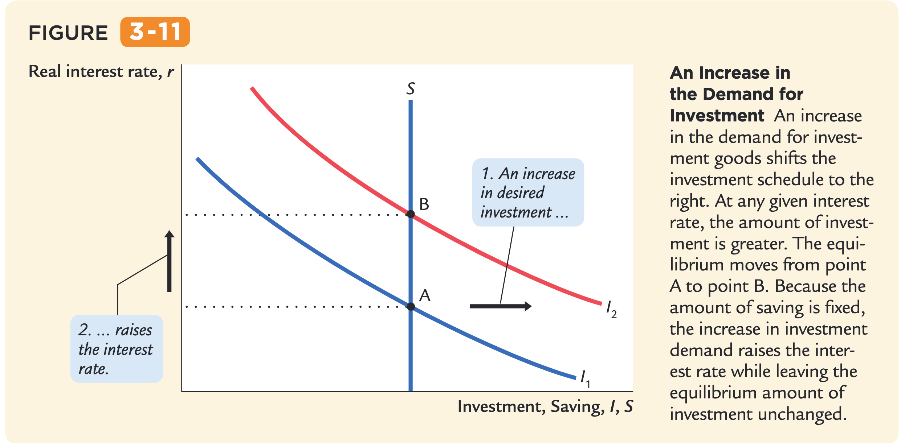
				- 然而利率上升会增加储蓄，减少消费，所以我们可以得到一个新的结论
				  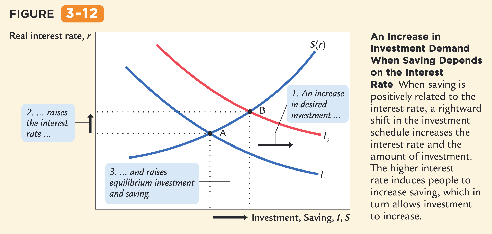
				-
	- 结论
	  collapsed:: true
		- 本章构建了一个模型解释的图中钱的循环流动
			- 产品的产出由劳动市场、资本市场决定
			- 金融市场通过利率调整储蓄和投资的关系
- The Monetary System:  What It Is and How It Works
  collapsed:: true
	- what is money
	  collapsed:: true
		- 种类
			- commodity  money：货币本身具有价值，比如黄金
			- fiat money：法定货币，价值由政府担保，现有的纸币多属这种
		- 钱的三个作用
			- store of value：作为价值的载物，比如劳动的价值用钱支付，并可以将其存储将来消费
			- unit of account：等价物，衡量物品价值的单位
			- medium of exchange：交易的中间品
		- How the Quantity of Money Is Controlled
			- 对于commodity money而言，货币的总量就是对应产品的总量
			- 对于flat money，货币的总量可以被操纵
			  collapsed:: true
				- 操纵货币的机构一般是各地的中央银行
				- 操纵货币数量的方法一般被称为money policy
				- 常见的方法是市场的方法：
					- 通过购买债券等向市场发放货币
					- 通过售卖债券向市场回收货币
					- 央行的负债可以认为是央行向市场发放的货币总量：money base
		- How the Quantity of Money Is Measured
			- 我们可以根据钱的流通能力，将钱分类并统计
				- 现金流动性最强
				- 活期存款和现金流动性差不多（和现金区分由于其参与到了money amplify中）
				- 定期存款流动性稍差
			- 由此统计货币总量
			  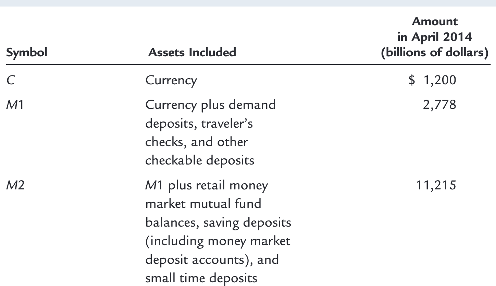{:height 297, :width 476}
	- 银行的作用
	  collapsed:: true
		- 根据定义，货币供给Money Supply（M）为
		  M = C + D(Demand Deposits)
		- 银行的乘数效应
		  collapsed:: true
			- 假如银行只将一部分（比例记为rr，reserve rate）保留，剩下的借出去
			  collapsed:: true
				- 第一家银行财政
				  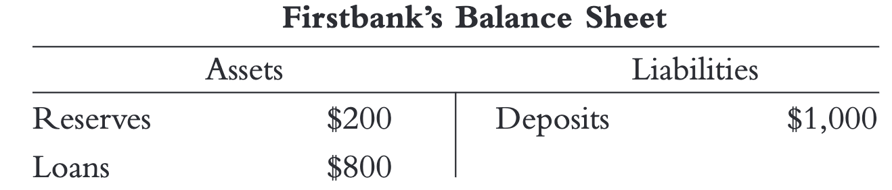
				- 第二家
				  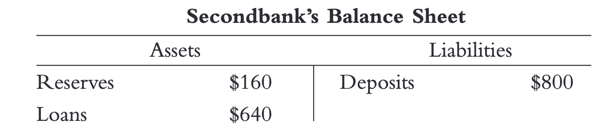
				- 第三家
				  
				- 一直持续下去，我们可以得到最后总的Money Supply为
				  $$M = C + D = C + C*(1-rr) + C*(1-rr)^2 +... = \frac{M}{rr}$$
				-
			- 银行理论可以货币放大为原来的$\frac{1}{rr}$倍
			- 用于钱的分配的机构叫金融中介（financial intermediation），比如股市、债券。只有银行会造成乘数效应
		- 银行的杠杆
		  collapsed:: true
			- 银行需要初始的资本，然后根据这些资本来接受存款房贷。总资本/初始资本就是杠杆率
			  collapsed:: true
				- 下述银行暗示杠杆率为五倍
				  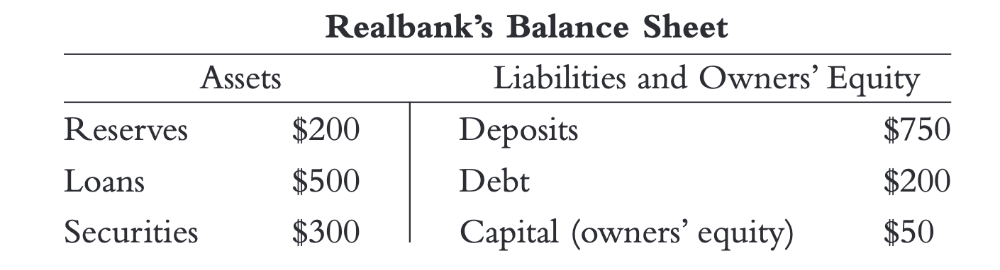
			- 杠杆率过高会使得银行抗风险能力很低
			  collapsed:: true
				- 加入二十倍的杠杆，只有亏损5%，就会把本金亏掉，然后就会导致无法取出所有存款
	- How Central Banks Influence the  Money Supply
	  collapsed:: true
		- A Model of the Money Supply
		  collapsed:: true
			- 基本数据
				- B（Money base）：由央行向市场发放的资金总量，即央行的负债
				- rr（reserve-deposit rate）：银行存款的比例
				- cr（currency-deposit rate）：居民存款率
			- 模型的建立
				- 基本等式
					- 货币总量等于M1
					  $$M = C+D$$
					-
					- 货币供给等于居民和银行的存款
					  $$B = C+R$$
				- 推导
					- $$\frac{M}{B} = \frac{C+D}{C+R} = \frac{C/D + 1}{C/D + R/D} = \frac{cr + 1}{cr + rr}$$
					- $$M = \frac{cr+1}{cr + rr}*B$$
					- $(cr+1)/(cr+rr)$ 被称为货币乘数（money multiplier），一般记为m
		- The Instruments of Monetary Policy
		  collapsed:: true
			- Changes  the  Monetary  Base
				- 可以通过购买债券增加货币总量，销售债券减少货币总量
				- 还可以通过discount window直接向银行放债
				  collapsed:: true
					- discount rate：央行房贷的利息，越低银行借钱越多，B越高
					- Fed还有一种方案，确定房贷资金总量，通过竞拍利息高的人赢得，通过改变资金总量也可以改变B
			- Changes  the  Reserve–Deposit  Ratio
				- 直接划定最低比例，要求银行rr不得低于其
				- Fed的新政策是向reverse支付利息
			-
				-
- Inflation: its cause, effects, and social costs
  collapsed:: true
	- The Quantity Theory of Money
	  collapsed:: true
		- 公式1：人需要买东西需要花钱
		  $${M}\times{V} = {P}\times{T}$$
			- M,Money：即社会上的货币总量(M2)
			- V,Velocity：货币的流通速度，意外货币会在交易中重复利用
				- 比如1元钱从A到B，又重B到C，那么这一元变出现了两次
			- P,Price：每笔交易的价格
			- T,Trasaction：交易数量
		- 公式2：市场上交易的数量和该经济体的总产出相关
		  $$M\times V = Y\times T = \text{Nominal GDP}$$
			- Y：该经济体产出商品的数量，和总产出*价格就是名义GDP，也等同于总收入
			- 实际上，二者并不完全相等，因为经济体内部会出现一些非产出的交易，比如二手物品，古董等
			- 库存商品本质也是被消费了，因为老板为其支付了生产它的成本
		- The Money Demand Function and the  Quantity Equation
			- real money balances,$\frac{M}{P}$：表示实际能购买商品的数量，也就是按价格归一化后的实际货币量
			- 我们将实际货币需求记为$(M/P)^d$，则货币需求函数为
			  $$(M/P)^d = kY$$
				- 其中k表示人们倾向于将多少钱花出去
				- 该函数表面货币需求和实际总收入成正比
			- 我们可以假设供需平衡即$(M/P)^d = M/P$，那么结合公式2，我们可得：
			  $$M/P = kY \rightarrow M/k = PY = MV \rightarrow V = 1/k$$
				- 从上述公式我们可以得到，货币流速和k有关
				- 当k越大，人们花更多的钱去消费，那么V就越大；反之依然
			- The Assumption of Constant Velocity
				- 我们可以假定短时间内V不变，那么我们就得到了**quantity theory of money**
				  $$M \overline V = PY$$
				- 由上可得，当M增加时，P会成比例增加，这便是通货膨胀的直接原因
					- Y不会增加，因为货物的产出和边际价格有关 ((639b2805-e2d3-4796-9283-c88e5174cea1))
		-
	- Inflation and Interest Rates
		- Two Interest Rates: Real and Nominal
			- 我们可以将利率分为两个部分，即fisher quation
			  $$i =  r+\pi$$
				- r：表示实际利率，即利息的实际收益
				- $\pi$：表示通胀率，即用来抵消通胀的利息
				- 该方程暗示了，通胀率会造成名义利率的上升
				  id:: 63c41879-2473-49c3-be61-68fa4c1c15af
			- Two Real Interest Rates: Ex Ante and Ex Post
				- 根据上述公式可得，利率是会随着时间的变化，因为通胀率会随时变化
				- 所以对于一个较长时间的存款或者借债，怎么衡量时间内的利率
				  collapsed:: true
					- ex ante事前利率：根据借债/存款时间的利率
					- ex post事后利率：根据还债/取出时间的利率
					-
				- 一个更为准确的判断是预期通胀，即
				  $$
				  i = r + E\pi$$
		-
	- The Nominal Interest Rate and the Demand for Money
		- 我们定义money demand function：
		  $$(M/P)^d = L(i,Y)$$
			- 市场上的income越高，代表交易数量越多，货币需求量越大
			- 名义利率越高，人们存钱越多，k就越大，流速越低，所以货币需求量更高
		- 通胀和利率的正反馈调节
		  collapsed:: true
		  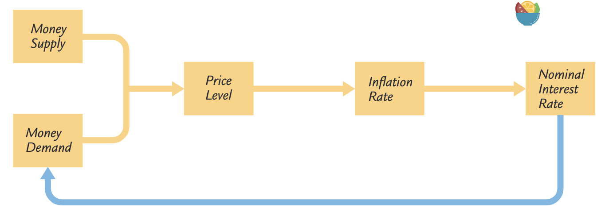
			- 货币供给和需求决定价格
			- 价格决定通胀率
			- 通胀率决定名义利率
			- 名义利率又会反过来影响货币需求
			- xj: 名义利率也会影响货币供给，因为利率越高，存死期的人越多？
		- 当然根据供需平衡，我们可以得到
		  $$M/P = L(i,Y) = L(r + E\pi, Y)$$
			- 该方程暗示之前结论有一个问题： ((63c41879-2473-49c3-be61-68fa4c1c15af))
			- 价格都改变并不依赖于实际的通胀，而是预期的通胀。也就是如果一个社会预测未来会通胀，那么价格会上升，货币需求同时上升，进一步导致通胀
	- Social effect of Inflation
	  collapsed:: true
		- 通胀可以作为一种税，向全体货币持有者征收
		- 通胀会改变货币的价值，造成货币作为一般等价物的价值。特别是在高通胀或者通胀变化无常的时候
		- 另一种价值在当有了通胀，人的工资就可以一直涨，可以保持打工人的乐观（存疑）
	- hyper inflation
		- 恶性通胀的直接原因是货币供给超量
		- 货币供给超量的原因有很多
			- 政府赤字太大，靠发债已经无法支付利息，只能使用货币税；但是货币税会造成货币的贬值，导致税收的价值更低（为什么，税收不是等比例的吗
			- 流动性危机，政府通过发钱刺激经济（为什么可以这样
- The Open Economy
  collapsed:: true
	- 模型的变化：国内的产出需要考虑进口，国内的消费需要考虑出口
	  collapsed:: true
		- 产出与消费等式
		  collapsed:: true
		  $$Y = C^d + I^d + G^d + X$$
			- Y：总生产
			- $C^d$: 消费的国内产品
			- $I^d$: 投资的国内产品
			- $G^d$：政府采购的国内的产品
			- $X$：出口产品
		- 投资、消费、采购都包含国内产品和国外产品
		  collapsed:: true
			- $C = C^d + C^f$
			- $I = I^d + I^f$
			- $G = G^d + G^f$
		- 我们可以重写上述等式为
		  collapsed:: true
		  $$Y = (C-C^f)+(I-I^f)+(G-G^f)+X = C+I+G+(X-IM) =C+I+G+NX$$
			- IM：进口，即本国所有消费国际产品
			- NX：净出口，即出口-进口
		- 带入关于S的定义，我们可以得到
		  $$S = Y-C-G = I + NX$$
			- S是积蓄 ((63b148d0-0117-49e6-b4eb-74cdcf2fb8a5))
			- 上述等式即
			  collapsed:: true
			  $$S-I = NX$$
				- 关于上述公式的解释，我们认为$S-I$本质上是资本的流动，NX是国际货物的流动。其本质是买卖点一体两面
				- 根据NX的正负，我们可以得到对应的贸易情况
				  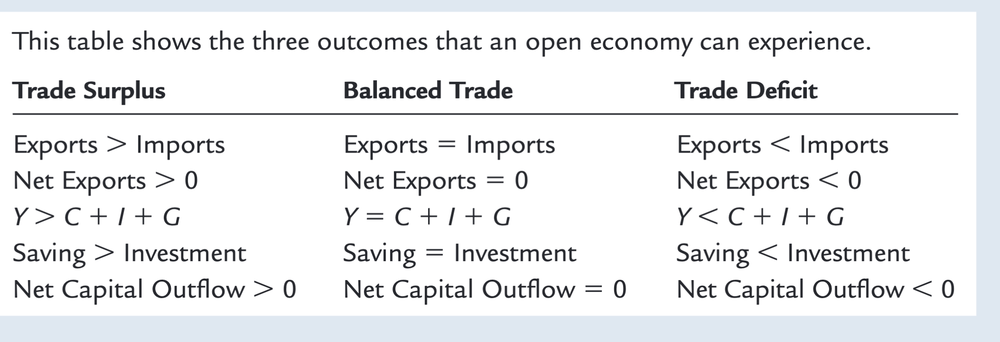
				-
		- 例子
			- 假如比尔盖茨向日本卖了一台电脑，它收到了10000 yen
				- 这次贸易明显增加了美国的净出口，即NX上升
				- 注：我的理解，如果没有出口，此次交易不会产生，所以10000 yen是新增的。如果没有这场交易Y会下降，当然C G不变
			- 接下来讨论比尔盖茨的行为会如何影响其不等式
				- 增加美国的储蓄，即比尔盖茨将钱存起来或者在日本投资。此时代表了美国资本向日本流动
					- 为何在日本投资也算储蓄增加，因为这算比尔盖茨的财产。不算在投资的头上是因为它是针对日本的投资
					- 对于日本而言，此时就是投资增加，出口减少
				- 比尔盖茨购买日本的产品，此时日本和美国净出口不变
				- 比尔盖茨兑换美元，此时根据美国银行的行为可以继续讨论
	- Small Open Economy
	  collapsed:: true
		- 我们首先讨论自由贸易的小国，即此时小国的进出口，投资都不会影响国际投资利率，即小国的利率恒等于国际利率$r^*$
		  collapsed:: true
		  $$r = r^*$$
			- 值得注意上述假设十分理想，没考虑的信息差，投资的成本，以及政策因素
		- Saving and Investment model
			- 回顾一些基本变量
				- 产出相对不变：$Y =\overline Y = F(\overline K, \overline L)$
				- 消费和储蓄有关：$C = C(Y-T)$
				- 投资受利率影响：$I = I(r)$
			- 带入NX公式得到：
			  $$NX = (\overline Y - \overline C - \overline G) - I(r) = \overline S - I(r)$$
				- Y和C和G，我们假设都不变，它们都较多的受到政策影响
			- 根据上述公式，我们可以得到一个基本利率和出口的关系图
			  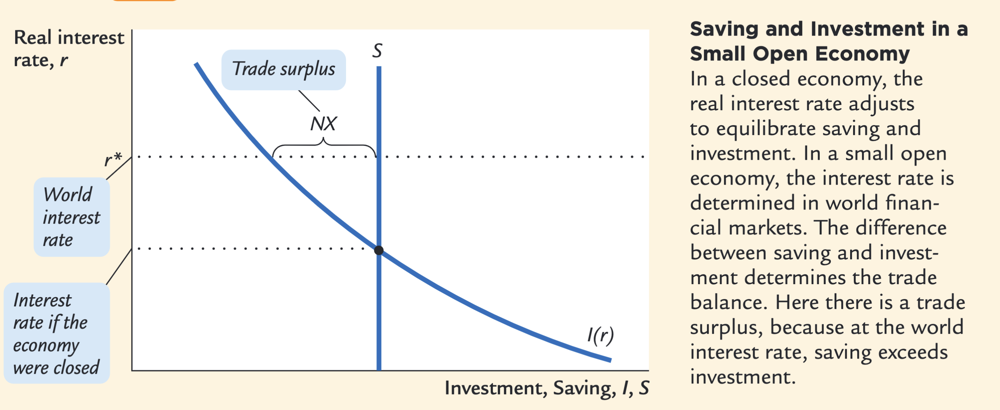
			- 政策对贸易的影响
				- Fiscal Policy at Home：国内政府进行扩张的财政，比如加大政府采购或者**只**进行减税。那么S变少，投资不变，NX下降
				  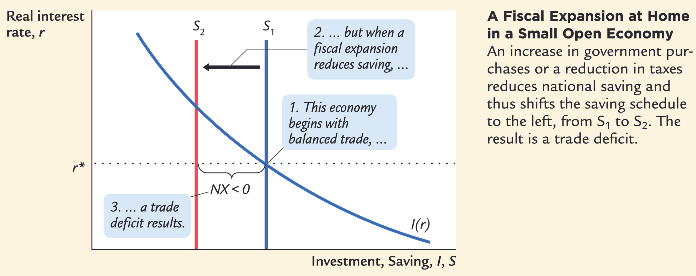
					- 只减税会增大C，所以会减少Y-C-G。
					- 多余的货物通过进口得来，容易理解
				- Fiscal Policy Abroad：如果外国进行扩张的财政，并且足以影响到国际利率。扩张的财政会导致利率上升，投资下降，从而NX上升
				  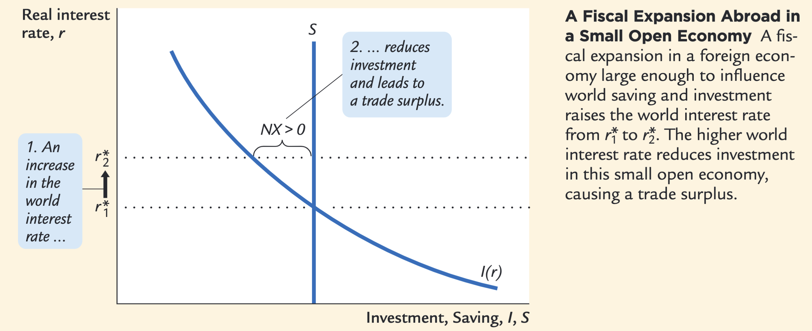
					- 扩张的财政会导致储蓄下降，而投资和储蓄本质是供需关系，所以这回导致利率上升
				- Shifts  in  Investment  Demand：如果国内鼓励投资，那么在相同Saving下，投资会变得更多，这样会NX下降
				  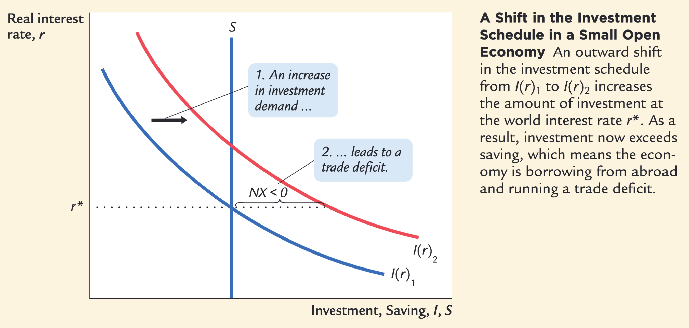
		- Exchange rate
		  collapsed:: true
			- 汇率的定义
				- 名义汇率：就是兑的钱，下述说汇率代表一美元兑的其它货币数量
				- 实际汇率：其包含对实际物品价格的修正
					- 定义
					  $$\text{Real Exchange Rate} = \frac{\text{Nominal Exchange Rate}\times \text{Price of Domestic Good}}{\text{Price of Foreign Good}}$$
					- 我们将Price的比进行缩写，可以得到
					  {:height 149, :width 463}
					- 例子
						- 1美元兑80日元
						- 美国同样的车卖1dollar，日本卖160yen
						- 此时实际汇率就是
						  $$\epsilon = \frac{80*1}{160} =0.5$$
			- 实际汇率对贸易的影响
			  collapsed:: true
				- 当实际汇率较高，那么意味着在国外买东西要更便宜，这时候净出口下降
				- 反之净出口会上升
				- 即净出口和实际汇率有关
				  $$NX = NX(\epsilon)$$
				- 而实际汇率和$S-I$ 相等，则我们可以得到，即汇率由$S-I$决定
				  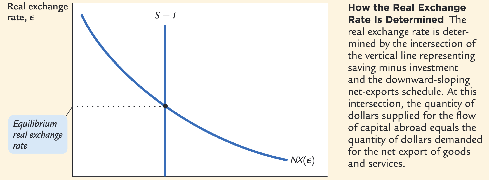
			- 实际汇率的影响因子
			  collapsed:: true
				- 货币政策
				  collapsed:: true
					- Fiscal  Policy  at  Home：我们可以复制上述讨论结论，扩张的国内政策会导致净出口下降
					  
					- Fiscal Policy Abroad：同理国外扩张的货币政策会导致净出口的上升
					  
					- Shifts  in  Investment  Demand：鼓励投资会导致净出口下降
					  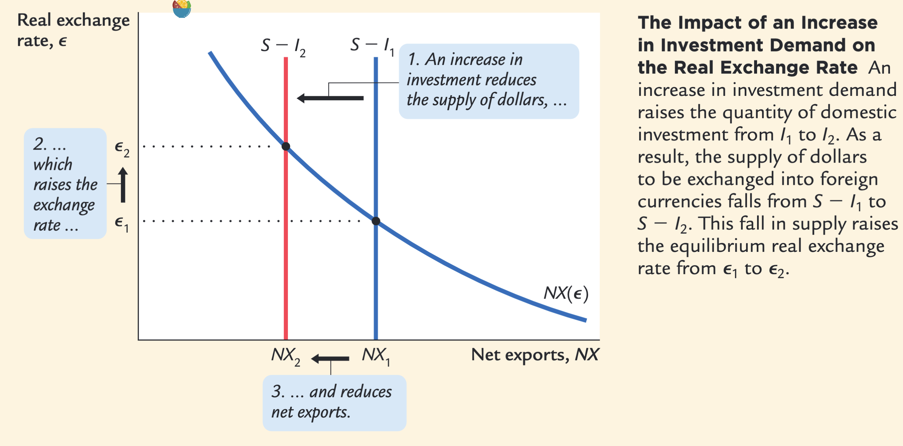
				- 贸易保护政策的影响
				  collapsed:: true
					- 假设存在一个贸易保护政策，比如加税或者禁止进口
					- 由于该政策不影响S和I，NX不变
					- 而由于增加了进口的门槛，所以此时实际利率应该更高
					  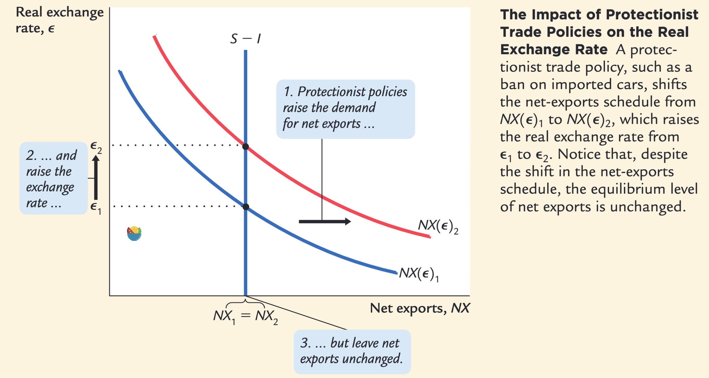
					- 所以结论是贸易保护主义无用，但这个是建立在Y不变的情况下，贸易保护主义可以培育本国产业
				-
				-
			- The Determinants of the Nominal Exchange Rate
			  collapsed:: true
				- 对上述等式求导，我们看得到
				  $$e = \epsilon \times P^*/P \\ \text{Change in e} = \text{Change in e} + \text{Change in P*} - \text{Change in P}$$
				- 而通胀率影响价格，所以我们可以得到
				  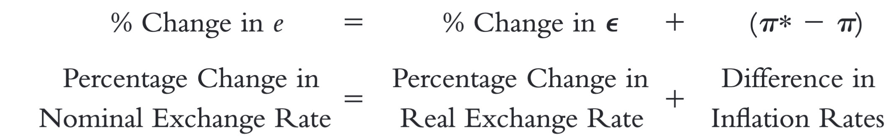
				-
		- The Special Case of Purchasing-Power Parity：购买力平价
			- 有一个理论认为，上述的价格比例总倾向为1。即实际汇率总倾向于和名义汇率相等。因为当它们不等时，说明有寻利空间，总结国际资本通过进口出口抹平这个差距。
			- 当时这忽略了实际贸易保护等实际因素，当时趋势是对的
	- The Large Open Economy
		- 大经济体和小经济体的核心区别在于，大经济体会影响到国际利率，而且大经济体国内利率和国际利率不一定相等
			- 原因1：大经济体会影响国际的saving和投资，从而影响国际利率
			- 原因2：实际并不存在完美的自由市场，资本的流动是有代价的，且存在信息差
		- 在一个封闭的经济体中，利率受储蓄和投资的影响；而在开放的经济体中，低利率会促使资本流向国外。
		  collapsed:: true
		  $$CF = CF(r)$$
			- 图示意为
			  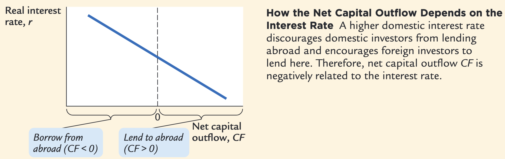
			- 和小经济体和封闭经济体对比。小经济体中，资本可以自由进出
			  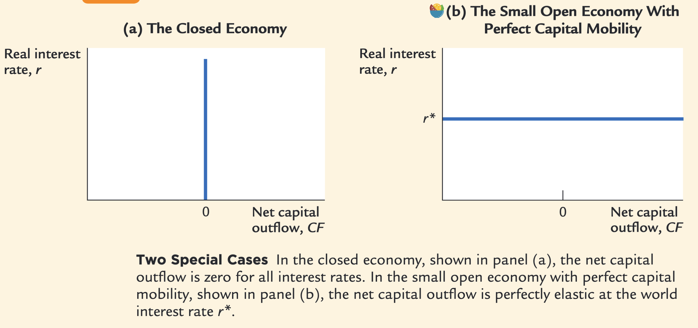
			-
		- 建模
			- The  Market  for  Loanable  Funds
				- 首先一个经济体的储蓄会流向投资和国外:
				  $$S = I + CF$$
				- 由于S不变，我们可以得到
				  $$\overline S = I(r) + CF(r)$$
					- 根据上述公式，可得图
					  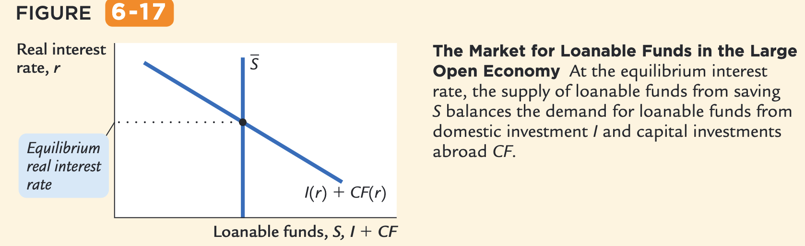
			- The  Market  for  Foreign  Exchange
				- 首先根据之前的推导
				  $$NX = S-I$$
				- 由于出口本质上是资本的流动，所以可得
				  $$NX(\epsilon) = CF$$
					- 图示为
					  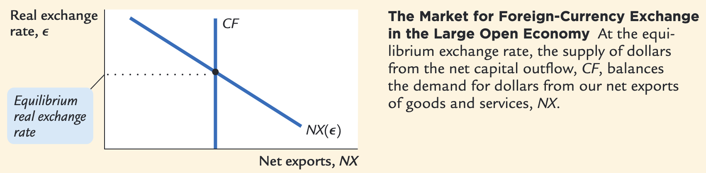
			- 根据上述建模我们可以得到
			  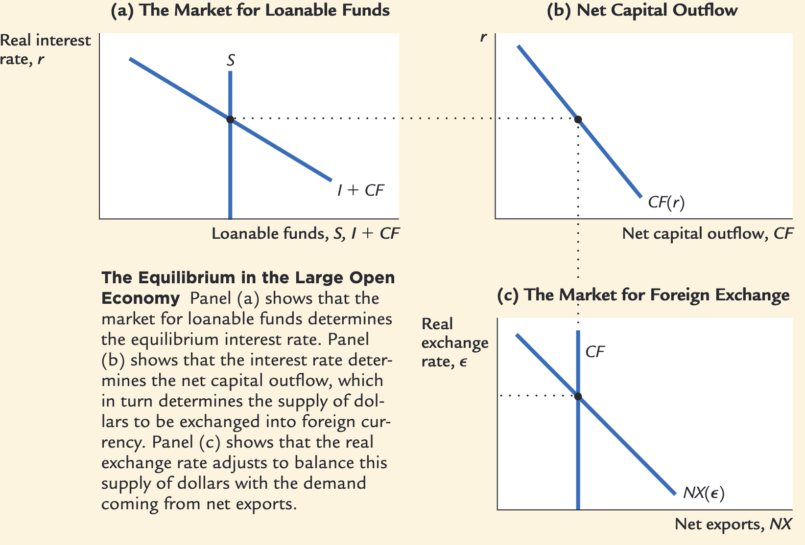
		- 政策的影响
			- 国内金融政策：扩张的金融政策会减少S，从而增加利率和CF，减少出口，使汇率上升
			  
				- 换个角度，减少CF，会造成美元供给变少，造成汇率上升
			- Shifts in Investment Demand：投资增加导致利率上升，同样会减少出口，使汇率上升
			  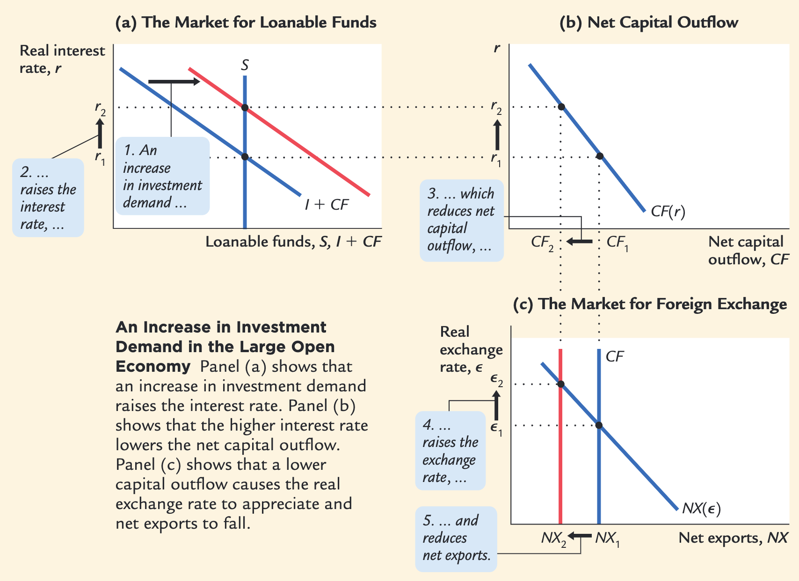
			- Trade  Policies：贸易保护导致汇率上升
			  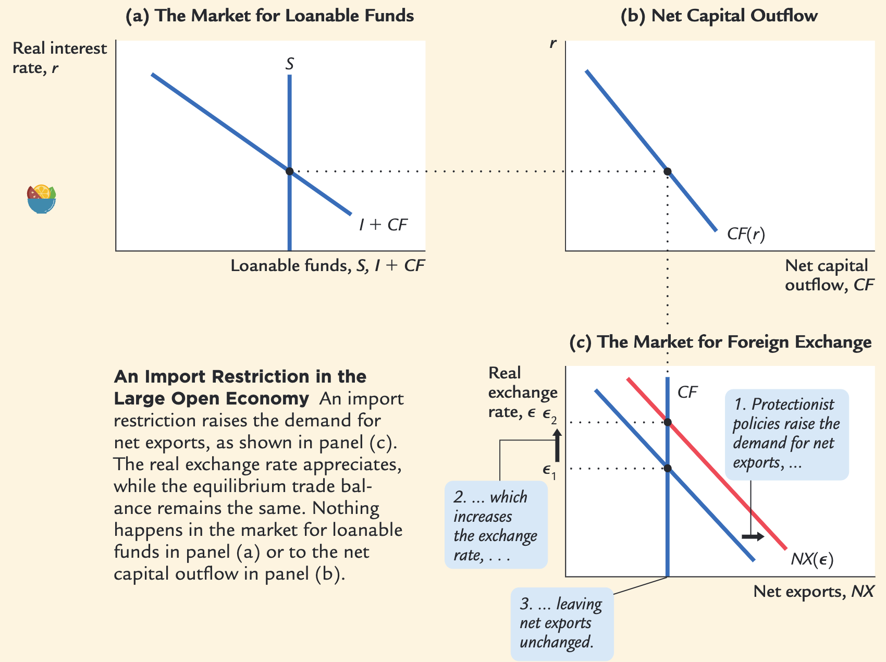
			- Shifts  in  Net  Capital  Outflow：CF的减少会导致利率下降，汇率上升
			  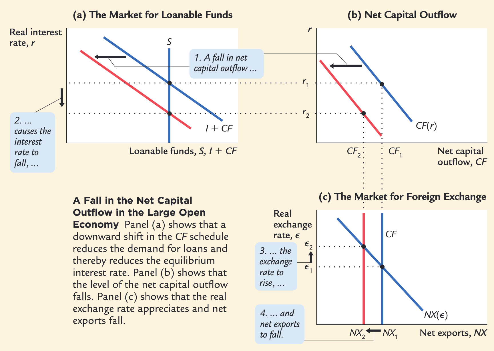
				- 造成CF变化的原因有很多，比如政府动荡导致资本撤出，或者一些金融政策鼓励
- Unemployment and the Labor Market