public:: true

- storage
  collapsed:: true
	- storage 的概念和 relation概念的映射关系 
	  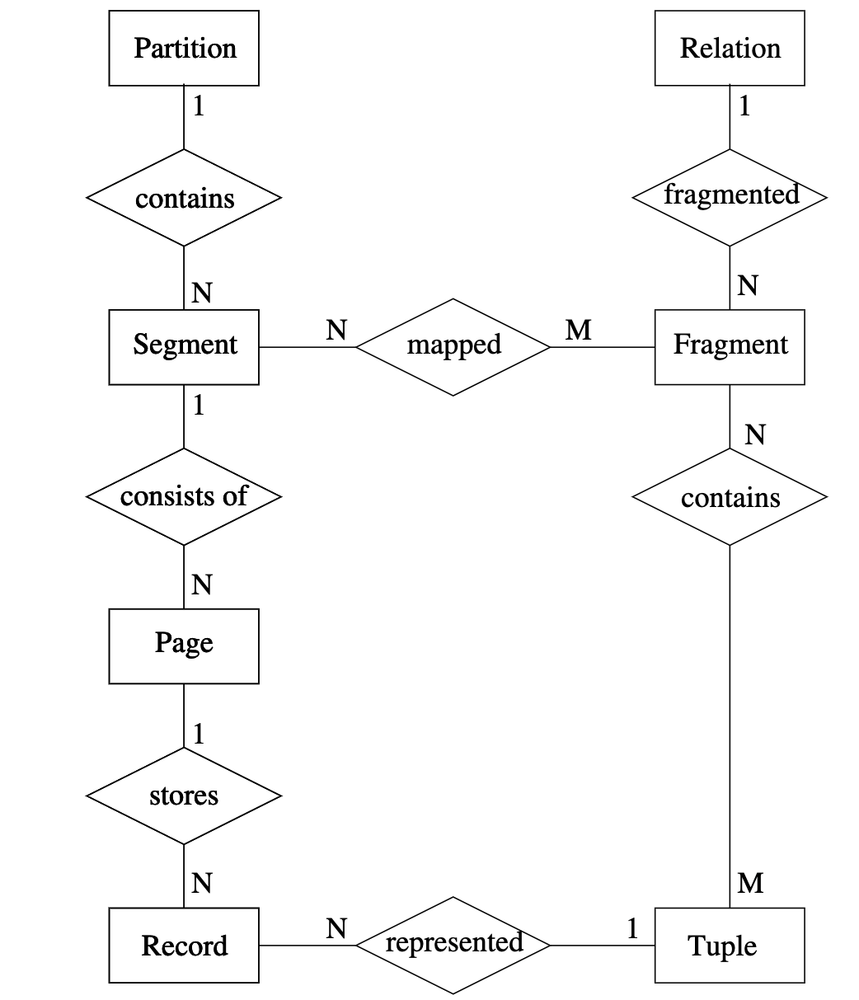
	- slot page
	   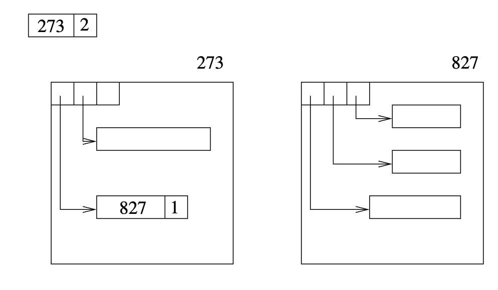
- Access Path（building block：指query plan中的叶子节点，它们往往是access path）
  collapsed:: true
	- Simple Scan：扫全表数据
	- Scan and Attribute Access
	  collapsed:: true
		- storage中存储的数据可能不是原格式，所以我们需要map，当遇到谓词时
		   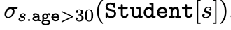
		- 考虑到如果会被多个谓词使用，我们可能希望只extract一次
			- 我们需要一个map算子，将对应数据提取并concat到tuple末尾 
			  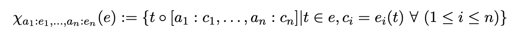
			- 这样我们可以得到新的谓词
			   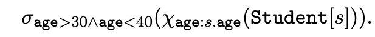
			- 一般来说，我们希望尽量延迟加载数据。最迟的时间点树pipeline breaker前？
			   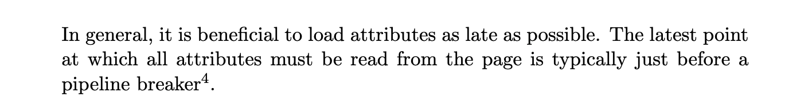
				- 有点类似谓词下推（上面比下面的执行计划要更好
				  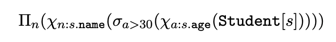 
				   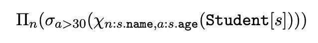
		- 有时候，数据库可以实现算子来直接对storage中的格式进行计算（比如按位比较）
		- 如果谓词能直接以存储格式进行比较，我们将其称为SARGable predicates
			- 如果能用index，则称为index sargable
			- 如果不能，则是data sargable
		- 我们可以进一步拓展scan，使得在scan的时候就可以做筛选
			- 比如筛选表I，中满足p的数据v
			   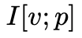
	- 临时表
	  collapsed:: true
		- 如果一个表需要重复使用，可以将其物化
	- Table function：一个函数，可以返回一个relation
	  collapsed:: true
		- Primes(1, 100)返回1到100之间的质数
		   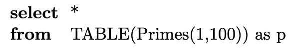
	- 索引
	  collapsed:: true
		- 索引类型
		- B+树/hash index
		- 聚簇，非聚簇 
		  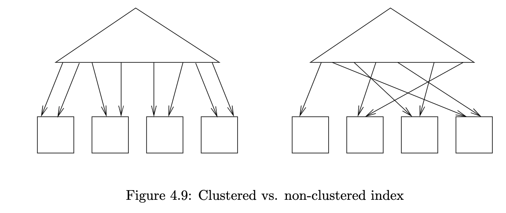
	- 单索引的access path
	  collapsed:: true
		- dependent join的书写格式
			- 下述符号中，<>是一个执行的子查询，这个查询需要接收外部的输入作为参数，比如：
			  $$T_1 \Join_{a_1=a_2} T_2 \rightarrow T1_{a_1}<(T2(a_1 = a_2))>$$
		- 单个键，无数据，value是TID
			- 我们需要筛选出数据的TID，然后提取对应数据
				- 比如 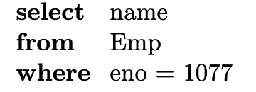
				- 我们可以使用Map函数
				   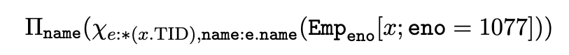
				- 也可以使用**dependent join**（<> 内的内容时dependent的部分，其依赖于外面的算子） 
				  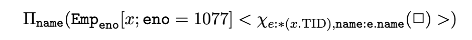
				- 对于非聚簇索引，我们需要对TID排序以保证顺序读取 
				  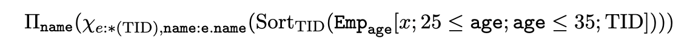
				- 如果我们需要读取的数据有序的，那么对TID排序会破坏这种有序性。所以我们需要再次排序
				   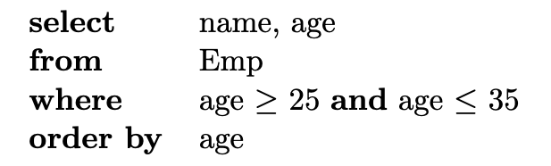
					- 如果引入一个密集的rank，会使得排序函数更快（比如直接桶排序）
					   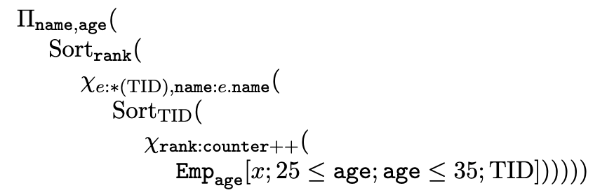
			- 如果我们只需要index的key，不需要访问relation，那么我们将其称为index only query
			- 对于条件，一些条件不是index sargable（我们称为residual predicate）。对于index sargable的我们往往可以确定其边界，有助于快速扫描
				- 比如下述语句age != 30 就不是index sargable
				   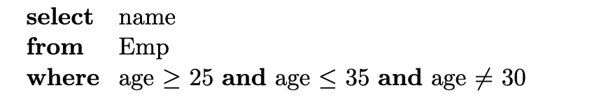
				- 在index 扫描中，我们可以确定边界（比如对上述语句的边界上[25, 35]）
					- 对于一些开边界，我们可以将其转为 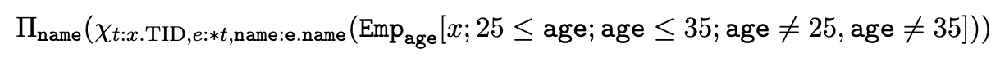
					- 更具体的，对于一个有效的index scan 
					  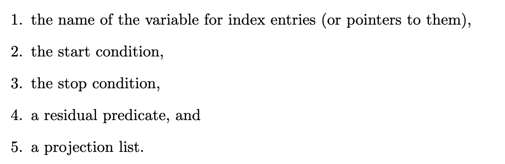
						- 为了表示这些符号，我们使用[]包括它们，并且用；分隔
						- 如果不存在条件的话，可以省略
						- 我们使用*表示project全部tuple
						- 例子：select *, name from emp 
				- 对于一些稠密的判断谓词，我们可以改写条件
					- 比如
					   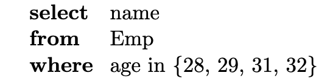
						- 我们可以总结，上下界为28，32。且很多residual predicate 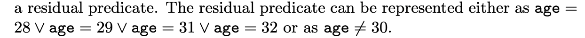
				- 对于一些稀疏的判断谓词，我们可以将其转弯d-join
					- 比如 
					  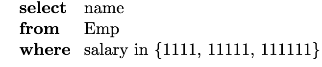
					- 其可以转为
					   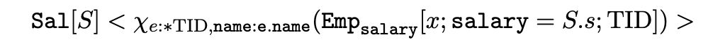
					- 对于上述多个区间的情况，B-tree 会实现gap skipping
						- 当我们进入到一个新的range的时候，避免全局扫描
							- 实现方案1：只比较下一个页的最大值
							- 实现方案2：回退到父节点
		- complex key index，value可以是部分数据
		  collapsed:: true
			- value数据越多，index only scan越多，但是写的代价越大
			- 对于complex key的谓词
				- 对于一个包含前缀谓词的条件
					- 如果全部都是equal 谓词，那么upper bound和lower bound很明确
					- 如果存在一个range 谓词
					  collapsed:: true
						- 比如
						   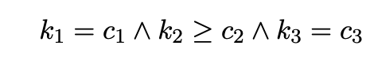
							- 它的lower bound（start condition）
							   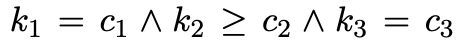
							- 它的upper bound（end condition），是（当k1=c1时，k2也是递增排列，所以可以一直到k1=c1的尾部） 
							  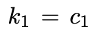
							- 它的residual condition上（k2 >= c2的区间内，k3的分布没有规律） 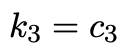
					- 比如
					   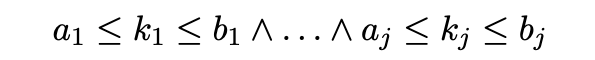
						- 那么它们的上下界就是每个谓词的上下界
						- 如果有一个key缺失上/下界，那么其后的那些key对于上/下界就没有帮助
				- 对于不包含前缀谓词的条件，如果这个前缀谓词有比较多的重复元素
					- 比如，index <male，hair color，height>对于谓`haircolor='blond'` and `height between 170 and 180`，我们没有办法直接确定谓词。但是我们可以转为 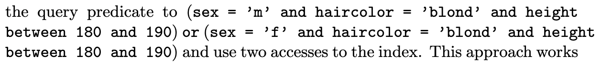
					- 如果缺失的key的domain比较少，我们使用gap skipping做这种改写可以非常有效
	- 多个索引的access path
	  collapsed:: true
		- 对于多个索引，我们可以将多个索引的结果做集合运算 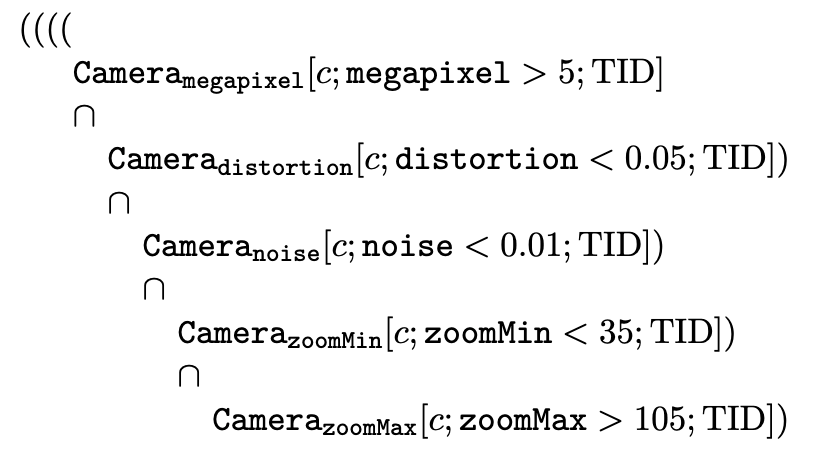
			- and：交
			- or：并
			- 对于不等的谓词，我们可以使用集合差
				- 比如
				   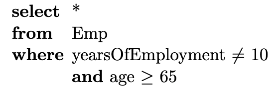​​​​​​​​​​​​​​​​​​​​​​​​​​​​​​​​​​​​​​​​​​​​​​​​​​​​​​​​​​​​​​​​​​​​​​​​​
			- 如果一个谓词的筛选率比较高，我们也可以取反，然后再用集合差
				- 比如
				   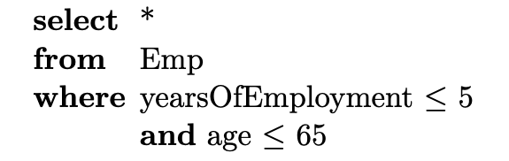
				- 如果>65的筛选率更高，我们可以将交集转为 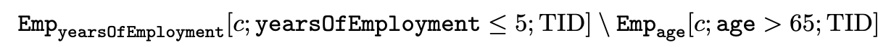
		- 在更复杂的情况下，扫描所有的索引不一定是最优的
			- 如果下一次的扫描的代价，已经大于先根据TIDs取当前的数据再做筛选。（只针对and谓词）
			- 我们需要先筛选筛选率高的数据
				- 筛选率越高越先
				- access数据的代价越高越先
				- 如果我们发现直接取数据的代价 小于 index scanning + intersecting。那么便放弃index scanning
	- index 和 join
	  collapsed:: true
		- index accessing可以被表示为一个join
			- 比如对于一个index access
			   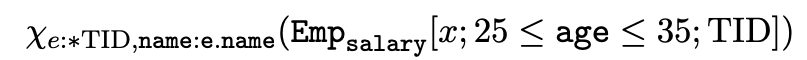{:height 50, :width 595}
			- 我们可以使用dependent join
			   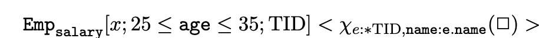{:height 47, :width 553}
			- 也可以直接join（比较低效）
			   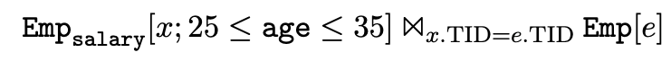{:height 54, :width 586}
			- 该方法尽管优雅，但是会造成搜索空间的指数级膨胀
		- 为了简化描述，我们做一些记号
			- 首先对于上述d-join
			   {:height 43, :width 501}
				- 我们将读索引记作$Emp_{salary}[x; x \leq age \geq 35; TID] \Rightarrow E_i$
				- 将<>号内的子查询记作$<\Chi e:*TID, name:e.name(\square)> \Rightarrow E_a$
				- 这样我们就可以简写上述符号$E_i<E_a>$
				  id:: 63232538-28a0-4ec8-87c5-73eb1f5b4bcc
		- 涉及到两个index的join
			- 假设语句为
			  ```sql
			  select *
			  from Emp e, Dept d
			  where e.name = 'Maier' and e.dno = d.dno
			  ```
			  我们可以转为执行计划
			  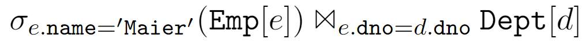{:height 43, :width 493}
			  
			  根据上述的规则我们可以转为d-join并记为：
			  $$Emp_{name}[x;name='Maier']<X_{t:*x.tid}><Dept_{dno}[y;y.dno=dno;dTID]><X_{u:*dTID}>\Rightarrow  E_i<E_a><D_i><D_a>$$
			- 以上述执行计划为例
				- 将$E_i$ 的结果按TID排序，可以避免随机IO
				- 将$E_i<E_a>$的结果按照dno排序
				  id:: 63241d6c-718d-4e3a-ae24-b7502b366a7f
					- 对于多个重复的dno可以去重
					- 如果Dept.dno 是聚簇索引，我们可以通过排序避免随机IO
					- 如果物化$D_i$的，有序的dno（或者是grouping 后的dno）可以使得物化视图只需要保存一条数据
						- 在$E_a$ 中，每个职员都唯一的映射到一个department
						- 多个职员可以属于同一个department
						- 如果dno是有序的（grouping）的，那么如果我们取得一个dno后，它之后就不会再被需要了
						- 这样我们便可以改写上述的$D_i$
							- 首先是根据dno，在department中的索引中访问唯一的TID
							   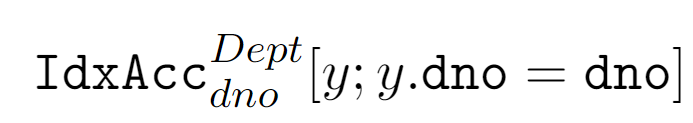{:height 72, :width 380}
							- 如果内部执行的结果是一个物化视图
							   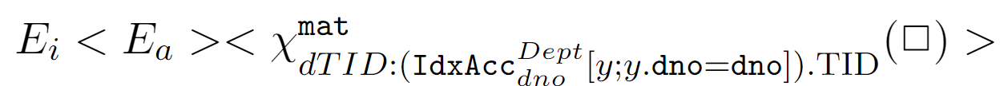{:height 59, :width 561}
								- 为什么要缓存？
							- 如果我们假设dno是已经排序的，那么我们只需要缓存一个就行
							   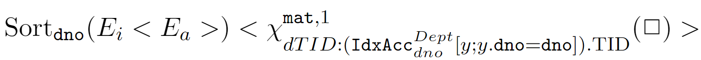{:height 95, :width 541}
							-
				- 将$E_i<E_a><D_i>$ 按照dTID排序，这和优化1效果相同
			- 优化措施总结
				- 将访问索引得到的TID排序，这样可以将随机IO转为随机IO
				- 将d-join的外部得到的数据排序（grouping），我们可以避免访问数据两次
				- [[Executing Nested Queries]] 待看
			-
			-
			-
- Counting the Number of Accesses
	- 一些基本记号如图：
	  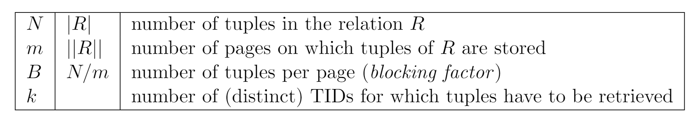
		- 如果$k > N-M$，或者m=1，那么需要访问全部page
		- 如果$k = 1$，那肯定只需要访问一页
	- 问题定义
		- 假设我们需要访问k个tuple（item），那么我们可能需要访问多少个page（bucket），具体的可以分为两种情况：
			- k distinct items
			- k non-distinct items
		- 访问模型，我们采用随机模型
			- **随机访问：给定一个TID，那么我们能直接访问对应的page**
			- 顺序访问：给定一个TID，那么我们需要顺序搜索
	- 问题建模
		- m个 bucket，每个含 n 个 item，共有$N = n*m$ 个items
		  随机访问k个item 需要的bucket数为$y_{n}^{N,m}(k)$
			- 推论1
			  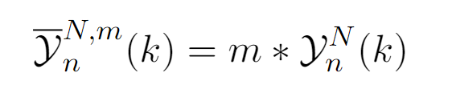{:height 50, :width 212}
				- 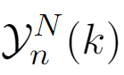{:height 43, :width 58}
				  指每页包含被访问的元素的概率
			- 推论2
			  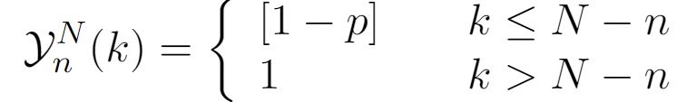{:height 57, :width 328}
				- p是一个bucket不包括这k个item中的一个元素，也就是这个bucket不被访问的概率
			- 推论3
			  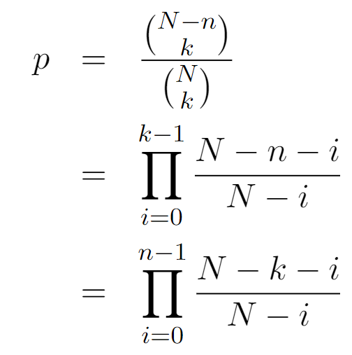{:height 222, :width 216}
				- 从N个元素选出k个item的可能是$N \choose k$
-