- 代价计算：profile+operator
- profile
	- 分类
		- 物理：page数量
		- 逻辑：cardinality（一个完整的logical profile是每个属性的子集的size）
			- 属性依赖：如果两个attribute 在各个值上的size相同，就可以说它们是依赖的
			- 数据类型
				- 类别：颜色
				- 离散：正整数，**字符串** （只有activate domain）
				- 连续：**浮点数 **（只有activate domain）
- 基本操作
  collapsed:: true
	- 构建 
	  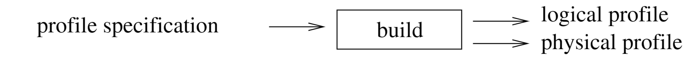
	- 更新
		- 全量更新
		- 增量更新
	- 推导/传播：即计算一个表达式结果的profile 
	  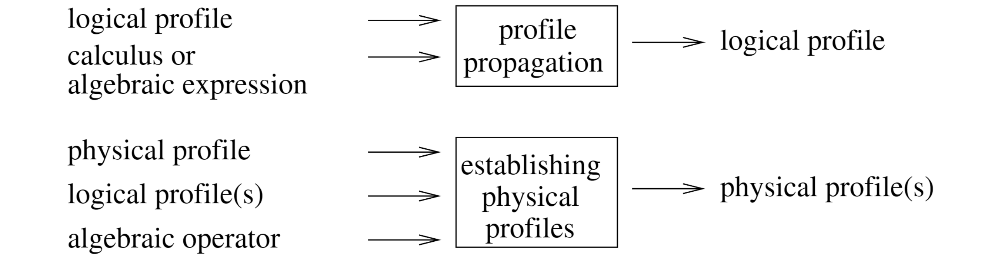
	- 计算
	   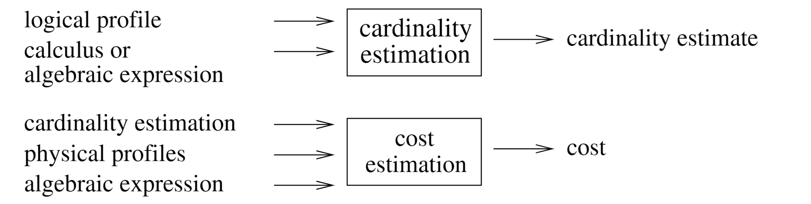
- A First Approach
  collapsed:: true
	- Abbreviations
	   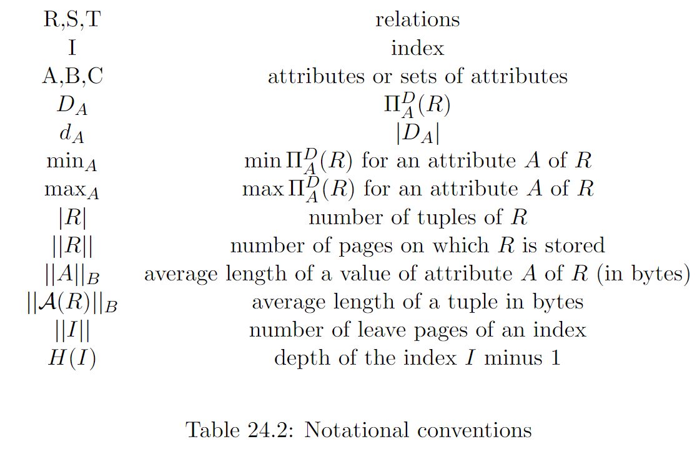
	- CPU cost
		- RSI：the number of calls to the tuple oriented interface
			- 即在volcano模型中，next调用次数
		- 缺点：函数代价并不是固定的
			- 有些函数的代价依赖输入：字符串比较
			- 有些是用户自定义函数
	- I/O cost
		- 在面向磁盘的数据库中，I/O就是页的数量
		- 对于不同的access path（​​​​     记为满足条件p的tuple的比例fraction）
			- 聚簇索引  / 所有含有满足条件的tuple的页都能装入内存
			   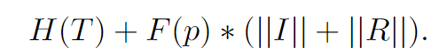{:height 46, :width 320}
			- 非聚簇索引 （存在BPM的置换）
			   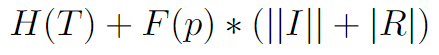{:height 40, :width 272}
		- 对于不同的join的代价
			- nest loop join
			  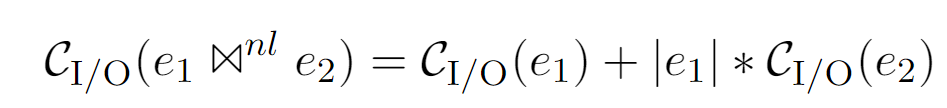{:height 54, :width 400}
			- Sort merge join
				- sort cost（有点奇怪，不是log n吗）
				  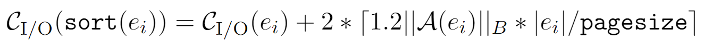
				- merge cost：如果在内存可以忽略
	- Cardinality Estimates：基于selectivity
		- selectivity定义
			- filter
			   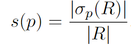{:height 60, :width 140}
			- join
			   {:height 51, :width 200}
			- 基于均匀假设的基本估计公式 
			  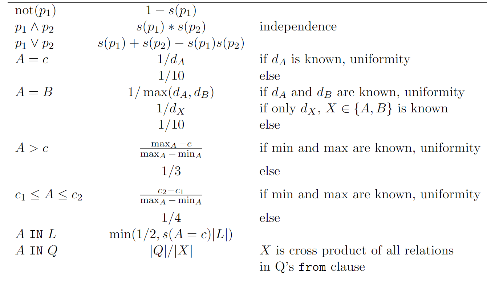
	- 模型的缺点
		- CPU计算很粗糙，没有考虑并行
		- 不包括projection和semijoin算子
		- profile propagation没有讨论
- Logical Profile
	- 完备性
	  collapsed:: true
		- **cardinality estimate**
		- **profile propagation**
	- 基本概念
	  collapsed:: true
		- 下界
		   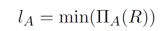{:height 42, :width 198}
		- 上界
		   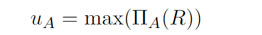{:height 43, :width 260}
		- **cumulated frequency**：tuple的数量（为什么不是势，感觉针对的是bag而不是set）
		   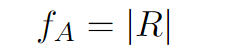{:height 38, :width 149}
		- distinct value：这里的含义是distinct value的数量
		   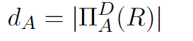{:height 44, :width 170}
	- 假设
	  collapsed:: true
		- 均匀分布
			- uniform distribute assumption：每个值出现的频率相同
			- uniform spread assumption(equal spread assumption)：每个值出现的位置分布是均匀的
				- 这里存在一个特例，continous-value assumption，即每个值都出现n/f次，不存在空洞，由于其更简单，所以更倾向这个估计
		- attribute独立
		   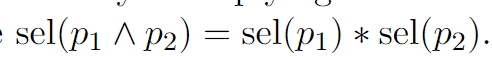{:height 49, :width 358}
	- Propagation
		- 问题描述
		  collapsed:: true
			- 表R 和 attribute
			   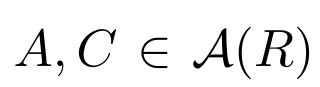{:height 46, :width 138}
			- 给定每个attribute的logical profile
			  $$bc = [l_c, u_c, f_c, d_c]$$
			  $$ba = [l_a, u_a, f_a, d_a]$$
			-
			- 针对每个一个操作符，计算其输出的profile
			  $$bc‘ = [l_c‘, u_c‘, f_c‘, d_c‘]$$
			  $$ba’ = [l_a’, u_a’, f_a’, d_a’]$$
		- 基本operator
			- filter（针对是同一张表）
			  collapsed:: true
				- exact match ​​​​​​​​​​​​​​​​$\sigma_{A=c}$
				  collapsed:: true
					- 属性A
						- l，u：上界下界 为c
						- distinct value：我们假设条件总等满足，所以d为1（因为总是返回0的估计没有意义）
						   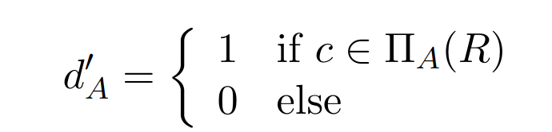{:height 94, :width 376}
						- 累计次数满足均匀分布且CSA（对于是key的attribute，为1）
						   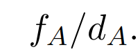{:height 58, :width 132}
					- 属性C
						- 由于没有足够信息，假设上下界不变
						   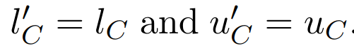{:height 44, :width 267}
						- 对于d（1-每个value不会出现的概率）* value的个数
						   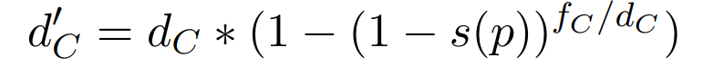{:height 37, :width 328}
							- s(p) 对应的是每个tuple被选中的概率 
							  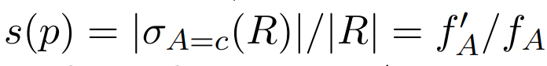{:height 52, :width 367}
							- 对于C的每个value，出现的频率为fc/dc
							- 所以value没有被选中的概率是者$\frac{fc}{dc}$次都没有被选中的概率
							  $$(1-s(p))^{\frac{fc}{dc}}$$
						- fc和fa相同 
						  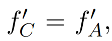{:height 57, :width 136}
				- range query $c1 \leq A \leq c2, l_A \leq c1 \leq c2 \leq u_A$
				  collapsed:: true
					- 属性A
						- 对于上下界我们可以直接得到
						  $$l_A = c1, u_A = c2$$
						- 对于f和d我们也可以直接利用CSA假设计算
						  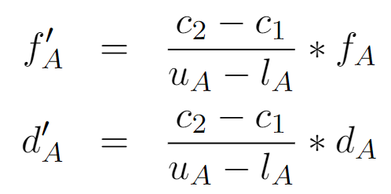{:height 128, :width 244}
					- 属性C
						- 对于c而言，我们的推导方式和上述方案一样
						- 上下界不变，f相同
						- 对于d的估计使用s(p)
						  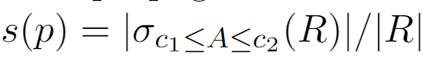{:height 51, :width 297}
				- Equality-based correlation $A = B$
					- 基本假设
						- 对于$[l_A, u_A], [l_B, u_B]$
							- 如果两个没有交集，则为空
							- 如果两个不相等，我们可以将其规范为相等的。则我们可以得到
							  $$l_A,l_B = max(l_A, l_B)$$
							  $$u_A,u_B = min(u_A, u_B)$$
							- 则经过filter 之后，上下界不变
						- 对于f
							- 由于$A,B \in \mathcal{A}(R)$，所以可得$f_A = f_B$，记为$f$
						- 对于d
							- A和B有相同的domain，假设这个domain内可能的元素个数为$n$，取值区间可以表示为$\{x_1,...,x_n\}$
							- 如果存在一个元素，$x \in [l_A, u_A], x \notin \Pi(R)$。则表示x是一个空洞
							- 则对于x，其在表R中A的概率是
							  $$p(x\in A) = \frac{n-1 \choose d_{A}-1}{n \choose d_A}=\frac{d_A}{n}$$
					- profile 传递
						- 上下界不变
						- 对于f，我们可以通过计算所有元素既在A又在B中的概率期望得到，注意每个元素不一定只出现一次
						  $$f_A^{\prime}=f_B^{\prime}=\sum_{i=1}^n \overline{f_A} p\left(x_i=A\right) p\left(x_i=B \mid x_i=A\right)$$
							- $\overline{f_A}$表示每个value对应的tuple数量$\frac{f}{d_A}$
							- 所以我们可以计算得到（当独立时$p(x_i = B | x_i = A) = p(x_i = B)$）
							  $$f_A^{\prime}=f_B^{\prime}=\sum_{i=1}^n \frac{f}{d_A} \frac{d_A}{n} \frac{1}{d_B}=f / d_B$$
							- 上述情况是$\Pi_B(R) \subseteq \Pi_A(R)$。结合$\Pi_A(R) \subseteq \Pi_B(R)$我们可以得到
							  $$f_A^{\prime}=f_B^{\prime}=\frac{f}{\max \left(d_A, d_B\right)}$$
							- 如果上述条件都不成立，但是A和B是独立的。那么我们可以推得
							  $$p(x_i \in B | x_i \in A) = p(x_i \in B) = \frac{1}{n}$$
							  $$f_A^{\prime}=f_B^{\prime}=\sum_{i=1}^n \frac{f}{d_A} \frac{d_A}{n} \frac{1}{n}=\frac{f}{n}$$
						- 对于d
							- 如果$\Pi_B(R) \subseteq \Pi_A(R)$或$\Pi_A(R) \subseteq \Pi_B(R)$成立，（System R中的估计，误差比较大）
							  则
							  $$d_A^\prime = d_B^\prime = min(d_A, d_B)$$
							- 如果上述条件不成立，且A和B是独立且均匀分布，那么我 们可以用 [[qc-Access Path]]内的推导
								- 对于$n*n$个可能的元素，我们选|R|个元素，其中distinct 的元素个数是
								  $$\mathcal{D}(n*n, |R|)$$
								- 由于实际只有n个元素满足相等的条件，所以每个元素出现的概率还要除以n
								  $$d_A^\prime = d_B^\prime = \frac{\mathcal{D}(n*n, f_A)}{n}$$
							- 用上述方法我们也可以做更精确的估计，如果$\Pi_B(R) \subseteq \Pi_A(R)$或$\Pi_A(R) \subseteq \Pi_B(R)$成立
							  $$d_A^\prime = d_B^\prime = \frac{\mathcal{D}(n*n, f_A)}{max(d_A, d_B)}$$
							- 当然如果我们无法得到domain size，比如对于一个连续区间，我们需要换一种估计
								- 即我们将每个value想象为一个bucket，里面的item看为tuple。那没问题可以变为：bucket的大小为$\frac{f_A}{d_A}$，总的大小为$f_A$，取$f^\prime$ 个元素，所涉及到的bucket的个数
								  $$d_A^\prime = d_B^\prime = d_A*\mathcal{Y}_{f_A}^{f_A/d_A}(f^\prime_A)$$
								- 也可以用类似的估计
								  $$d_A^\prime = d_B^\prime = d_A*(1-(1-\frac{f_A^\prime}{f_A})^{f_A/ d_A})$$
							-
				- Inequality-based correlation
				  collapsed:: true
					- 这里以$\sigma_{A \leq B}(R)$为例，为了简化问题，假设$l_A = l_B, u_A = u_B$（当不满足假设也可以通过计算分布变得满足）
						- 上下界同样保持不变
						- 对于f
							- 这里我们保持假设uniform spread assumption，假设每个值的间隔为
							  $$\Delta_A = \frac{u_A - l_A}{d_A - 1 }$$
							  则，对于第i个值可以得到
							  $$x_i = l_A + (i-1)\Delta_A$$
							- 则可以得到公式
							  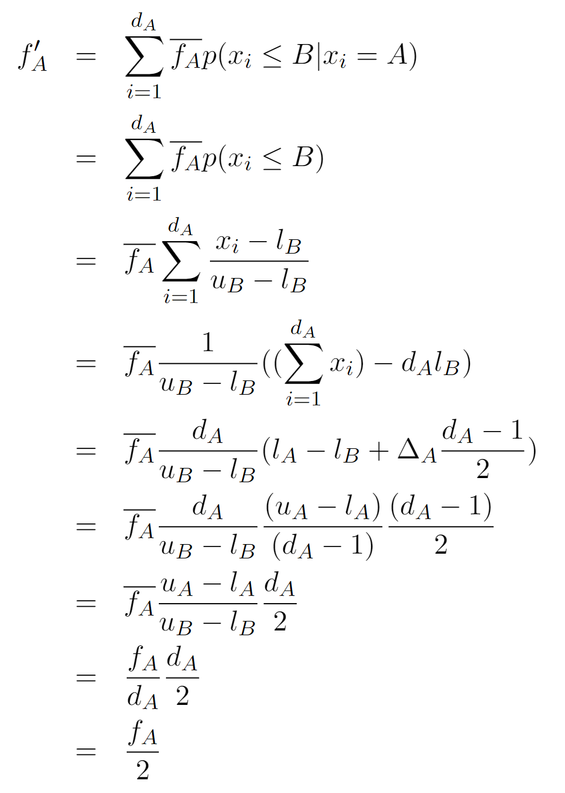{:height 556, :width 393}
								- 我们需要计算每个值满足上述条件的期望，其中概率包括上个部分
									- 该值在A中的概率$\overline{f_A} = \frac{f_A}{d_A}$
									- 该值小于B的概率，即[x_i,u_B]这个区间的古典的概率。
									- 上述公式感觉有点问题，但是结论没有问题
								-
						- 对于d
							- d的推导如图上步
								- 如果我们能估计出总的domain size，拿问题便成了从对应的domain size中取得$f_A^\prime$ 的元素的distinct value值
								  $$d_A^\prime = \frac{\mathcal{D}(n*n, f_A)}{n*n/2}$$
								- 如果无法估计，还可以转换为取n个元素会涉及多少个桶的问题
								  $$d_A^\prime = d_A*\mathcal{Y}f^{f_A}_{f_A/d_A}(f_A^\prime)$$
									-
				- 结合上述推导，我们可以得到总结（上下界的变化比较简单，略去）
				  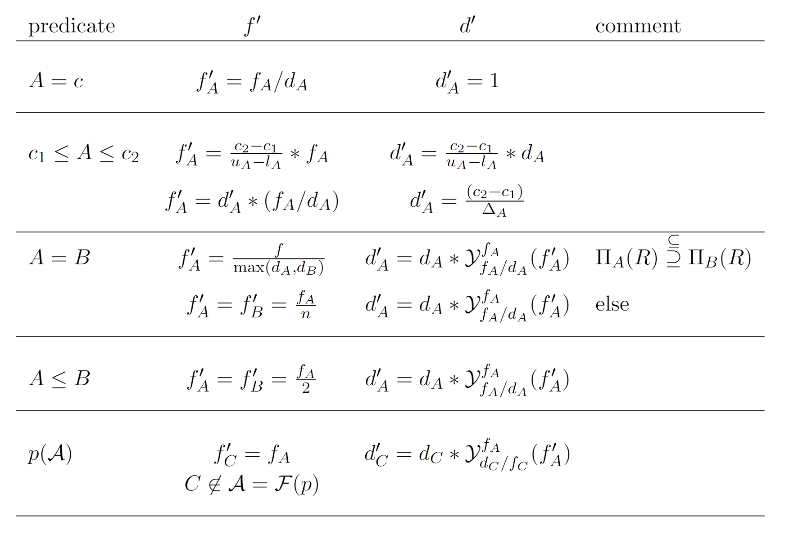
				- 还存在一些其它的条件，可以用类似思想推导得到
				  collapsed:: true
					- 这里给出一些帮助
					  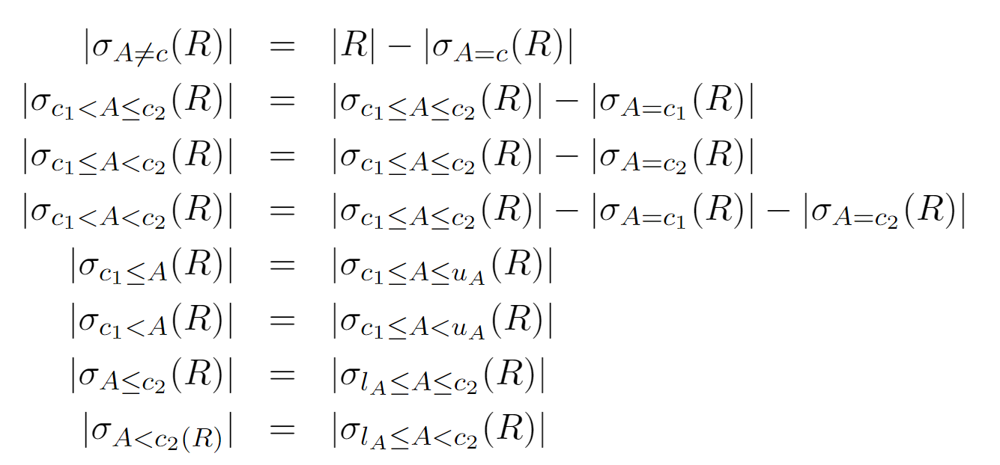
			- Join（针对不同表的条件）
			  collapsed:: true
				- semi-join $semijoin_{A = B}$
				  collapsed:: true
					- 注：semi-join只会返回满足条件的外表tuple，所以在执行的时候会有去重
					- f
						- 计算公式为：每个$x_i$ 的 在A中出现次数*$p(x_i \in A)p(x_i \in B | x_i \in A)$ 期望
						  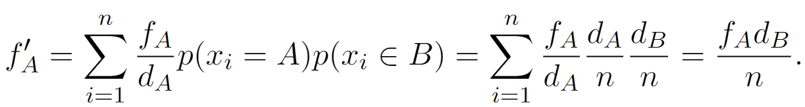
							- 注意当存在$\Pi_B(R) \subseteq \Pi_A(R)$，我们可以将$n$ 换为 $d_A$
							- 反之同理，即此时join 条件永远成立
					- d
						- 对于$d_A$中的每个value，它出现的在B的概率为$\frac{d_B}{n}$，则我们可得 
						  $$d_A^\prime = d_A*p(x_i \in B| x_i \in A) = \frac{d_A*d_B}{n}$$
						- 对于一个独立于A，B的属性C，我们可以使用桶建模的的方式得到
						  $$d_C^\prime = d_C*\mathcal{Y}_{f_C/d_C}^{f_A}(f_A^\prime)$$
						-
				- regular join $\Join_{A = B}$
				  collapsed:: true
					- 和semi-join不同的是，此时不需去重，即返回的是相同元素tuple的笛卡尔积
					- f
						- 由于返回的是笛卡尔积，所以当条件满足时，返回的tuple数是 在A出现的次数*在B出现的次数。由此可得公式
						  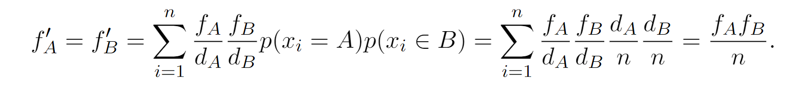
						- semi-join 和 regular join对distinct value没有影响，所以我们可以用上述结论
				- self-join $R \Join_{A=A} R$
				  collapsed:: true
					- 这时候，所有的tuple都可以找到$f_A/d_A$个相同的partner，所以可得
					  $$f_A^\prime  = \frac{f_A*f_A}{d_A}$$
					- d此时不变
					- self join也可以推出一个上界
					  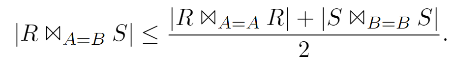{:height 63, :width 429}
					-
				- 对于Join我们总结
				  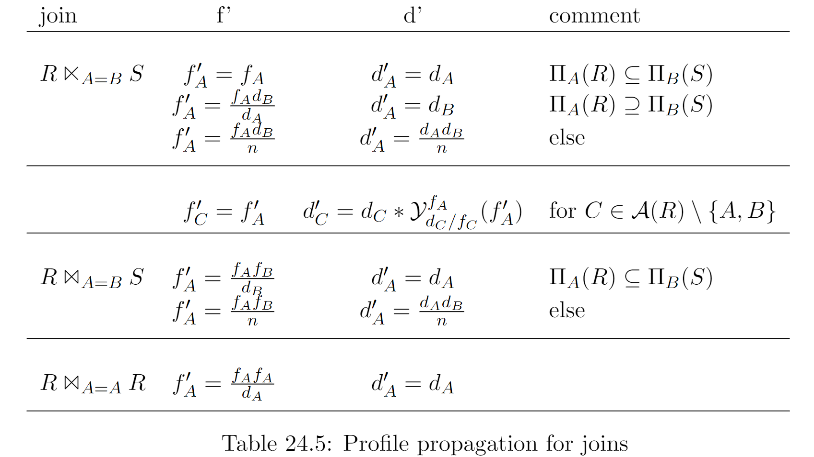
			- duplicate elimination Project
				- 这里主要应用 [[qc-Access Path]]中的$\mathcal{D}$-function
				- f
					- 由于去重，我们可以得到
					  $$f_A^\prime = d_A^\prime = d_A$$
					-