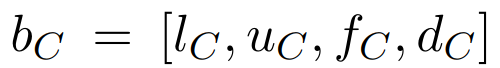
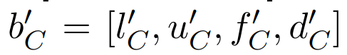

- 代价计算：profile+operator
- profile
	- 分类
		- 物理：page数量
		- 逻辑：cardinality（一个完整的logical profile是每个属性的子集的size）
			- 属性依赖：如果两个attribute 在各个值上的size相同，就可以说它们是依赖的
			- 数据类型
				- 类别：颜色
				- 离散：正整数，**字符串** （只有activate domain）
				- 连续：**浮点数 **（只有activate domain）
- 基本操作
	- 构建 
	  
	- 更新
		- 全量更新
		- 增量更新
	- 推导/传播：即计算一个表达式结果的profile 
	  
	- 计算
	   
- A First Approach
	- Abbreviations
	   
	- CPU cost
		- RSI：the number of calls to the tuple oriented interface
			- 即在volcano模型中，next调用次数
		- 缺点：函数代价并不是固定的
			- 有些函数的代价依赖输入：字符串比较
			- 有些是用户自定义函数
	- I/O cost
		- 在面向磁盘的数据库中，I/O就是页的数量
		- 对于不同的access path（​​​​     记为满足条件p的tuple的比例fraction）
			- 聚簇索引  / 所有含有满足条件的tuple的页都能装入内存
			   {:height 49, :width 316}
			- 非聚簇索引 （存在BPM的置换）
			   
		- 对于不同的join的代价
			-
	- Cardinality Estimates：基于selectivity
		- selectivity定义
			- filter 
			- join 
			- 基于均匀假设的基本估计公式 
	- 模型的缺点
		- CPU计算很粗糙，没有考虑并行
		- 不包括projection和semijoin算子
		- profile propagation没有讨论
- Logical Profile
	- 完备性
		- **cardinality estimate**
		- **profile propagation**
	- 基本概念（上界、下界、势、域）
		- 下界 
		- 上界 
		- **cumulated frequency**：tuple的数量（为什么不是势，感觉针对的是bag而不是set） 
		- 域：值得注意的是对于一些实数，我们可以取实际的取值范围作为域 
	- 假设
		- 均匀分布
			- uniform distribute assumption：每个值出现的频率相同
			- uniform spread assumption(equal spread assumption)：每个值出现的位置分布是均匀的
				- 这里存在一个特例，continous-value assumption，即每个值都出现n/f次，不存在空洞，由于其更简单，所以更倾向这个估计
		- attribute独立 
	- Propagation
		- 问题描述
			- 表R 和 attribute 
			- profile 
			- 针对每个一个操作符，得到其输出 
		- 基本operator
			- filter
				- exact match ​​​​​​​​​​​​​​​​
					- A
						- l，u：上界下界 为c
						- domain：我们假设条件总等满足，所以domain为1（因为总是返回0的估计没有意义） 
						- 累计次数满足均匀分布且CSA（对于是key的attribute，为1） 
					- C
						- 由于没有足够信息，假设上下界不变 
						- 对于domain（1-每个value不会出现的概率）* value的个数 
							- s(p) 对应的是每个tuple被选中的概率 
							- 对于C的每个value，出现的频率为fc/dc
						- fc和fa相同 
				- range query