- 概念介绍
	- Order，用()表示
		- 为了避免重复排序，我们定义ordering这个properties 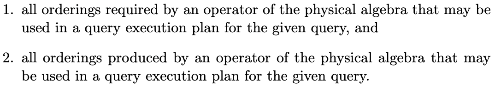
		- interesting orders
			- logical：指理论上某个attribute必须满足有序
			- physical：指实际的一个流有序
		- Ordering derived
			- 前缀：对于一个ordering而言，其所有前缀都符合ordering要求
				- 比如​​​​​​​​​​ 满足 ​​​​​​​​​​​​​​​​
			- 函数依赖​​​​​​​​​​​​​​​​​​​​​​​​​​​​​​​​​​​​​​​​​​​​​​​​​​​​​​​​​​​​​​​​​​​​​​​​​​​​​​​​​​​​​​​​
				- 我们通过函数依赖​ ，从ordering ​，推出来的集合，称之为​​ 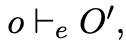
				- 那么，如果我们递归的调用它，那么新的ordering属性为 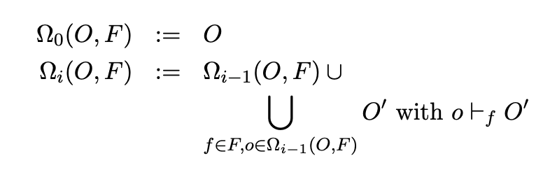
	- Group，用{}表示
		- Group和ordering类似 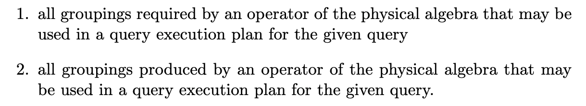
		- 对group的严格定义： 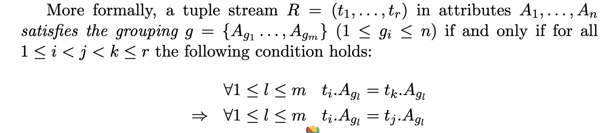
		- group 的推导
			- group 并不满足 ordering 的特点：即如果o被满足，那么它的所有前缀都会被满足
			- 函数依赖​​​​​​​​​​​​​​​​​​​​​​​​​​​​​​​​​​​​​​​​​​​​​​​​​​​​​​​​​​​​​​​​​​​​​​​​​​​​​​​​​​​​​​​​​​
				- 同理，我们记做 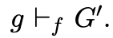
				- 对于一个集合，我们也可以递归的调用得到 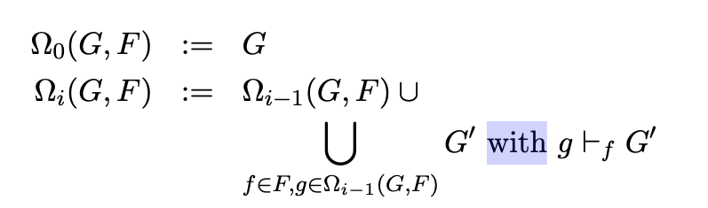
			-
	- function dependency
		- 函数依赖的推导 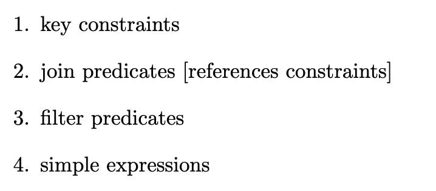
- properties的传播
	- 我们做出如下定义 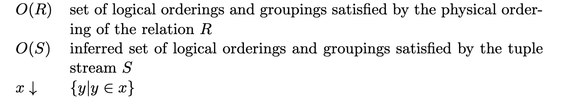
		- ​​​​：可以由 ​ 推导出出的所有的逻辑properties
		- ​​​​：可以由stream​ 推出的所有逻辑properties
	- 于是我们可以定义以下传播 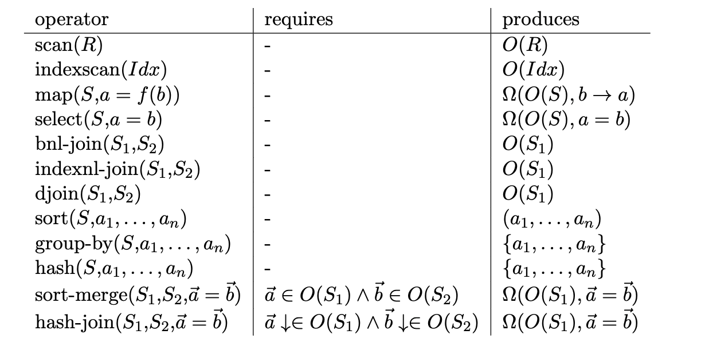
		- ​​​​​​ 会引入依赖
		- sort会破坏原有的并引入新的
		- group/hash 算子 会破坏原有的并引入新的group properties
		- join中的条件会引入新的函数依赖
- 问题定义
	- 对于每个算子而言，其可能需求一些logical properties
	- 对于一个stream/table，其只能存在一个physical properties
	- 我们需要结合function dependency来判断某个physical properties能否满足logical properties
		- 进一步判断满足其的最小physical properties
- 核心思路
	- 如果我们构造出全部的derived properties，空间巨大
		- 指数级增长
			- 假设有一个O
			- 我们可以在O的基础基于dependency 推导出第一级
			- 然后在第一级基础上推导第二级
			- 。。。。。
	- 解决思路：引入ADT
		- 我们只需要具有以下逻辑功能的Abstract data type即可
			- 构造器 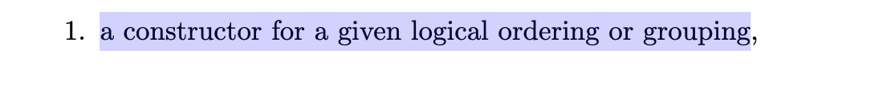
			- Membership test：可以判断需要的properties是否被满足 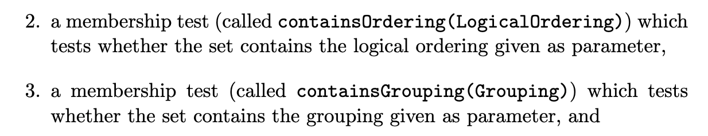
			- inference operation：根据function dependence 推导新的properties
	- 实现ADT：
		- 通过function dependence构造出一个NFM（个人理解，是根据输入的physical properties来构建的） 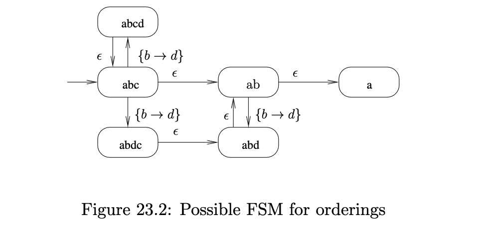
		- 然后我们只需要判断 对应的 physical properties和 logical properties是否可达，
		- 结合起group（下面方框）：每个ordering 都可以 derived 出一个 group（ordering 也可以实现group)，然后由这个group 去dervied 新的group 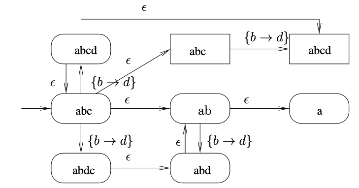
- 算法
	- 基础步骤
		- 确定输入 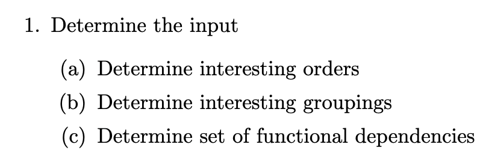
		- 构建NFSM 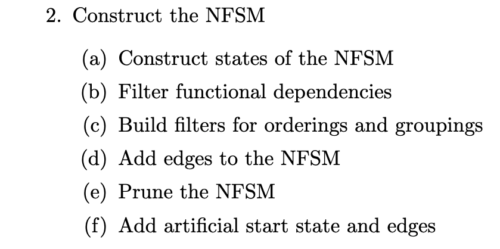
		- 转为DFSM 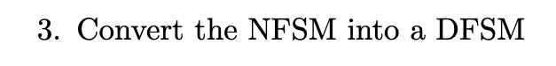
		- 预计算 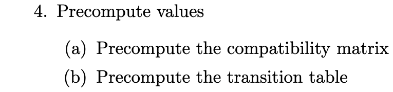
	- 确定输入
		- 对于每个算子
			- 我们可以得到​​​​​​​​
				- ​​​，算子产生的properties
				- ​​​，算子测试的properties
			- 由此构建出interesting order、group
		- 收集dependency set
	- 构建NFSM