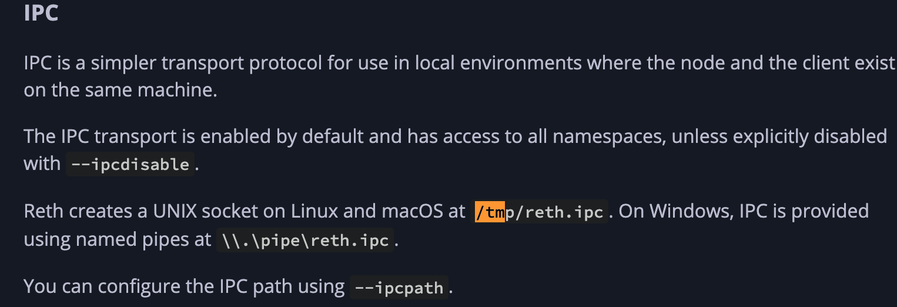

- 主流程:
	- LiveBuilder::run()
- txn: 获取
	- ipc_path 是指向reth的一个ipc Path
		- ```
		  ipc_path: PathBuf,
		  ```
		- reth的定义为: 
		  
	- 拿到ipc Path后, 构建alloy Provider
		- ```
		  let ipc = IpcConnect::*new*(config.ipc_path);
		  let provider = ProviderBuilder::*new*().on_ipc(ipc).await?;
		  ```
	- 通过provider subscribe txn
		- ```
		  let handle = tokio::spawn(async move {
		    info!("Subscribe to txpool with blobs: started");
		  - let stream = match provider.subscribe_pending_transactions().await {
		        *Ok*(stream) => stream.into_stream().take_until(global_cancel.cancelled()),
		        *Err*(err) => {
		            error!(?err, "Failed to subscribe to ipc txpool stream");
		            // Closing builder because this job is critical so maybe restart will help
		            global_cancel.cancel();
		            return;
		        }
		    };
		    let mut stream = pin!(stream);
		  - while let *Some*(tx_hash) = stream.next().await {
		        let start = Instant::*now*();
		  - let tx_with_blobs = match get_tx_with_blobs(tx_hash, &provider).await {
		            *Ok*(*Some*(tx_with_blobs)) => tx_with_blobs,
		            *Ok*(*None*) => {
		                trace!(?tx_hash, "tx not found in tx pool");
		                continue;
		            }
		            *Err*(err) => {
		                error!(?tx_hash, ?err, "Failed to get tx pool");
		                continue;
		            }
		        };
		  - let tx = MempoolTx::*new*(tx_with_blobs);
		        let order = Order::*Tx*(tx);
		        let parse_duration = start.elapsed();
		        trace!(order = ?order.id(), parse_duration_mus = parse_duration.as_micros(), "Mempool transaction received with blobs");
		        add_txfetcher_time_to_query(parse_duration);
		  - match results
		            .send_timeout(
		                ReplaceableOrderPoolCommand::*Order*(order),
		                config.results_channel_timeout,
		            )
		            .await
		        {
		            *Ok*(()) => {}
		            *Err*(SendTimeoutError::*Timeout*(_)) => {
		                error!("Failed to send txpool tx to results channel, timeout");
		            }
		            *Err*(SendTimeoutError::*Closed*(_)) => {
		                break;
		            }
		        }
		    }
		  ```
- payload builder: 依赖relay api 和 relay client
	- 构建payload
		- 输入的txn: 源于上一步获取的txn
		  id:: 6704c280-0713-44bf-abb1-ed1112178a2d
			- 构建就绪的txn pool
				- ```
				  let mut builder_pool = BlockBuildingPool::*new*(
				      self.provider_factory.clone(),
				      self.builders,
				      self.sink_factory,
				      orderpool_subscriber,
				      order_simulation_pool,
				  );
				  ```
			- 构建
				- 构建parent block hash
					- ```
					  let parent_header = {
					      // @Nicer
					      let parent_block = payload.parent_block_hash();
					      let timestamp = payload.timestamp();
					      let provider_factory = self.provider_factory.provider_factory_unchecked();
					      match wait_for_block_header(parent_block, timestamp, &provider_factory).await {
					          *Ok*(header) => header,
					          *Err*(err) => {
					              warn!("Failed to get parent header for new slot: {:?}", err);
					              continue;
					          }
					      }
					  };
					  ```
					-
				-
		- 构建
	- 传出payload
		-
	-