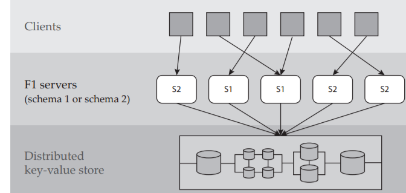
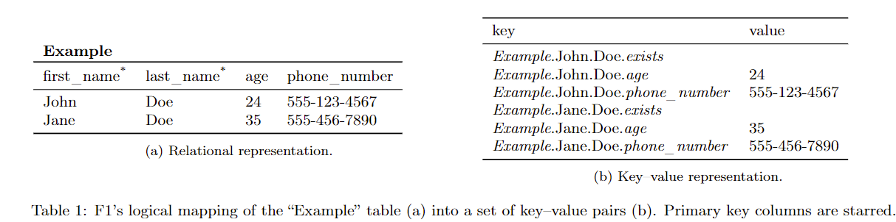

- 变化
    - 对于一个schema S1
    - 要在S1 中加入一个 索引，使得schema变为 S2
- 问题
    - 异步变化，在分布式集群中，机器不可能同步的变迁schema
        - 分布式集群的时钟问题
        - 性能问题
    - 导致的问题
        - 假如S2的机器 插入了一条数据：record+index
        - S1的机器删除一条数据，S1只能删除对应record
        - 那么对应index成为孤儿索引
- 解决方法
    - 思路
        - 一小步一小步的变换，使得状态能够兼容
    - 流程
        - absent：所有机器都处于S1
        - delete only：所有的机器都变为S2，但是对应的index不能插入数据
            - 和上一状态兼容，因为index内无数据，所以不存在孤儿index
        - write only：可以插入数据，但是历史数据没有整理，所以此时还不能使用这个索引
            - 此时和上一状态兼容，上一状态保证了所有schema都变为了S2
        - public：所有历史数据都添加到index中，更新完成
    - 保证schema全部变化的机制：lease（类似于分布式cache）
        - 有一个机器S负责DDL，即更改schema
        - 其它机器从S拉取schema，并有一个lease（在lease到期之前需要重新更新lease）
- paper
    - F1 architecture 
    - 问题
        - 没有办法同步更新
            - 缺少global membership
            - 加锁的开销
        - index的问题
    - 要求
        - we do not restrict access to data **undergoing reorganization ？？？**
        - Second, because the schema change must have minimal impact on user transactions, we allow transactions to span an arbitrary number of schema changes,although we do not automatically rewrite queries to conform to the schema in use ???
        - asynchronous，所以存在多个版本的schema共存
    - background
        - key-value 存储
            - 原子 test and set
            - key-value有timestamp
        - schema
            - a list of Column
            - a list of secondary index
            - a list of integrity constraint
            - a list of optimistic locks
        - row representation
            - table
                - key：table id + primary key + column
                    - redundancy primary key
                    - physical storage format eliminate
                - value：some data or null
                - example 
            - secondary index
                - cover a subset of columns which is non-empty
                - key: table_id + row_id + index_column_values+ index row_primary_key
                    - 有primary key的原因是防止重复的index
                - 
        - operation：curd
        - concurrency control：MVCC
            - 事务的读操作会记录timestamp
            - 当commit的时候，会检测timestamp的一致性
            - 如果一致，则成功commit，否则回退
    - schema change
        - elements：columns、index、locks、tables and so on
        - states
            - absent：not present
            - public：represent and affected by all operations
            - **delete-only**
                - table、column：只能被删除
                - index：can be deleted and updated （update can not create new index??）
                - 即key-value可以被删除，但不可以被create（index key-value可以被更新）
            - **write-only**
                - key–value pairs modified by insert, delete, and update operations, but none of their pairs can be read by user transactions.
        - 一致性保证
            - A database representation d is consistent with respect to schema S iff
                - column：所有的column都有对应的row 和 table（row 可以是 NULL？？）
                - row：所有的row都有对应 的index.
                - index。。。。。
            - 总结
                - 孤儿数据：有相关数据，没有对应定义
                - 不完整：有相关定义，不存在对应数据
    - 
