- Introduction
	- 多个线程并行或是并发，执行顺序nondeterministic
	- 核心
		- 关键区域：对共享变量的访问
		- 等待：阻塞等待某个事件完成
- Locks
	- 对于实现的评价指标
		- mutual exclusion：是否能保证互斥
		- fairness：是否保证每个线程获取锁是等概率的
		- performance：释放和获取的时间
	- 自旋spin
		- A Failed Attempt: Just Using Loads/Stores 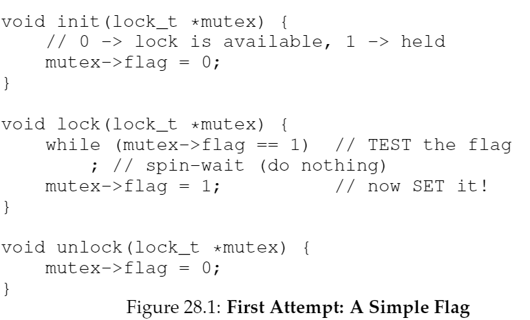
			- 问题：并不能做互斥的控制 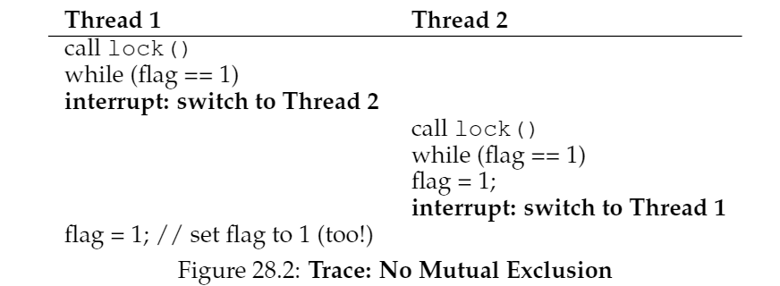
		- Building Working Spin Locks with Test-And-Set
			- 硬件提供原语操作 test & set 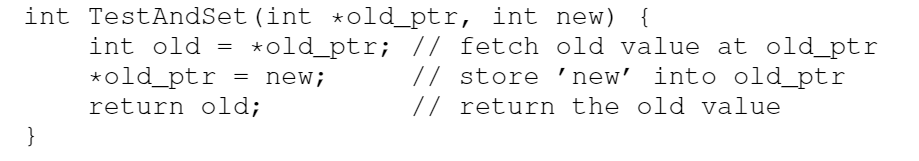
			- 锁的话，判定test & set的返回值即可 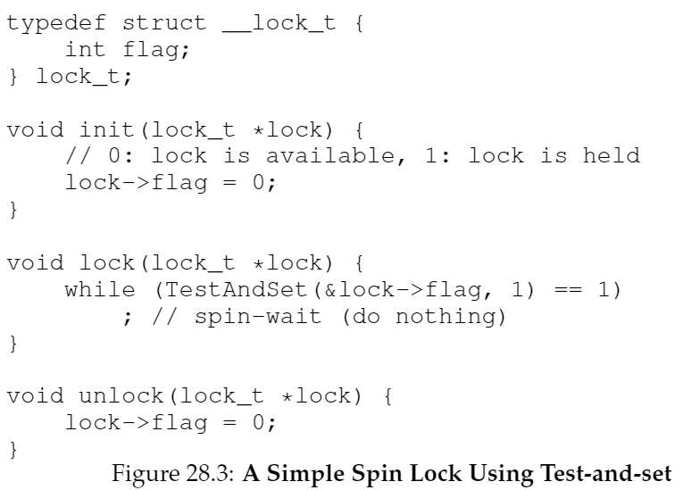
		- Compare-And-Swap
			- 硬件提供了另一种原语：compare & swap 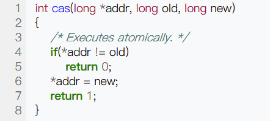
			- 这样就可以提供另一钟Lock实现 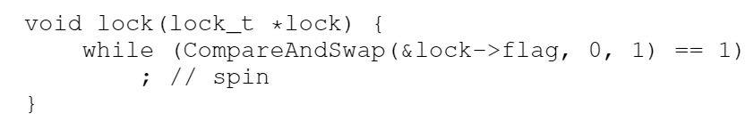
		- Load-Linked and Store-Conditional
			- 另一种原语
				- load linked 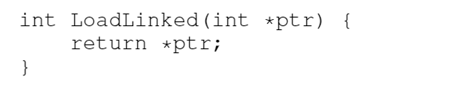
				- store conditional 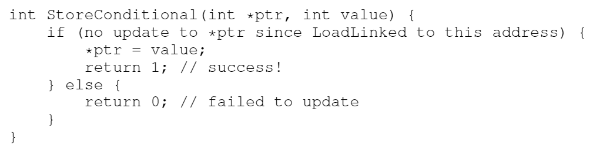
			- 在第一次fail中，fail的原因是锁在读和写1的过程中又被重读了，所以我们只需要保证锁在读和写的过程中没有被篡改即可 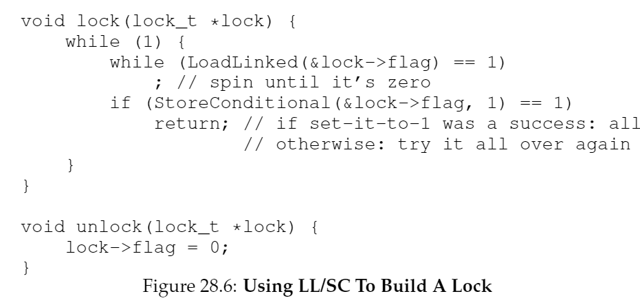
		- Fetch-And-Add
			- fetch & add 原语 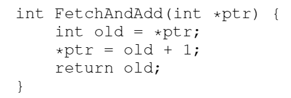
			- 该操作用了两个共享变量 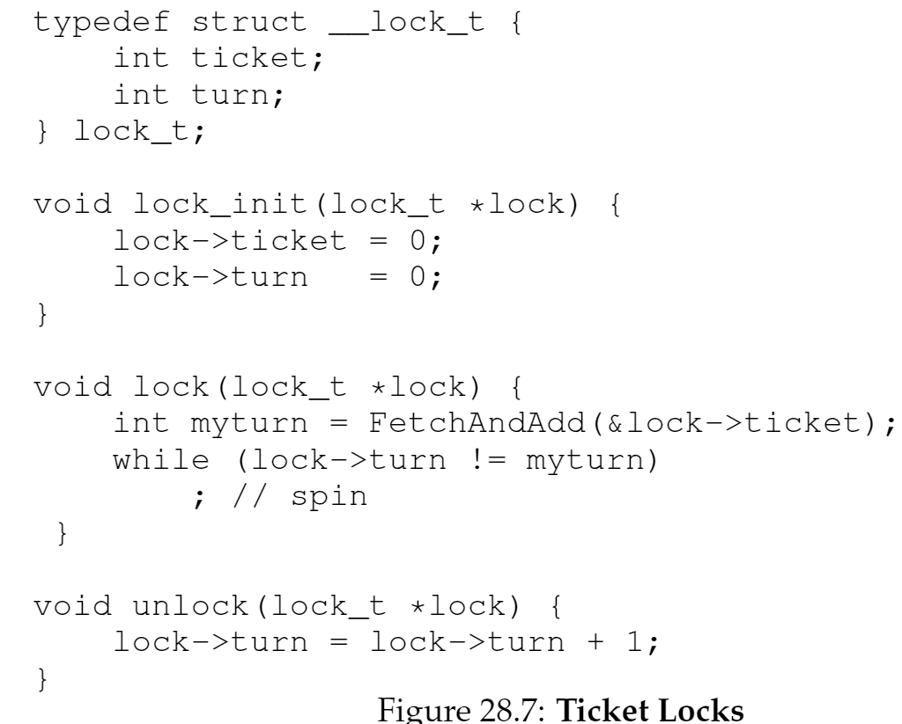
				- 每个线程在lock时，会首先拿一张票
				- 然后不断循环判定票和当前的turn 是否对应
			- 该实现方案保证了每个线程都有可能抢到锁
				- 每个线程拿到的票号是固定的
				- turn随着锁的释放不断增加，肯定会轮到某个进程
				- （医院客人首先拿个单号，排队等候，叫到对应单号的人进去，出来时单号加1）
		-
	- spin的问题
		- 耗时：因为每次调度都浪费检查一个不会更改的值（因为当前cpu的控制权在当前进程中，而当前进程不会release 锁）
		- 优先级反转（这个可能是优先级调度的通病）/参见P17，<a  href="https://pages.cs.wisc.edu/~remzi/OSTEP/threads-locks.pdf">《OSTEP: Locks》</a>
	- 自旋锁的改进
		- yield 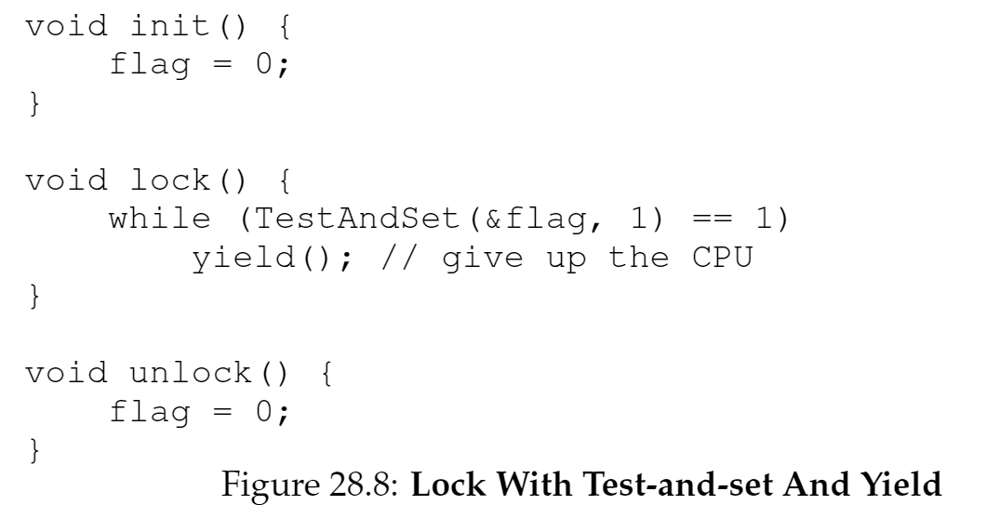
			- 每次自旋的时候，如果发现当前锁被持有就yield，放弃当前时间片cpu的控制权
			- yield：将自己从running 状态转换到ready 状态
		- sleep & queue
			- 实现 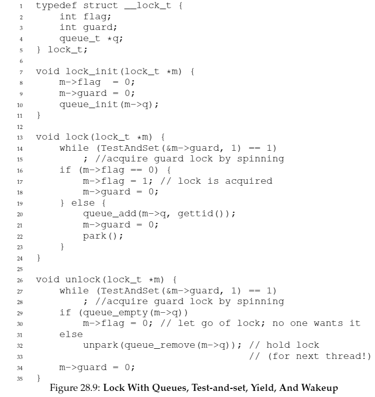
				- guard是操作queue的关键区域的锁：因为该部分比较短，所以自旋并不会太长时间
				- flag即位当前的锁
				- park：将当前线程转为sleep状态
				- unpark：将对应线程唤醒
			- 一些细节
				- 在unlock的时候并没有更新flag
					- 因为在park后，没有对flag的判定。当unpark的时候，线程直接从park后执行
					- 相当于锁没有被释放，只不过关键区域内执行的线程改变了
				- 在park前的竞争
					- 当线程从`m->guard=0`执行到`park()`之间，可能其它线程执行了`unpark`
					- 这样一个线程刚`unpark`又`park`，导致全部睡眠
					- 或者将释放锁和`park`合并为一个原语操作?
	- Linux的实现
- Lock-based Concurrent Data Structures
	- 针对并行编程的优化：避免 对锁的操作 成为瓶颈
	- counter
		- 最常规的实现
			- 递增 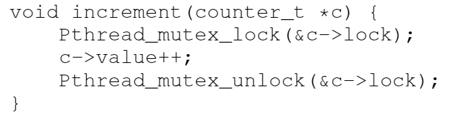
			- 递减 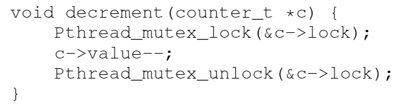
			- get 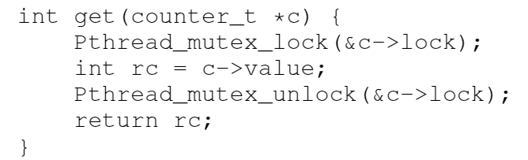
		- scalable：上述实现在并行时，时间会显著增加，所以需要改进
			- 每个线程增加一个本地的计数器（该步是scalable）
			- 按照一定间隔（S步后），同步到全局计数器（不可scalable）
			- 在获取的时候可能会有延迟，不过可以强制全局更新，只在get时（不可scalable）
			- S是一个关键变量
	- Concurrent Linked Lists
		- basic 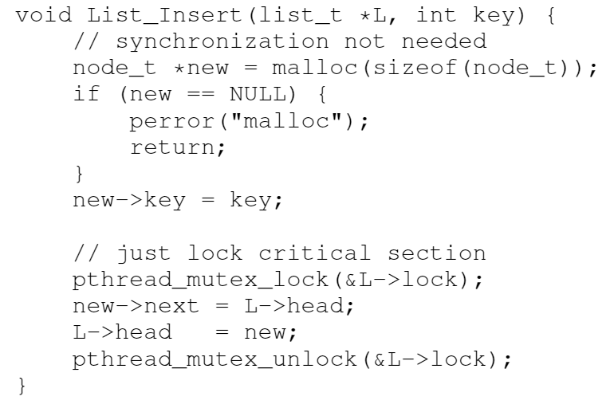
		- scalable
			- 针对链表的整体加锁有时候是不必要的，因为有时候我们只对表的部分进行操作
			- 所以可以降低锁的粒度，但是这会引入更多的锁（极端的，每个node一个锁）以及更多的对锁的操作
			- 需要权衡
	- Concurrent Queues
		- basic：略
		- scalable
			- 给队首和队尾各分配一个锁
			- 入队时 需要对队尾加锁 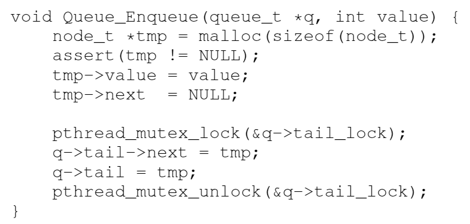
			- 出队是 需要对队首加锁 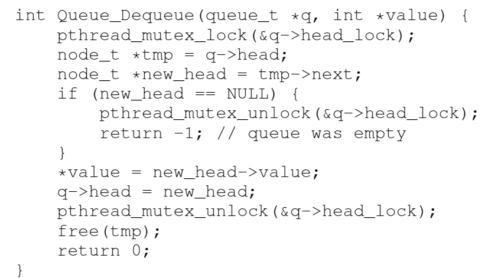
			- 这两种操作在某种程度上并行（如果队首和队尾是一个？？）
	- 等等等等：待探索
		- 权衡点：锁的粒度？
		- 局部与全局？
- Condition Variables
	- condition variable 机制类似于上述将的sleep & queue
		- 每个condition variable 都是一个queue
		- 提供两个基本操作
			- 释放锁，并将thread加入队列（防止之前说的竞争？） 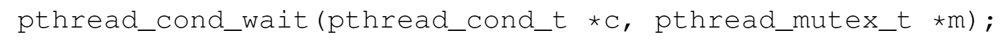
			- 将队列的线程重新释放回来 
		- 实现线程的join 和exit
			- join 
			- exit 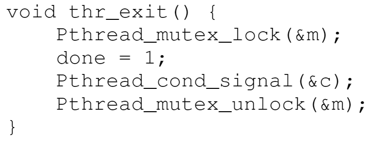
			- 附
				- 必须要有done：如果没有`done`，首先可能子线程执行`exit`直接退出，主线程一直`wait`
				- 必须要有锁m：和上述同理，如果没有锁，可能主线程读到`done = 0`，然后子线程`thr_exit`，然后主线程无限`wait`
	- The Producer/Consumer (Bounded Buffer) Problem
		- 1：mesa semantic
			- 生产者 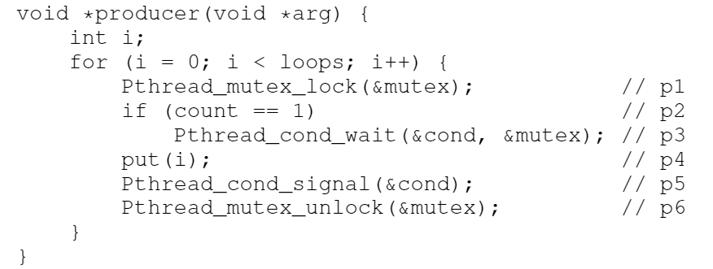
			- 消费者 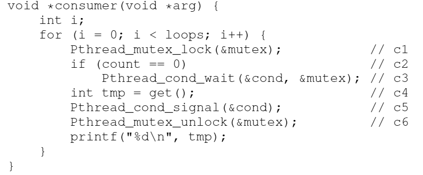
			- 问题：在wait 到 抢锁get()这个期间可能引起竞争，即count可能发生改变
				- wait -> lock -> get（假设有两个consumer ， 1个 producer） 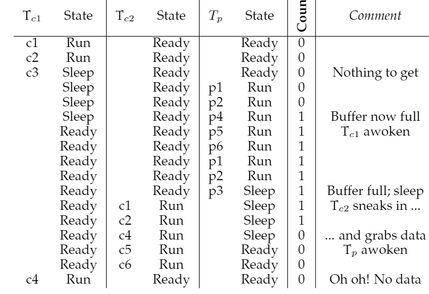
		- 2：while（对于变量的判定用while肯定是没错的）
			- producer 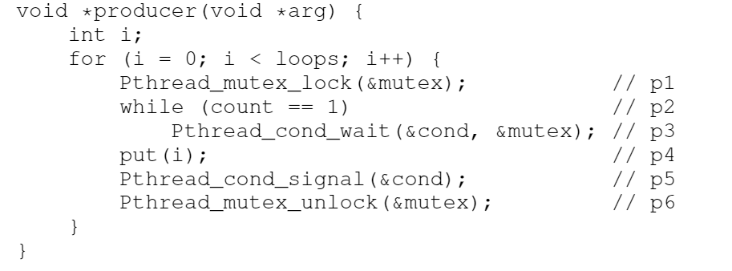
			- consumer 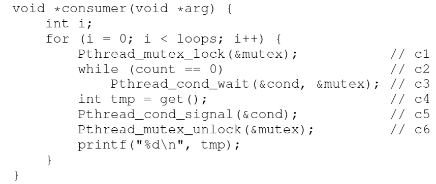
			- 问题：只用一个条件变量（一个队列），那么consumer有可能会唤醒另一个consumer
		- 3：两个队列
			- producer 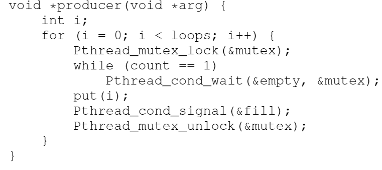
			- consumer 
	- covering condition
		- 某些条件变量可能需要唤醒所有的sleep线程`pthread_cond_broad()`
- semaphore
	- 构成：一个变量+一个条件变量？
	- 接口
		- wait： 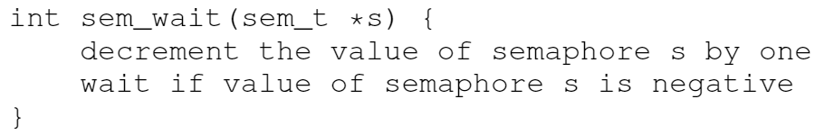
		- post： 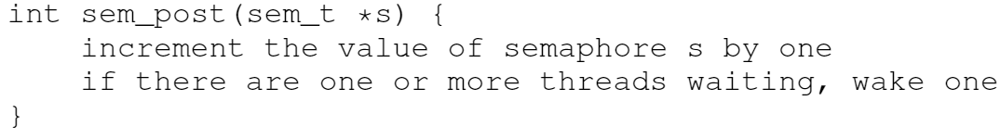
	- 解决问题
		- Binary Semaphores (Locks)
			- 初始值为1的信号变量：二值信号变量
		- Semaphores For Ordering
			- 对于那些有需要等待的事件
			- 比如主线程等待子线程（类似于Lock章节中条件变量） 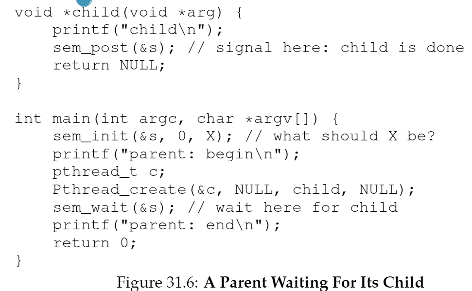
		- The Producer/Consumer (Bounded Buffer) Problem
			- basic
				- producer 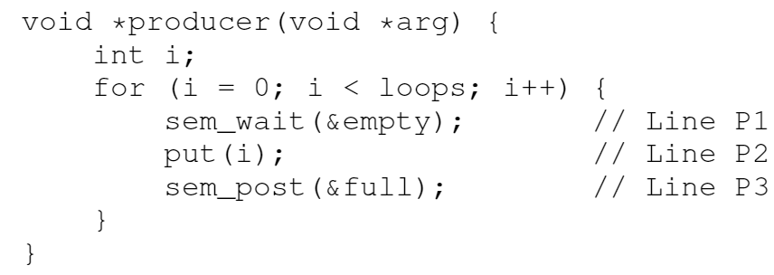
				- consumer 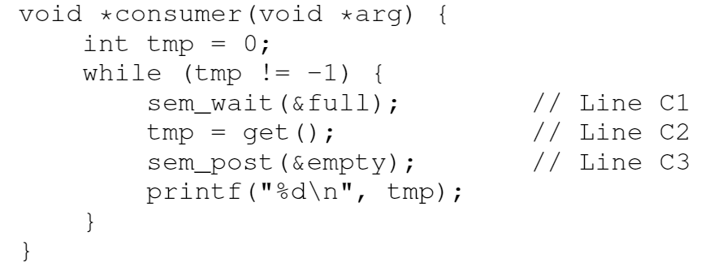
				- 问题：可能会有多个线程进入关键区域（put/get）
			- 加锁版本
				- producer 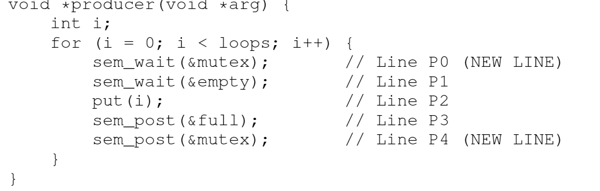
				- consumer 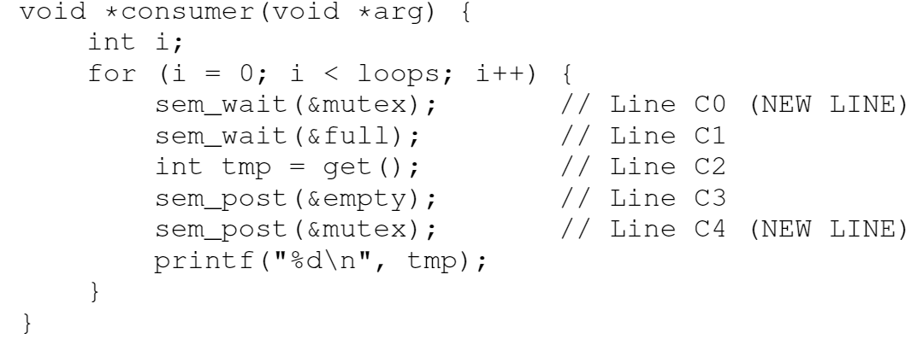
				- 问题：在关键区域内sleep，可能会导致死锁（保证关键区域的最小）
			- 加锁v2
				- producer 
				- consumer 
		- Reader-Writer Locks
			- 读者写者问题：读和写的并发性是不一样的
				- 读：可以允许多个并行，但是排斥写
				- 写：最多只能一个线程写
			- 解决思路：
				- 读：`reader==1`第一个读者持有写锁（排斥写），`reader==0`最后一个读者释放写锁 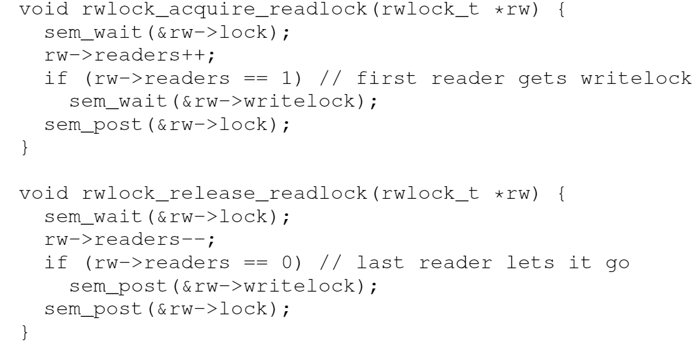
				- 写：持有写锁 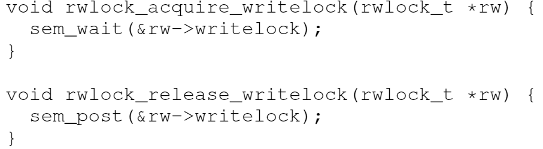
			- 问题：reader可能持续不断导致写starve
				- 解决思路：当写wait的时候，禁止更多的读线程进入
		- The Dining Philosophers
			- 问题定义略
			- 死锁：每个人都可能拿起一边的fork
			- 解决思路1：打破顺序，设定其中一个人拿起fork的顺序不一致 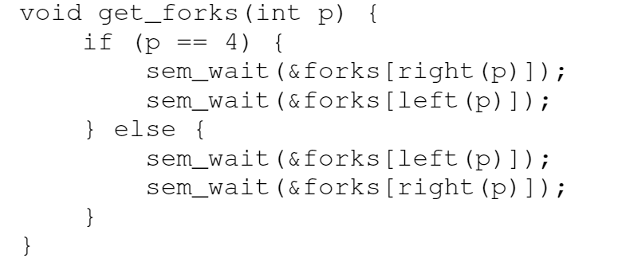
	- 实现：锁+条件变量
		- wait 
		- post 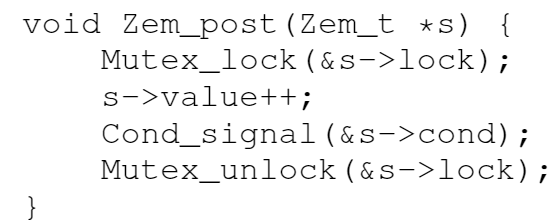
- Common Concurrency Problems
	- 并发bug的组成
		- Non-Deadlock
			- Atomicity Violation：有些操作不是原子的，可能被打断（通过加锁，保证原子） 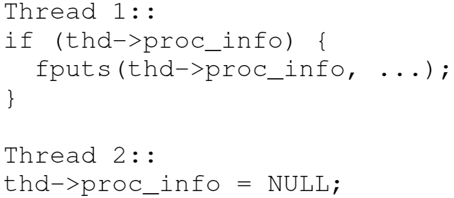
				- `fputs` 的`proc_info` 可能为`NULL`
			- Order-Violation Bugs：执行的顺序被打乱（通过信号量（或者锁+`done`变量+条件变量）保证执行顺序） 
				- `mThread` 可能在T2执行的时候还没有创建
		- Deadlock
			- 死锁的条件
				- 互斥
				- 持久以及等待
				- 循环等待
				- 不可抢占
			- Prevention（阻止）
				- Circular Wait：为锁提供一个全序关系
					- 循环等待的原因是锁的`aquire`顺序不一致造成的
					- 如果我们对所有锁`aquire`的顺序一致，就不会循环等待了
						- 比如总是先 `L1` 在 `L2`
					- linux通过锁的地址提供这样一种全序关系
				- Hold-and-wait：一次就将所有的锁获取（作为一个原子操作）
					- 操作 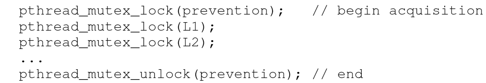
					- 缺点：临界区大的惊人，所有的锁必须提前获取而不是在needed的时候
				- No Preemption：如果抢占失败就放弃
					- 实现 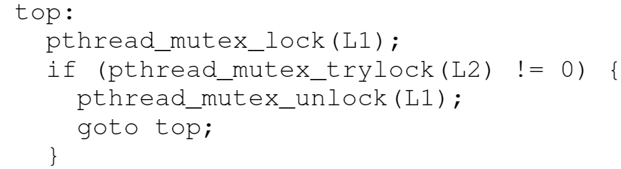
					- 问题
						- 可能造成活锁
							- t1 ： `lock L1 ---> try lock l2 ---> unlock l1`
							- t2 ：`lock l2 ---> try lock l1 ---> unlock l2`
							- 增加随机的delay
						- goto top的成本
							- 上述在释放L1的时候可能需要有一些其它的操作，比如释放之前申请的内存等等
				- Mutual Exclusion：实现lock free的算法（比如mvcc？）
			- Deadlock Avoidance via Scheduling：比如银行家算法，但是比较局限，目前没有广泛使用
			- Detect and Recover