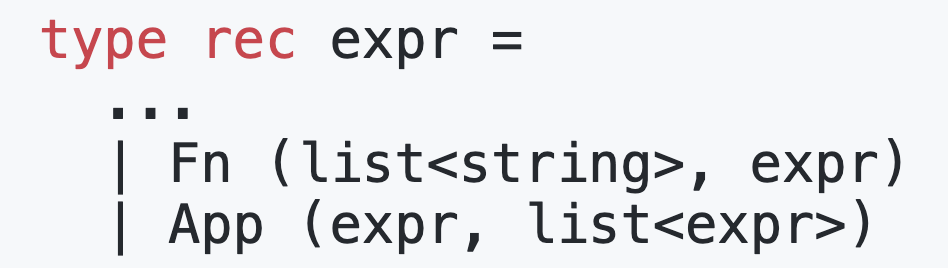
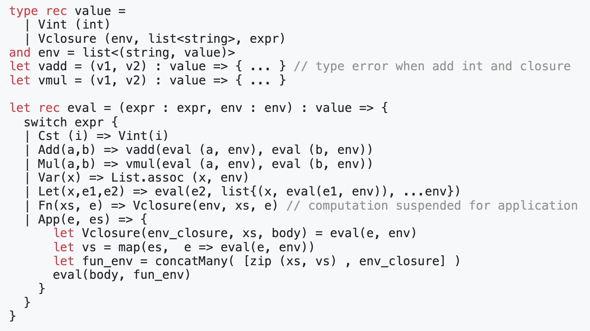
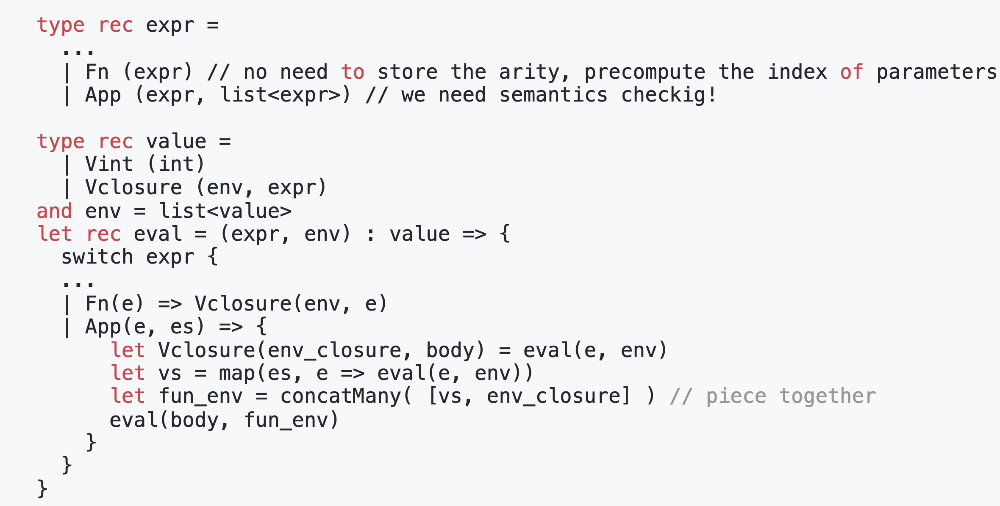
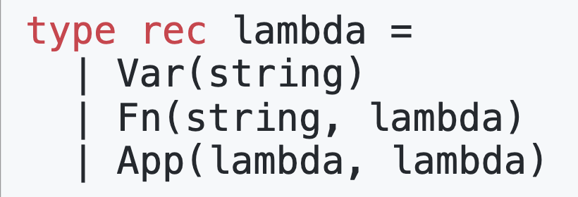
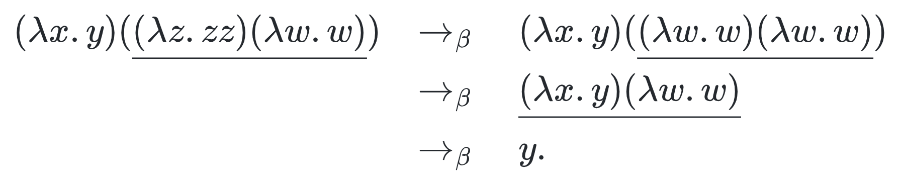
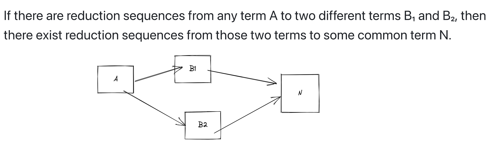
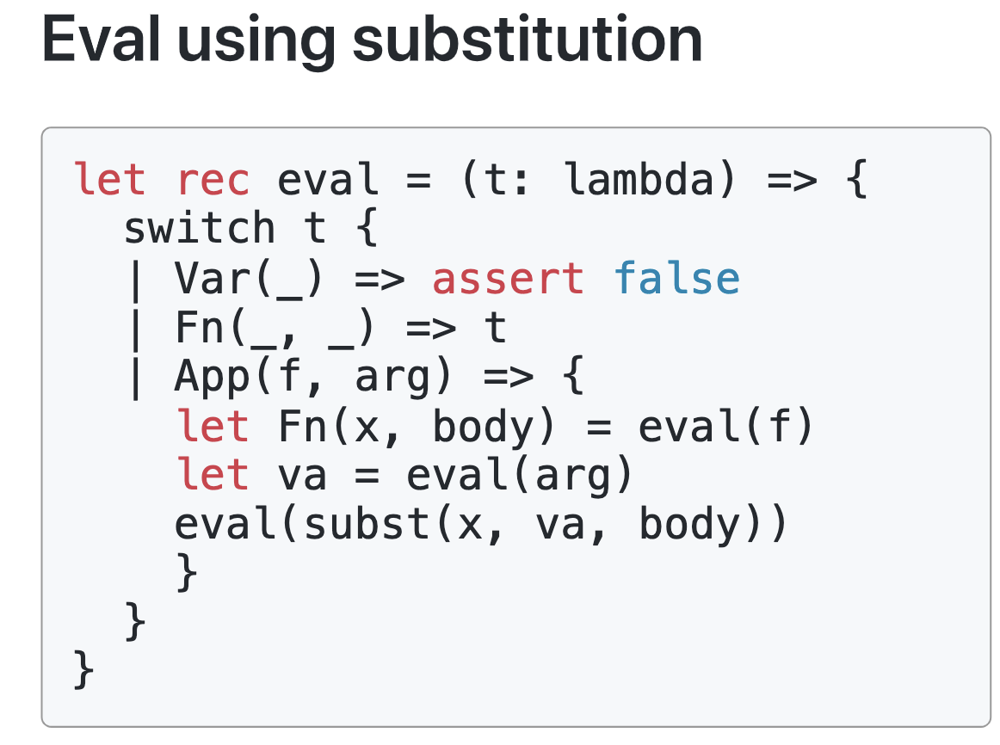
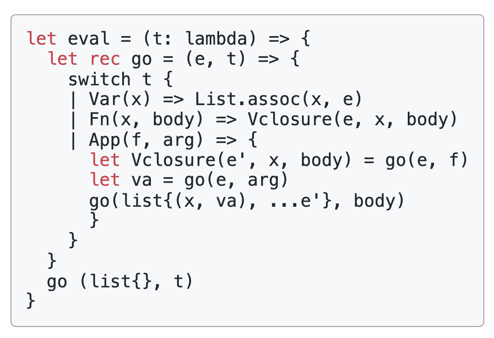

- 从引入函数开始（tiny language 3）
  collapsed:: true
	- 我们继[tiny language](((639b2805-145f-444e-805a-b0fe66998f11)))需要引入新的expr定义
	  collapsed:: true
	   {:height 113, :width 375}
		- 注意这里的Fn可以捕获环境变量，比如 x = 1 in func y -> x+y
	- 这里我们可以定义函数的解释过程
	  collapsed:: true
	  
		- 首先引入两个新的iterm：vadd，vmul。表示数的操作，引入这两个操作的原因是add的参数可以是函数调用
		- 然后对于函数的解释，我们会返回一个对象Vclosure，包含三个部分：环境env，参数定义xs，函数体 e
		- 调用函数的过程是：
		  collapsed:: true
			- 提取函数定义中的env，xs，e
			- 将parameter（形参） 和 argument（实参） 绑定，即作为一个新的参数环境：<parameter name, argument value>
			- 然后将捕获的环境和参数环境合并为一个env
			- 根据当前env执行函数体
	- 我们可以将上述语言转为Nameless Expr，上述的解释过程也不需要对应的参数
	  collapsed:: true
		- 转为Nameless Expr的本质是将所有的变量名都绑定到实际的栈地址上，所以解释过程和上述过程的差距是不需要任何有名参数
		- 解释过程
		  
			- 在这里，Fn 和 App都不需要参数
			- 在函数体中和所有的变量们都是当前执行环境env的索引，指向对应的环境变量
		- 如何计算对应的索引，homework
	-
- lambda calculus
	- Simplify tiny language 3 to lambda calculus
	  collapsed:: true
		- 对于let iterm，我们可以将其转为函数调用
		  $$let(x, e1, e2) = App(Fn(x, e2), e1)$$
		- 将所有的常量数转为函数（Church numeral）
		- 将所有的多元的参数转为单元参数（Currying，柯里化）
			- $$Fn(x_1, x_2, e) = Fn(x_1, Fn(x_2, e))$$
			- $$App(e, e1, e2) = App(App(e, e1), e2)$$
		- 这样我们就可以得到最简tiny language 3，类似lambda 演算
		  {:height 165, :width 467}
			- 变量名
			- 一元函数定义
			- 一元函数调用
	- Formally Definition
	  collapsed:: true
		- Lambda terms: $M,N ::= x|(MN)|(\lambda x.M)$
			- 其中小写字母x，作为变量名
			- MN: 是函数调用，即将N作为M的参数
			- $\lambda x.M$ 是函数定义，其中参数是x，函数体是M
		- computation
			- 计算过程也就是函数调用，称为 $\beta - reduction$
			- $\beta - redex$ 是一个term，形如 $(\lambda x. M)N$，表示$\beta - reduction$操作的对象
			- $\beta - reduction$ 是将 一个 $\beta - redex$ 归约到 $M[N/x]$，即将M里所有的x替换为M
			- 例子：
			  
		- Confluence of untyped lambda calculus
			- lambda 计算的结果和计算的顺序无关，也就是说我们可以随便选择一个 $\beta - redex$进行归约
			- 形式化的描述
			  
	- Execution
	  collapsed:: true
		- 形式化执行
			- 如何执行函数Call by Value
			  $$\frac{}{(\lambda x.a)v \rightarrow a[v/x]} $$
			- 执行顺序，从左到右
			  $$\frac{a\rightarrow a'}{ab\rightarrow a'b}, \frac{b\rightarrow b'}{vb\rightarrow vb'}$$
		- 具体的解释执行可分为两种：Substitution 和 Environment
			- 在执行的时候，替换对应变量，正如上述定义
			  {:height 344, :width 392}
				- 实际不容易实现，因为生成代码很麻烦
				- 在编译时可以做一些IR的生成，类似于常量折叠，partial evaluation？
			- 在执行的时候，将所有的外部变量，都保存在环境中，最后统一解释执行替换
			  {:height 255, :width 345}
	- 用函数表示数
		- bool
			- 数据定义：$T = \lambda xy.x , F = \lambda xy.y$，即它接收两个参数，即if else里的两个参数
			- 基本操作if-then-else $\lambda x.x$
				- 当我们带入T，即$\lambda x.x T MN= \lambda xy.x MN = M$。可见正好选择了第一个参数，和true语意相通
				- 同理，当我们带入F的时候，会选择N
		- Pair
			- 数据定义：$P = \lambda xyz.zxy$，它接受三个参数，pair 对xy和访问方法p
			- First：F=$\lambda p.p \lambda xy.x$
				- 规约过程
				  id:: 63bd7690-255f-4331-9138-7c191cfc0a19
				  $$
				  F P M N \rightarrow F \space \lambda z.zMN  \rightarrow \lambda z.zMN \space \lambda xy.x \rightarrow \lambda xy.x MN  \rightarrow M
				  $$
			- Second: $F = \lambda p.p \lambda xy.y$
		- Numerals
		-
-