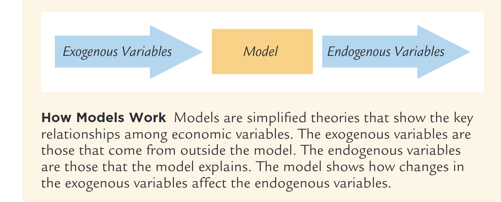
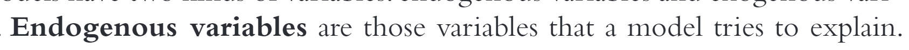
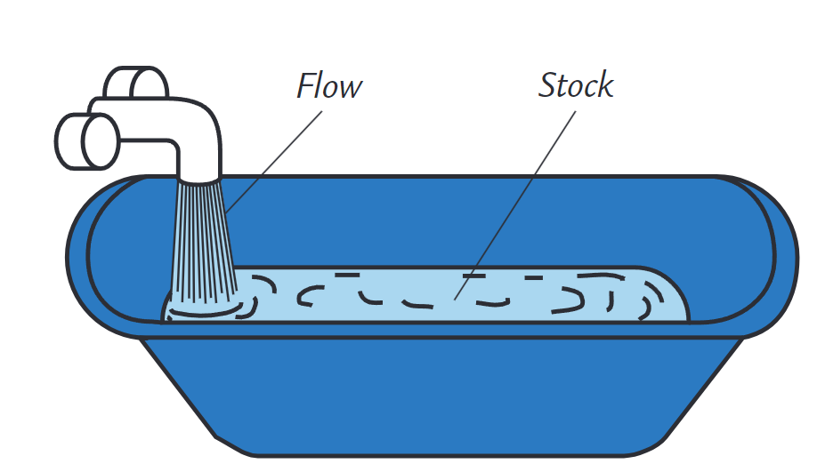
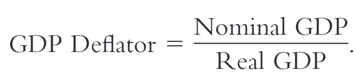

- Intro
	- 建模
	   {:height 287, :width 548}
		- 基本思想：将经济学抽象为一个数学模型
		  collapsed:: true
			- 基础假设
				- 基本价格假设
				   {:height 55, :width 551}
					- market clearing：在长期市场，价格会快速变化（flexibility）使得供需平衡
					- sticky：在短期市场中，价格会保存粘性（即基本不变）
			- 自变量（外部变量）
			   {:height 34, :width 453}
			- 因变量（内部变量）
			   {:height 34, :width 562}
	- 基本概念
		- Gross  domestic  product（GDP）
		  collapsed:: true
			- 存量和流量
			  collapsed:: true
			   {:height 276, :width 462}
				- 流量是当前时间的生产，被算进GDP
				- 存量作为社会的资产存量，存量的转移不被算成GDP。比如拍卖会、二手房、库存
			- GDP 衡量的整个社会的生产力
				- 我们可以通过总收入/总支出来衡量生产力
				- 在一笔交易中，收入和支出只取决于视角（买方支出，卖方收入，所以总收入和总支出本质上相同）
			- 库存对GDP的影响
				- 库存是作为生成者自己买下的
				- 第二年的库存销售作为资产的转移，即支出是库存，收入是买方，相互抵消
			- 实际GDP和名义GDP
				- 一般来说$GDP = Quantity * Price$
				- 名义GDP是用当前物价计算，包含了货币变动的影响
				- 实际GDP会固定某一年的物价计算GDP
				- 名义GDP和实际GDP的系数可以使用GDP Deflator
				  {:height 59, :width 235}
			- 上述计算的问题是没有考虑生产力的提高，比如电脑的价格持续下降
			  collapsed:: true
				- 为了解决这个问题，可以使用chain-weighted 计算
				- 即我们用相邻年份的平均价格，用它们来衡量实际GDP的real growth
					- 因为相邻年份的平均价格可能变化不大，所以可以用来衡量实际GDP的增长
			- GDP的计算
				- 支出法 C+I+G+NX
					- 消费C
					- 投资I
					- 政府投资G
					- 出口NX
			- 其它的指标
				- GNP：GDP + Factor Payments from Abroad - Factor Payments to Abroad
				-
		- consumer price index（CPI）
			- 衡量物价指数丈夫的指标，将一些商品的价格除以过去商品的价格
				- 由于不同商品的销量不一样，所以权重的价格不一样
			- producer price index：用生产者的价格指数衡量，即工厂消费的商品
			- CPI VS GDP Deflator VS PCE Deflator：都是通胀的衡量因子
				- CPI VS GDP Deflator
				  collapsed:: true
					- 1. GDP 包含所有的商品（比如包含政府消费和工厂消费）
					  2. CPI 只包含消费者消费的数据
					- 1. GDP只包含国内生成的
					  2. CPI也包含进口的
					- 从本质上来看，两者都是 市场上对一组价格的聚合 的比
					  1. GDP对每个商品的权重是不同的（即它的产量）
					  2. CPI一般使用固定权重
						- 例子：比如某年，橘子产量为0，库存的橘子价格暴涨。
						  CPI也会暴涨，因为它的橘子权重不变
						  GDP deflator不变，因为橘子产量为0，所以影响为0
						- 拉式指数（Laspeyres index）：a price index with a fixed basket of goods
						  collapsed:: true
							- 倾向于高估通胀，因为其没有考虑商品的替代（橘子和苹果的替代）
						- 帕氏指数（Paasche  index）：a  price  index  with  a  changing  basket
							- 倾向于低估通胀，因为其没有考虑替代的代价
				- PCE Deflator：使用GDP Deflator的计算方式，不过基于消费数据
					- 使用CPI的范围，比如只包括消费价格，还包括进口商品
					- 使用GDP的计算机方式，拥有可变的basket（即利用生产数据作为权重）
		- unemployment rate
			- 人是劳动市场中最重要的资源，我们可以将成年人分为以下三种：
				- employed：找到工作的
				- unemployed：想找但是未找到工作的
				- Not in the labor force：不想找工作的且无工作的，比如家庭主妇，学生等
			-
-