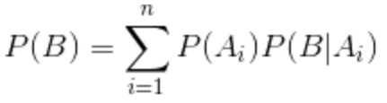
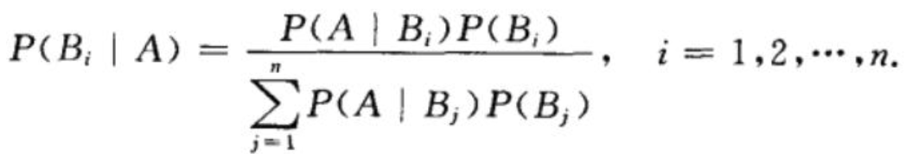
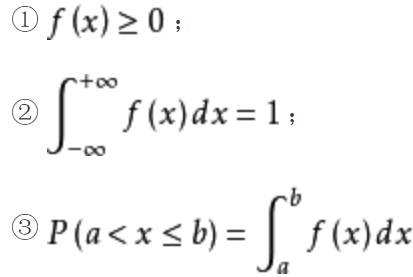
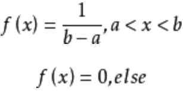
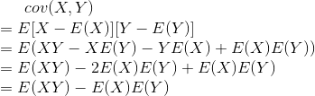

- 第1讲 基本概念
	- 随机事件与随机变量
		- 事件关系
			- 包含关系
			- 和事件、积事件
			- 互不相容事件
			- 对立事件、差事件
	- 概率
		- 概率
		- 频率
		- 古典概率
			- 有限个基本事件
			- 每个事件的可能性相等
		- 概率加法定理：P(A并B) = P(A) + P(B) - P(AB)
	- 条件概率
		- 条件概率
			- P(A | B) = P(AB) / P(B)
			- P(A)和P(A | B)没有确定大小关系
		- 乘法公式
			- P(AB) = P(A|B)P(B)
			- P(A1A2...An) = P(A1)P(A2|A1)...P(An|A1A2...)
		- 全概率公式（事前概率）
			- 
		- 贝叶斯公式（事后概率）
			- 
	- 事件的独立性
		- 相互独立: P(AB) = P(A)P(B)
			- 互斥一定不独立，独立一般不互斥
		- n事件的独立性：
			- 相互独立，一定两两独立
			- 两两独立，不一定相互独立
			- n个事件相互独立：2^n - n - 1
				- 任意多个事件换成对立事件，依然相互独立
- 第2讲 随机变量的分布
	- 随机变量的分布函数： F(x) = P{X | X <= x}
		- 单调不降函数
		- 极限 0, 1
		- 右连续函数（联系图像）
	- 离散型随机变量
		- 分布律：P{ X = xi } = pi, i = 1,2...
		- 伯努利概型与二项分布
			- 二项分布： 
			- 伯努利分布：n = 1
		- 泊松分布
			- 二项分布的极限分布：每次试验的概率小， 试验次数很大
			-  
	- 连续型随机变量
		- 概率密度函数： 
			- 性质
				- 
				- 4. 
				- 5.分布函数是连续的
		- 均匀分布
			- 
		- 指数分布（无后效性）
		- 正态分布
			- 上侧分位数
				- F(u0.05) = 0.95
- 第3讲 多维随机变量
	- 二维随机变量
		- 联合分布函数
			- 边缘分布函数
				- 因为不知道X,Y的关系，边缘分布无法推联合分布。而联合分布一定能推出边缘分布
			- 性质(充要)
				- 单调不降
				- 右连续
				- 非负有界
				- 相容性
		- 联合分布律
			- 性质 P67
		- 联合概率密度
			- >=0处处成立
			- 全积分 = 1
			- 边缘概率密度
		- 二维均匀分布(几何概率)
		- 二维正态分布
			- 二维正态随机变量的边缘分布仍为正态分布
	- 随机变量的独立性
		- 分布律
		- 分布函数
		- 概率密度
		- 相互独立
			- 定义 P76
			- 定理 P77
	- 条件分布
		- 条件分布律
		- 条件分布函数
		- 条件概率密度 = 联合概率密度 / 边缘概率密度
	- 随机变量的函数及其分布
		- 离散型随机变量的函数
			- 分布律
			- 可加性
				- 泊松分布
				- 二项分布
		- 连续性随机变量的函数
			- 概率密度
			- 正态随机变量，其线性函数也服从正态分布
		- 特殊函数的分布
			- 极值分布
			- 和的分布
			- 商的分布
- 第4讲 随机变量的数字特征
	- 数学期望
		- 随机变量
			- 离散型
			- 连续型
		- 随机变量的函数
		- 性质
			- E(C) = C
			- E(CX) = CE(X)
			- E(X+Y) = E(X) + E(Y)
			- 若X,Y相互独立，E(XY) = E(X)E(Y)
	- 方差
		- D(X) = E [X - E(X)]^2
			- = E(X^2) - [E(X)]^2
		- 性质
			- D(C) = 0
			- D(CX) = C^2 * D(X) = D(CX + B)
			- 若相互独立， D(X+Y) = D(X) + D(Y)
			- 方差为0的充分必要条件
		- 标准差（均方差）
		- 标准化随机变量
	- 常见分布的数学期望and方差
	- 协方差、相关系数与矩
		- **协方差** 
			- D(X) = cov(X,X)
			- D(X+Y) = D(X) + D(Y) + 2cov(X,Y)
			- 性质：由计算公式易得
				- 对称性 cov(x,y) = cov(y,x)
				- 齐性 cov(ax,by) = abcov(x,y)
				- 可加性cov(x1+x2,y) = cov(x1,y)+cov(x2,y)
		- 相关系数
			- 量纲为1 
			- 性质
				- 绝对值小于等于1
				- 绝对值等于1的充要条件：依概率为1线性相关
				- 不相关、负相关、正相关
					- 不相关仅指：无线性相关关系
		- 矩
			- 原点矩
			- 绝对原点矩
			- 中心矩
			- 绝对中心矩
	- 多维正态随机变量
		- 可加性