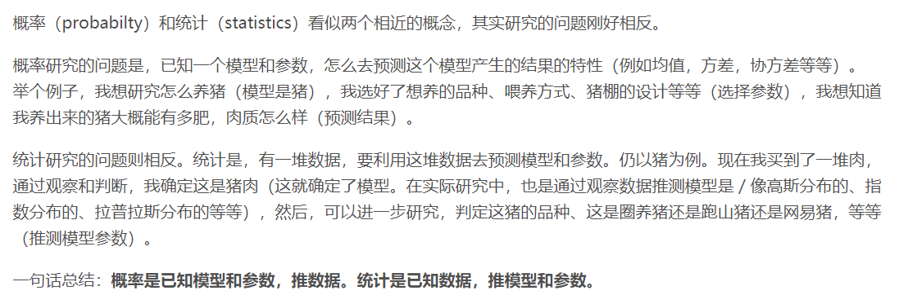
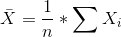
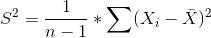
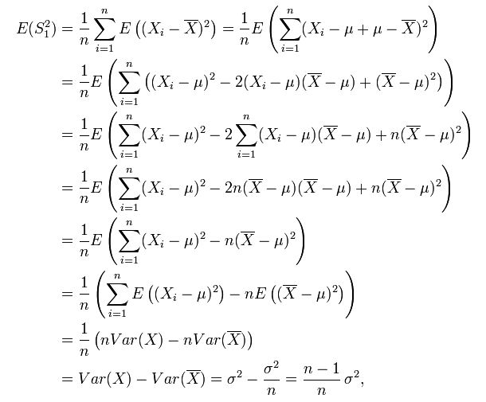
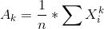
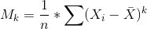
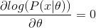

- 参见  <a  href="https://blog.csdn.net/u011508640/article/details/72815981">https://blog.csdn.net/u011508640/article/details/72815981</a> 
- 数理统计基本概念
    - 基本概念
        - 总体：研究对象的全体
        - 样本：按一定的规定从总体中抽出的部分
        - 统计量，Xi是样本
            - 样本均值 
            - 样本方差：n-1解释<a  href="https://www.zhihu.com/question/20099757">https://www.zhihu.com/question/20099757</a> 
                - 如果用n的问题：会导致估计偏小 
                - 所以严谨公式为 
                - 自由度
                    - X1...Xn是无关的，所以它们的自由度为n（类似于秩？）
                    - Xi  -   \bar X：自由度为 n-1 ，所以秩序为n-1
            - 样本k阶原点矩 
            - 样本k阶中心矩 
    - 抽样分布
        - 重要分布
            - 卡方分布
            - t分布
            - F分布
        - 抽样分布定理
            - 主要是样本均值和样本方差的关系
- 参数估计
    - 参数估计方法，已知某个分布的未知参数：θ
        - 矩估计：用**样本的k阶原点矩  **去 估计 ** 总体的k阶原点矩；**以此得到方程组
            -  得到总体的矩
                - E(x) = f1(θ)
                - E(x^2) = f2(θ)
            - 求出的样本中的一阶矩和二阶矩阵：α1 ，α2；得到等式
                - f1(θ) =  α1
                - f2(θ) = α2
            - 求解未知数
        - 极大似然：就是利用**已知的样本结果**，推得使得**这些结果出现概率最大**的模型参数
            - 假设一个分布模型f_θ，其未知数θ，假设对于随机变量而言：p(x) = f_θ(x)
            - 对于样本空间：P(x|θ) = f_θ(x1)f_θ(x2)f_θ(x3)f_θ(x4)f_θ(x5)...
            - 哲学思考：出现的结果肯定是可能性最大的，所以需要最大化P(x|θ)
            - 最大化P(x|θ)
                - log化：使得累乘变为累加，使得处理更加方便 
                - 求导使得导数为0（log函数无最小值（无穷小），所以等于0情况是最大值） 
                - 求解θ值
- 假设检验
- 回归分析
