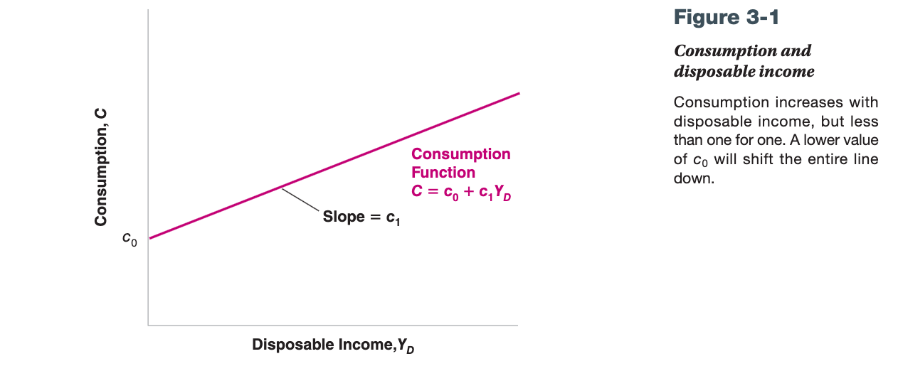
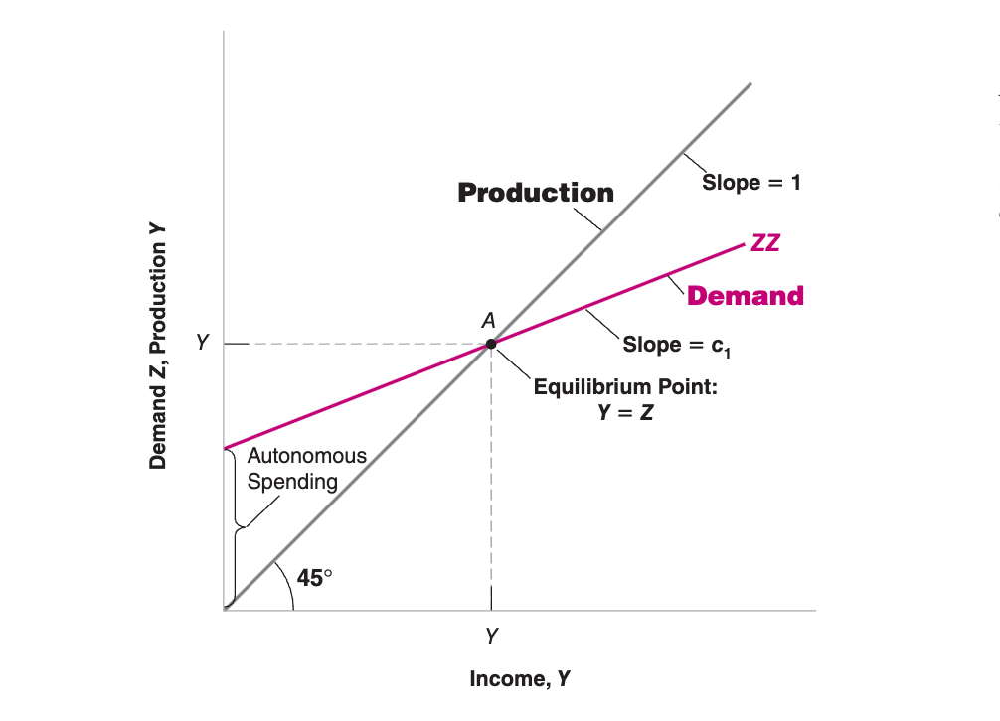
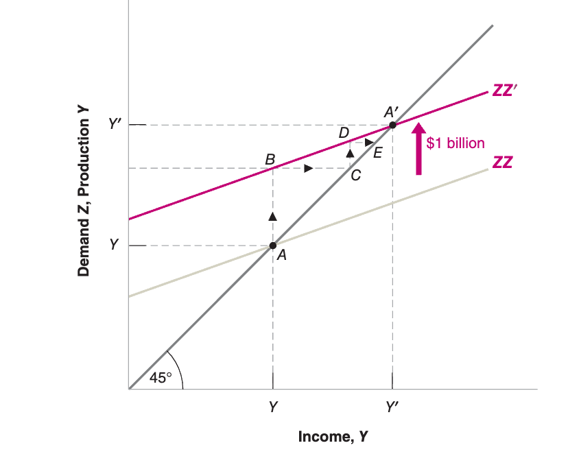

- 产品市场：商品的供求 = 收入；投资 = 收入 - 消费 = 储蓄
	- GDP 的组成
	  collapsed:: true
		- C：个人市场的消费
		- G：政府消费
		- I：投资
			- 投资是用于平衡消费与生产的平衡的，即投资 = 生产 - 消费
			- 投资可正可负
		- NE：净出口（X - IM）
			- X 出口
			- IM 进口
	- 商品的供需平衡：商品的供求 = 收入
	  collapsed:: true
		- 假设商品的需求为Z，定义 $Z \equiv I + C + G + X - IM$。这里暂时忽略出口，则得$$Z \equiv I + C + G$$
		- 对于商品消费端：
			- 个人消费和收入正相关，假设可支配收入(disposable income) 为$$Y_D$$。可得：
			  $$c = C(Y_D) = c_1 * Y_D + c_0$$
				- c1 是 弹性支出的系数，也称为边际收入倾向（propensity to consume）
				- c0是固定支出
			- 由此可得消费和收入的关系为：
			  
			- 其中$$Y_D = Y - T$$，Y为总收入，T为缴税
		- 假设投资是一个自变量，即$$I = \bar I$$
		- 结论：将上述两个公式结合可得：$$Z = I + c_1 * (Y_D) + c_0 + G$$
			- 消费和收入必然相等，可得$$Z = I + c1*( Z - T) + c_0 + G$$
				- 生成和收入相等，但是和消费之间差一个投资
			- 化简得：$$Z = \frac{1}{1 - c_1}(c_0 + \bar I + G -  c1*T)$$
			- 可得图示：$$Y = Z ;  C = c1 * Y_D + c0$$
			  
			- c0对平衡点的影响，假设c0 上升1
				- 图的角度：
				  collapsed:: true
				  {:height 419, :width 457}
					- 总消费和总生产上升幅度为：$$1 + c1 + c1^2 + ... = \frac{1}{1-c1}$$
						- AB：1
						- CD：c1（红线的斜率是c1）
						-
				- 公式角度：
					- 公式为：$$Z = \frac{1}{1 - c_1}(c_0 + \bar I + G -  c1*T)$$
					- c0上升1，c1上升$$\frac{1}{1-c1}$$
				- 现实角度：
					- 消费增加1 => 生产增加1 => 收入增加1
					- 收入增长1 => 弹性支出增加c1 => 消费增长c1
					- ....
				-
	- 投资平衡：投资 = 收入 - 消费 = 储蓄
	  collapsed:: true
		- 储蓄：
			- 个人储蓄是消费和税收后的剩余：
			  $$S \equiv Y - T - C = Y - T - (c_0 + c_1 * (Y - T)) = -c_0 + (1-c_1)(Y - T)$$
			- 政府储蓄就是税收减去开销：$$S_G = T - G$$
		- 投资的定义为生产消费的差：$$I = Z - C - G = Y - C - G$$
			- 正好等于储蓄的和：$$I = S + S_G = S + T - G$$
				- 结合公式可得：$$I = -c_0 + (1-c_1)(Y- T) + (T - G)$$
				- 该公式可得到税收和政府投资对投资的影响
		- 根据上述公式可以解，与商品供需平衡得到的解相同
		  $$Y = \frac{1}{1 - c_1}(c_0 + \bar I + G -  c1*T)$$
- 金融市场
- 产品市场与金融市场：IS-LM 模型
- IS-LM模型扩展