- Ch1
    - 方程组的解释(二维为例)
        - 行图像 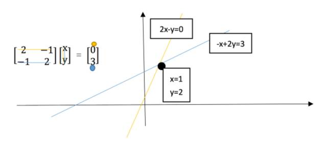
        - 列图像 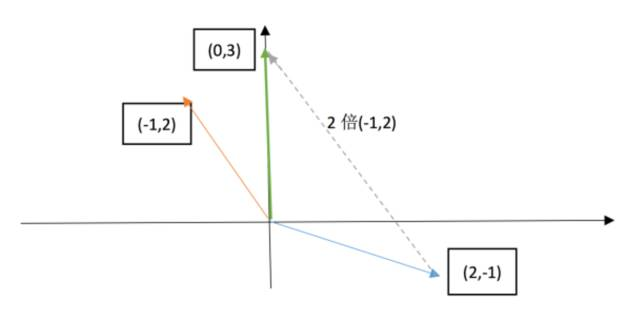
    - 矩阵乘法
        - A*x可以看作A的列向量线性组合 
        - A*x可以看作A的行向量和x进行点击 
- Ch2
    - 消元法 Method of Elimination
        - 高斯消元法（Gauss elimination）：通过对方程组中的某两个方程进行适当的数乘和加，消减某个未知数。
    - 回代 Back-Substitution
        - 做方程的高斯消元时，需要对等式右侧的b做同样的乘法和加减法。
        - 将b插入矩阵A之后形成最后一列。形成增广矩阵，在消元。
    - 消元矩阵 Elimination Matrices
        - 列线性组合 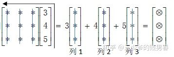
        - 行线性组合 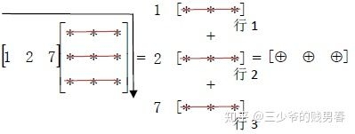
        - 矩阵消元的本质就是不断左乘消元矩阵
            - 例如三元矩阵A:E32(E31(E21A)) = > EA = U;U为上三角矩阵 
                - E21使得 a21 = 0
                - E31 使得 a31 = 0
                - E32 使得 a32 = 0
    - 置换矩阵：本质还是对行和列的线性组合
        - 左乘行 
        - 右乘列 
        - P^-1 = P 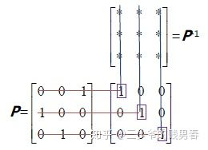
    - 逆矩阵 inverse
        - 高斯-若尔当消元法 Gauss-Jordan Elimination 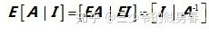
        - 公式 
- Ch3
    - 矩阵乘法 Matrix multiplication
        - 标准方法（行乘以列）
        - 列操作 
        - 行操作 
        - 分块乘 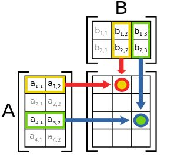
- Ch4
    - 转置，对称矩阵的概念 
    - LU 分解
        - EA = U，其中E矩阵第i行是第0~i行之间线性组合，故E为下三角矩阵，主元为1
        - A = E^-1U = LU
            - 分解 
            - 左乘逆E21^-1,其中E21^-1是E21的反向操作，故 
            - 即E^-1既是E下三角非主元部分的相反数
    - 运算量
        - 对第一行需要n次操作(把第一行变为，其余变为0)，第i行需要(n-i+1)次操作，故可得 
        - 如果主元的位置出现了0，就需要进行“行交换”。我们可以通过左乘一个置换矩阵
- Ch5
    - 向量空间与子空间
        - 向量空间
            - 线性组合：加和与数乘运算
            - 向量空间的线性运算封闭
            - 例
                - R2即为向量空间，它是具有两个实数分量的所有向量（二维实向量）的集合。
                - R3是向量空间，它是具有三个实数分量的所有向量的集合。
                - Rn是向量空间，它是具有n个实数分量的所有向量的集合。
                - 反例：R2中的第一象限则不是一个向量空间。
        - 子空间
            - 包含于向量空间之内的一个向量空间称为原向量空间的一个子空间。
            - 子空间包含0向量
            - R2子空间
                - R2空间本身
                - 过原点的一条直线（这是R2空间中的一条直线，与R1空间有区别）
                - 原点 仅包含0向量 Z
            - Rn子空间
                - 本身 n维？
                - 任一个过原点的1~n-1维 空间
                - 原点 0维？
            - 子空间P L的交 并 运算
                - P ∪ L 不是
                - P ∩ L 是 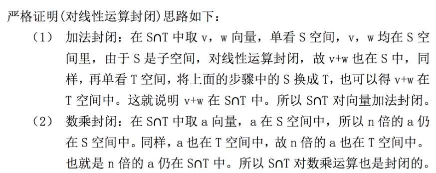
        - 列空间
            - 矩阵A，A的列组成一个空间，A的列空间
            - 
- Ch6
    - Ax = b
        - 如果b不在A的列空间中，则代表无解
            - 如果A是满秩的，A的列空间是整个R^n空间所以肯定有解
            - 否则列空间不能充满 R^n 空间，b不一定在其中
    - Ax = 0 （零空间）
        - Ax = 0 解 构成的子空间
            - 验证线性组合的封闭性 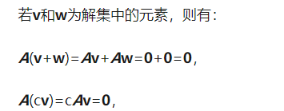
    - Ax = b的解的组合
        - 不过零点（故肯定不构成一个子空间）
    - 由列空间和零空间可得构造子空间的两种方式
        - 对于列空间，它是由列向量进行线性组合张成的空间；
        - 零空间是从方程组出发，通过让x满足特定条件而得到的子空间。
- Ch7
    - 计算零空间 Nullspace
        - 例 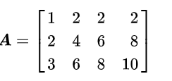
        - 高斯消元得到上三角（矩阵的秩是主元列的个数）；主元列和自由列的一个重要区别就是，自由列可以表示为其左侧所有主元列的线性组合，而主元列则不可以。 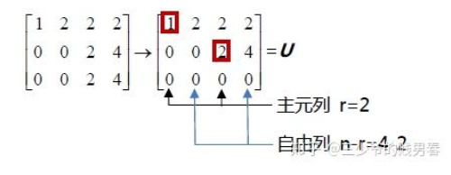
        - 行最简阶梯矩阵 Reduced row echelon form：上述矩阵经过列交换、数乘得到下述形式 
        - Ax = 0可得 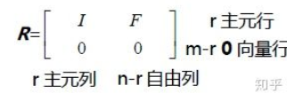
        - 则零空间为，注意如果在变换出R左上角的单位阵的过程中采用了列交换，则最后的解要完成逆变换。 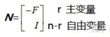
        - 由上述可得零空间是n维空间中n-r维的子空间
        - 上述的线性组合就是通解
- Ch8-求解Ax=b：可解性与结构
    - 可解的条件 Solvability conditions on b
        - 列空间角度：当且仅当 b 属于 A 的列空间时成立。
        - 线性组合角度： b 必须是 A 各列的线性组合。
        - A 矩阵本身变换角度：如果 A 的各行线性组合得到零行，那么对 b 取相同运算方式，必将得到自然数 0.
    - 通解 = 矩阵零空间向量 + 矩阵特解
        - 方程的解Ax=b构成了穿过xp点并和矩阵零空间平行的“平面“。但该”平面“并不是R4空间的子空间。
    - 秩 Rank
        - 列满秩：r=n
        - 行满秩：r=m
        - 满秩r=m=n 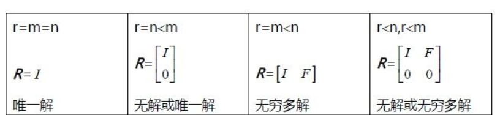
- Ch9  线性无关，基和维数
    - 线性无关
    - 张成空间 Spanning a space
        - 当一个空间是由向量v1，v2……vk的所有线性组合组成时，我们称这些向量张成了这个空间。例如矩阵的列向量张成了该矩阵的列空间。
        - 如果向量v1，v2……vk张成空间S，则S是包含这些向量的最小空间。
    - 基与维数Basis &Dimension
        - 基：构成该空间线性无关的向量
        - 子空间的基 Basis for a subspace
            - 子空间的基构成一个列满秩的矩阵。
            - 其子空间维度即为秩
- Ch10 4个基本空间,A(n*m)
    - 列空间 Column space C(A)
        - 矩阵A的列空间是A的列向量的线性组合在 **R^m** 空间中构成的子空间。
    - 零空间Nullspace N(A)
        - 矩阵A的零空间是Ax=0的所有解x在 **R^n** 空间中构成的子空间。
    - 行空间Row space C( A^T )
        - 矩阵A的行空间是A的行向量的线性组合在**R^n**空间中构成的子空间，也就是矩阵 **A^T** 的列空间
    - 左零空间Left nullspace N( A^T ):**A^T * x = 0 或者 x^T * A = 0** 
        - 我们称矩阵 A^T 的零空间为矩阵A的左零空间，它是 **R^m **空间中的子空间。
    - **示意图如下：行空间和列空间正交由    简单的    矩阵乘法    可推出** 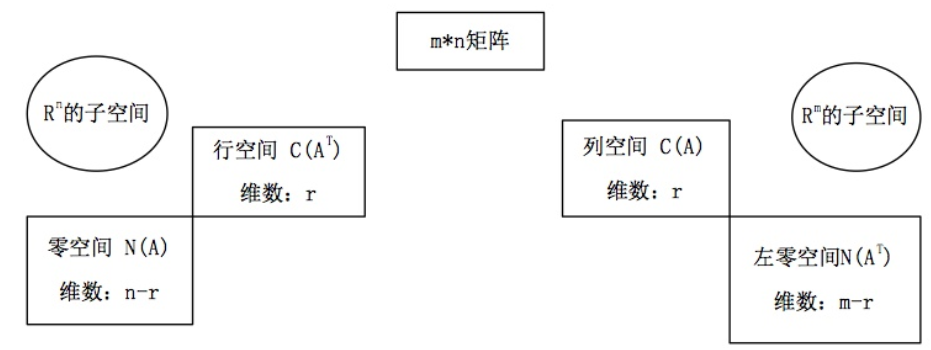
- Ch11  矩阵空间、秩1矩阵和小世界图
    - 新的向量空间 New vector spaces
        - 空间M是所有3x3矩阵所构成的空间
            - M的部分子空间包括：
                - 所有的上三角阵，记为U。
                - 所有的对称阵，记为S。
                - 所有的对角阵，记为D，它是前两个子空间的交集。
            - 基：9个矩阵，每个元素等于1 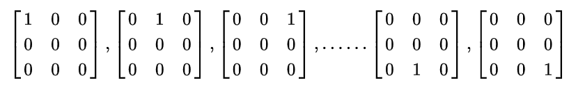
        - 微分方程 Differential equations
            - 对于给定的微分方程 ，求解该方程可以视为求它的零空间
                - 特解：y = cosx ； y = sinx ； y = e^ix    通解：y = c1cosx + c2sinx 
            - 秩1矩阵 Rank one matrices
                - 秩1矩阵可以分解: A = U * V^T 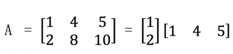
                - 可以用秩1矩阵搭建其他矩阵：比如秩为 4 的矩阵， 通过四个秩一矩阵就能搭建出来。？？？？？
            - 
- Ch12  图、网络、关联矩阵
    - 矩阵表示图
        - 这里用了别扭的方式？
            - m个节点，n条边。用一个n*m的矩阵表示
                - 每一列代表节点
                - 每一行代表边
                - -1表示起点，1表示终点 
            - 矩阵的零空间：Ax=0的解。零空间告诉我们列向量线性组合的状态。 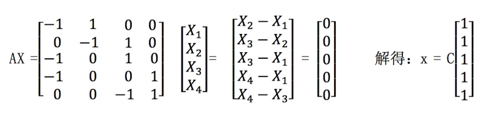
                - 零空间代表电势差为0，其维度为1
                - Ax = b代表给的电压b的情况下的解
            - 矩阵的左零空间 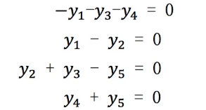
                - 上述个数代表每个节点流入流出电流相同：基尔霍夫定律
            - 电势差和电流之间的关系：欧姆定律 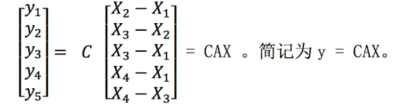
            - 故整合关系为 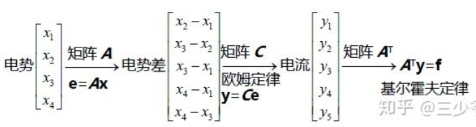
            - 考虑外加电源，A^T  *  y  = f ,f即为外部流入的电流，即得到： 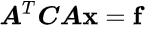
- Ch13复习1 待写
