- ch14 正交向量与正交子空间
    - 正交向量（Orthogonal vectors）：点积 x^T * y = 0
        - 正交基
            - 单位向量；模为1 ；标准
            - 基
            - 正交
    - 正交子空间
        - 子空间S与子空间T正交，则S中的任意一个向量都和T中的任意向量正交。
        - 附：垂直两个平面（黑板、地面）不正交，交线不符合定义
    - 零空间和行空间正交 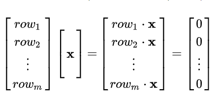
        - 行空间和零空间实际上把 **Rn **空间分割成了两个正交的子空间
        - 这种称为正交补
    - 无解方程 Ax = b的最优解，拟合？？？？？参见Ch16？？？？？？？？
        - 当Ax=b无解的时候，求解以下方程得到最优解。 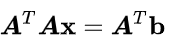
        - 其中A^T A的性质 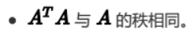
- Ch15 投影
    - 投影（射影）Projections
        - 二维空间的线投影，b投影到a向量上
            - 得到投影向量p = xa(x 是倍数)，使得b-p最小，即b-p和a正交 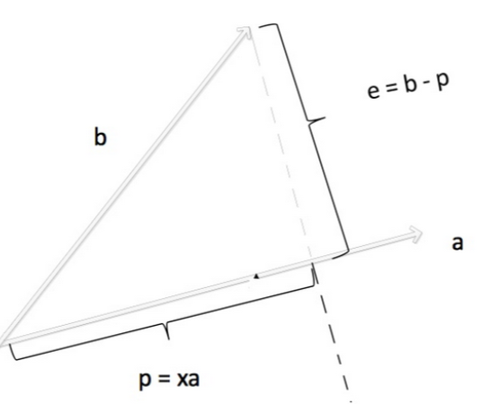
            - 解得 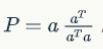
                - 其中投影矩阵有：
                    - 是对称矩阵 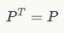
                    - 投影两次结果不变，（大于两次也不变） 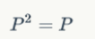
        - 三维空间的平面投影（也可扩占到n维）
            - 设投影平面的基：a1 a2；投影平面：p = x1*a1+x2*a2 / p = Ax,A = [a1 a2],x = [x1,x2]^T
            - 由正交得 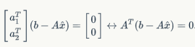
            - 解 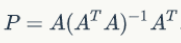
            - 如此便得到面（甚至更高维）的投影矩阵
                - 投影矩阵性质不变：对称，累乘不变
        - 投影矩阵的两种特殊情况
            - b在投影空间A内：不变 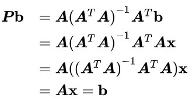
            - b与投影空间正交 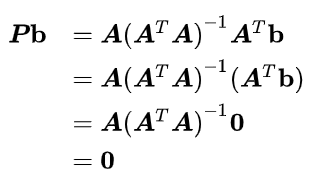
- Ch16 投影矩阵和最小二乘法
    - 最小二乘法：x * w = b无解，即无法得到权重w
        - 1、误差角度：使得误差最小，此时未知量 x 即为权重，A为点的集合，对误差求导，得到最小值 
        - **2、列空间角度：Ax = b无解本质是 b 不在A的列空间上** 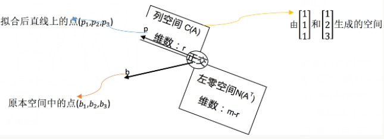
            - 我们需要把b投影到列空间中：即将b向量投影到它列空间最近一点，使得Ax为b投影的点 b‘ ；（即Ax - b最小） 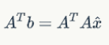
            - 解得x = (A^T A)^-1 A^T b；当A个列线性无关，A^T A可逆
    - 结论证明
        - 前提 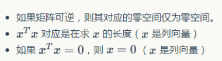
        - 推导：证明 A^T A x = 0,其中x是 0 向量 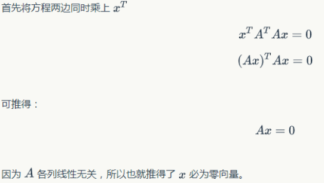
- Ch17  正交矩阵和施密特正交化
    - 标准正交向量：Orthonormal vector 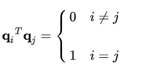
    - 标准正交矩阵 Orthonormal Matrix 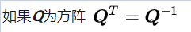
    - 标准正交列向量的优势 Orthonormal columns are good
        - 若Q的列向量为标准正交向量，则投影到Q的列空间的投影矩阵为： 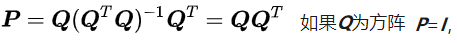
            - 上述公式代表Q张满了整个空间，投影不会改变i项链
        - 最小二乘中 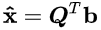
    - 施密特正交化Gram-Schmidt
        - 从两个线性无关的向量a和b开始，它们张成了一个空间，我们的目标是希望找到两个标准正交的向量q1，q2能张成同样的空间
            - 若有一组正交基，标准化就好了 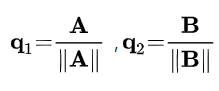
            - 若基a b不正交，Gram提出：令A=a，我们在a和b张成的空间中，取与A正交的向量做成标准正交基，方法就是将b投影到a的方向，然后取B=b-p 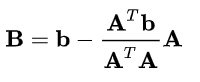
                - 若是第三个基c，将c投影导A，B的平面上，C =  c - p 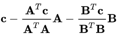
- Ch18 行列式及其性质
    - 行列式：这里可以从行向量组成空间的大小（二维是面积，三维是体积），理解这些性质 
        - 基本性质，前三个是基本的，后面都可以通过前三个证明
            - 单位矩阵，单位面积/体积。。。。 
            - 交换边，广义上反号 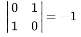
            - 相当于大平行四边形，划分成两个 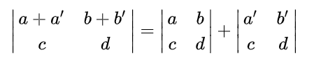
            - 如果矩阵的两行是完全相同的，则它的行列式为0；重合面积为0，或者从性质2推导
            - 从矩阵的某行k减去另一行i的倍数 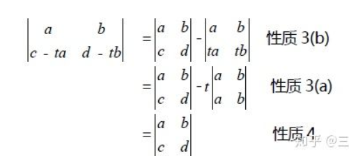
            - 三角阵的行列式的值等于其对角线上数值（主元）的乘积。迹
            - det(AB)=det(A)det(B)
            -  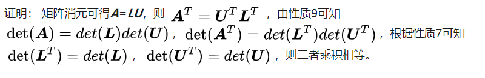
- Ch19 行列式公式和代数余子式
    - 二阶见上一章
    - 三阶 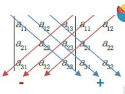
    - n阶
        - 代数余子式
            - 代数余子式是用较小的矩阵的行列式来写出n阶行列式的公式。 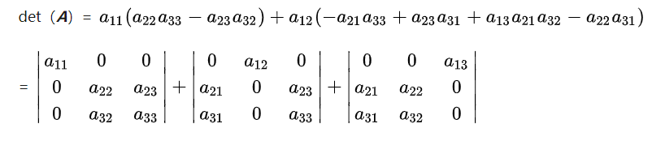
            - 对任意元素 aij 而言，其代数余子式 Cij 就是移除 i 行  j列 的行列式，再乘以 -1^（i+j）。 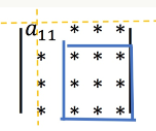
            - 对于n阶方阵，其行列式的代数余子式公式为： 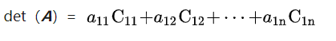
- Ch20 克莱姆法则、逆矩阵、体积
    - 逆矩阵的公式，其中 C 是代数余子式组成的矩阵，此时C^T 称作伴随矩阵 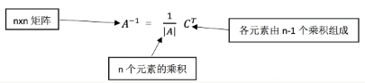
        - 证明， 
            - 附：证明，不是对应元素与代数余子式相乘 =  0 ：此时构建的矩阵有重复列，行列式为0 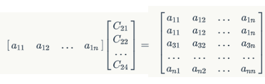
    - 克莱姆法则
        - 对于可逆矩阵A，方程Ax=b必然有解，带入可逆矩阵公式得: 
            - 其中C^T * b的展开是每一个代数余子式乘上b的各个分量。（附：余子式乘数字，和行列式的形式很像）
                - 求d得x的分量，其中 Bj 是用 **b 代替C 第j列，也等于C^T 第j行 和 b 点积** 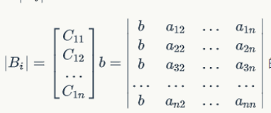
- Ch21 特征值 特征向量
    - Ax = λx：x是特征向量， λ是特征值
        - 注解特例：投影矩阵
            - 对投影平面上的x1：Ax1 = x1；λ = 1
            - 对正交平面上的x2：Ax2 = 0；λ = 0
    - 求
        - (A - λ*I) x = 0  有非零解=> det(A - λ*I) = 0
    - 性质
        - 矩阵的迹等于特征值之和
            - det(A - λ*I)是一个n次多项式，其中特征值 λ 是 该多项式的解
            - 由韦达定理，解之积与 n-1项系数an-1.n项系数an关系如下 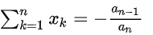
            - 方便考虑，等效为det (λI -A) = 0，其中an = 1.an-1 = -trace(A)
        - 对称矩阵的特征向量正交
            - 假设特征值 λ1 λ2，特征向量 x1 x2；注意第三步中A^T = A 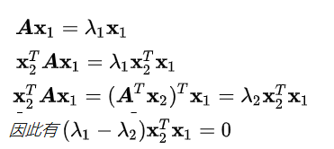
        - 特征之积为行列式的值，不知道证明
        - 上三角矩阵 的特征值 就是对角元素
            - 证明：当λ 为对角元素时，A-λI一个对角变为0，此时det(A-λI) = 0
    - 附：如果λ是A的特征值，λ也是A^T的特征值
        - det(（A - λI）^T )=det(（A^T - λI） ) = 0 
- Ch22 对角化和矩阵的幂
    - 对角化矩阵 Diagonalizing a matrix
        - 如果A有n个线性无关的特征向量可以组成    可逆矩阵S，得： 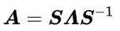
    - 矩阵的幂： powers of A 
        - 由上可得 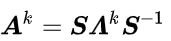
    - 重特征值Repeated eigenvalues
        - 如果矩阵A没有重特征值，则其一定具有n个线性无关的特征向量。
        - 如果矩阵A有重特征值，它有可能具有n个线性无关的特征向量，也可能没有。
            - 特例：单位矩阵的重特征值为1，但是其具有n个线性无关的特征向量
    - 差分方程 Difference equations ：uk+1 = Auk
        - 由差分方程递推：uk = A^k u0
        - 将u0写成k个特征向量组合 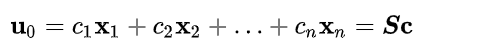
        - 则乘法可得到 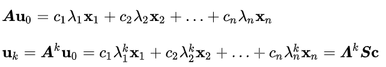
        - 例子:斐波拉契
            - 斐波拉契公司 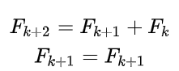
            - 矩阵形式 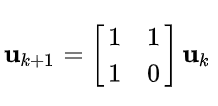
            - 求解特征值 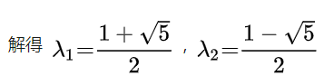
            - 得到uk 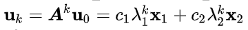
                - 其中λ2 < 1,当k 趋向 无穷时，其幂接近0，故这一项可以影响近似为0
- Ch23 微分方程和矩阵指数
    - 本讲中我们将面对微分方程，将一阶常系数微分方程转化为线性代数问题进行处理。主要思路基于常系数线性方程的解是指数形式e^(At)，而寻找其指数和系数就是线代主要研究的问题。 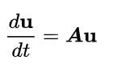
    - 微分方程 Differential equations
        - 例子1
            - 其中u1(0) = 1；u2(0) = 0 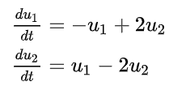
            - 得到 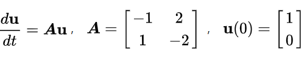
            - A的矩阵是为了追踪u随时间的变化
                - 求得特征值λ1 = 0，λ2 = -3
                - 一阶线性微分方程的解的形式是e^(λt)；其中λ = 0表示结果达到稳态，λ = -3表示结果随时间增大减小
                - 由之前通解可以延申到 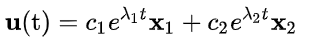
                - 由初始值得到 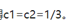
            - 对于解的证明，本质上还是运用了对角化
                - 对于微分方程 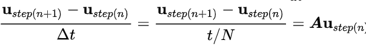
                - 由上述得到u1 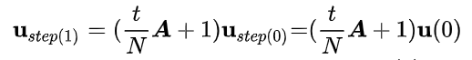
                - 将u0表示成特征向量的线性组合 
                - 带入上式 
                - 当N为无穷 
        - 稳定性：并不是所有的系统都会达到稳态，矩阵的特征值会告诉我们u(t)的发展趋势
            - Re(  λ  )<0，则有u(t)→0。（支配稳定性的是实部:Re(λ)，**虚部的作用是在单位圆上转圈？？？**。）
            - 稳态：有一个特征值为0，并且其它所有的特征值实部为负数。
            - 至少有一个特征值满足Re(  λ )>0，则发散。
        - 在方程 
            - 矩阵A使得u中不同分量耦合
            - 令u = Sv；S是A特征向量组成
            - 得到新的方程，不耦合 
            - 则可得到，方程组的对角线；其余为0 
            - 由此得到通解 
                - 其中矩阵指数函数 Matrix exponential e^At得到证明
                    - 幂级数· 
                    - 可得到 
- Ch24 马尔可夫矩阵；傅里叶级数
    - 马尔可夫矩阵
        - 马尔可夫矩阵：形如矩阵A
            - 任何元素非负
            - 且每列的元素加和为1 
        - 马尔可夫矩阵性质：
            - 将一个马尔可夫矩阵进行方幂运算得到的矩阵仍旧是马尔可夫矩阵。
                - 设A为马尔可夫矩阵，B = A*A
                - A的列为c1 ... cn，A的第j列的元素a1j ... anj；
                - B的**第j列**可以看成A的n列根据A的第j列的线性组合： bj = a1j*c1  + ... +anj*cn
                - sum（bj） = a1j  **sum(c1) **+ ...  + anj **sum(cn) = a1j +...+ anj = 1**
                - 且B元素非负，故满足马尔可夫矩阵性质
            -  λ1 =1是特征值之一。
                - A-I：每一列之和为0，由此可知不满秩，不可逆
            - 其他特征值比1较小
                - ????????????
        - 稳态(多次幂运算)
            - 如果矩阵具有n个线性无关的特征向量，则有： 
            - 如果λ1 = 1，而其他特征值小于1，则在k增大的过程中，其他项趋于0，uk趋于c1x1；即一个稳态
    - 傅里叶级数
        - 前情基础
            - 假设n个标准正交向量 q1 ... qn；则v： 
            - 得 
            - 由于Q是正交得： 
            - 得到各个分量，求分量的思路就是用空间的一组标准正交基去点乘目标向量 
        - 傅里叶级数
            - 函数f(x) 
            - 基为 
                - 正交证明
                    - 向量内积 
                    - 函数内积 
                    - 验证一些正交性。。。。。。。。 
            - 这里将f (x) 和 基正交得到分量，例如与 cosx 正交的分量，且由于一些基正交得到： 
- 复习2.。。。。。。。。。。。。。。。。。。。。。。
