- Ch25 对称矩阵和正定性
    - 对称矩阵 A = A^T Sysmmetric matices
        - 性质
            - 实特征值 real eigenvalues？？？？
                - 反证法
                    - 若为负数，其共轭复数满足？？？？？？？？？？为什么满足 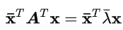
                    - 由于对称 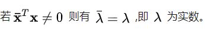
                    - x 不是零向量，故上述论证正确 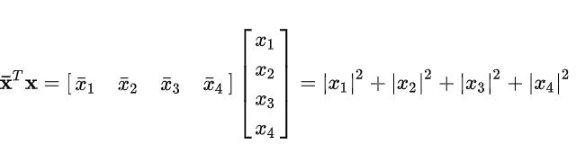
            - 特征向量正交
                - 参见特征值那一节
                - 简而言之 在 Ax1 = λ1 x1 两边同时乘x2 ^ T
                - 化为(λ1 - λ2)x2^T x1 = 0
        - 谱定理
            - 对于对称矩阵 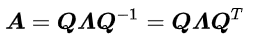
    - 正定性
        - 特征值全部为正数
- Ch26 复矩阵；快速傅里叶变换(涉及到复数，暂时不看)
- Ch27 正定矩阵和最小值（二次型）
    - 正定矩阵 Positive definite matrices
    - 正定矩阵的判定 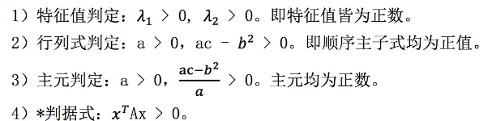
        - 附：若A是正定，A+B也正定，由性质四可得
    - 二次型quadratic form
        - x^TAx = λx^T x
            - 若A正定
                - x^TAx > 0
                - 仅在x = 0处等于0
                - 是一个开口向上的碗状
            - 若存在小于0
                - 存在一个鞍点
            - 若半正定
                - 存在多个点等于0
            - 图像如下 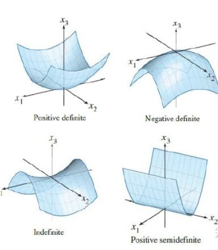
    - 最小值
        - 微分判定 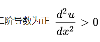
        - 线性代数判定
            - 二阶导数矩阵是否正定？？？？
            - 配方？？
                - 将二次型配方 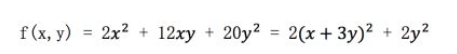
                - 通过平方项前系数判断是否正定
                - 配方就是消元 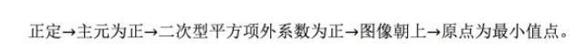
            - 主轴定理 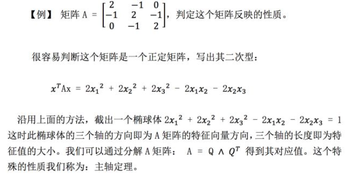
- Ch28 相似矩阵和若尔当标准型
    - 正定矩阵 A^T A
        - 有大量的实际问题用到了长方形矩阵，而最小二乘问题中用到了长方形矩阵的积A^T A，它是正定矩阵
        - 证明 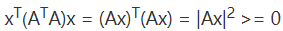
            - 若Ax = 0的零空间 只有零向量，则正定矩阵成立（即rank(A) = n,A列满秩）
    - 相似矩阵
        - 定义 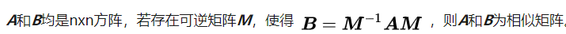
            - S-1AS=Λ，那么A相似于Λ；
        - 性质
            - 特征值相同（注意特征向量并不相同） 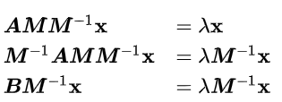
            - B=M-1AM， B的特征向量等于M的逆乘以矩阵A的特征向量；
        - 重特征值情况 repeated eigenvalue
            - 如果重特征值，可能无法对角化（特征向量可能不线性无关）
            - 第一类 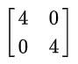
                - 只和自己相似，其相似矩阵仅包含自身 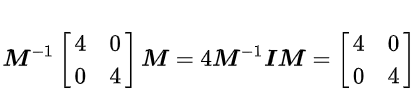
                - 当特征值完全相同时，特征值矩阵λ = k*I
                - 特征值矩阵之和自己相似，故原矩阵不能和特征值矩阵相似，故不能对角化。
            - 第二类 
                - 该矩阵元素1的位置换上其他数值，还是相似矩阵
                - 该矩阵称为Jordan form
        - 若尔当标准型 Jordan form：解决不能够对角化的问题
            - 若尔当矩阵
                - 若尔当块 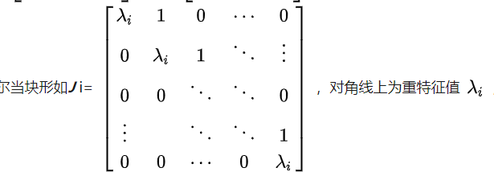
                - 若尔当矩阵：若干个若尔当块可以拼成一个若尔当矩阵。 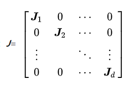
                - 若尔当理论：任意n阶**矩阵A**都与一个**若尔当矩阵J**相似。若尔当矩阵中的每一个若尔当块对应**一个特征向量**。若矩阵具有n个不同的特征向量，则可以对角化，此时其若尔当标准型J就是对角矩阵Λ。若出现重特征值，则特征向量个数变少。
- Ch29 奇异值分解 Singular value decomposition** ？？？？**
    - 奇异值分解(SVD)：任意矩阵可分解如下形式，分解结果为**正交矩阵U**，**\sum 对角阵**和**正交矩阵V；本质上是对非方阵的分解** 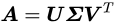
    - 过程
        - 可以将矩阵A视为一种线性变换操作；
        - 将其行空间中的一个向量v1,u1 = Av1 变为其列空间中的向量  。
        - 奇异值分解就是要在行空间中寻找一组正交基，将其通过矩阵A线性变换生成列空间中的一组正交基 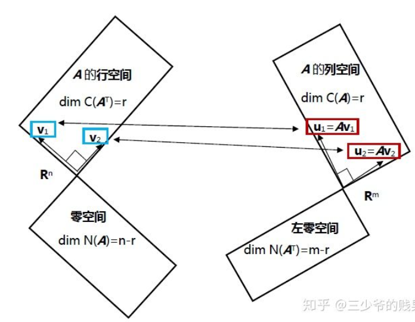
        - 难点：如何找到一组正交基v1 ... 通过变换得到的 u1 ... 也是正交的
    - 矩阵描述上一过程
        - 找到一组正交基V，使得：其中u也是一组正交基 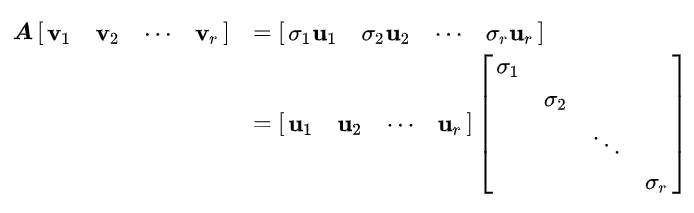
        - 则可得公式 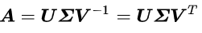
        - 求得 u 和 v
            - 对A和A^T相乘得到： 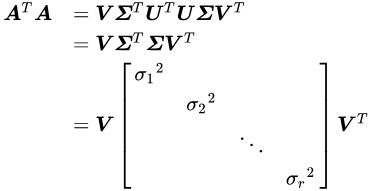
            - 由之前正定知识可得，上述V V^T即为正定矩阵 A^T A的正交分解。(附：AT A也是对称矩阵，所以特征向量正交)
            - 由此求出V之后便可以求出U
            - 
    - 
    - 红色石头这一过程的描述：<a  href="https://redstonewill.com/1529/">https://redstonewill.com/1529/</a>
        - 对于方阵
            - 普通方阵分解 EVD 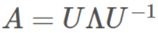
            - 对称矩阵的矩阵分解 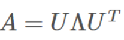
        - 对于非方阵，可以转化 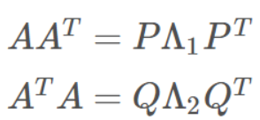
            - Λ1 和 Λ2 是对焦矩阵（特征值组成矩阵），转置不影响特征值，故Λ1 和 Λ2 应该相同
            - 由此便得到如下公式（什么鬼）怎么分解的，其中Λ = sqrt(Λ1 ) 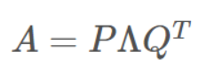
            - 
- Ch30 线性变换及对应矩阵？？？？
    - 通过线性变换使得平面内的一个向量变为平面内的另一个向量，这种变换关系通常称之为“映射”（mapping）。
        - 其中T，类似一个函数，给定一个“输入”，进行线性变换后得到一个“输出”
            - T(v)=Av，表示一系列线性变换
        - 规则：对于任意向量v，w和标量c，
            - T(v+w)=T(v)+T(w)
            - T(cv)=cT(v)
            - T(0) = 0
        - 例子
            - 求长度T(v)= || v ||;  或者说一维向量T：R3→R1，数乘负数不符合规则
            - 旋转 Rotation by 45
                - 这个变换T：R2→R2，是一个线性变换，数乘和加法均符合。
    - 描述线性变换 Describing T(v)
        - 通过基来确定所有线性变换的结果：一个向量v，确定一组基，v1...vn 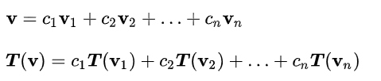
    - 如何确定矩阵A Rule to find A
        - 矩阵A  的列实际上是描述**输出原空间的基向量得到的列空间**线性组合的系数 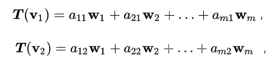
        - **A [输入向量的坐标] = [输出空间的坐标]**
        - 例如：其中A就是输出空间的基向量的线性组合（a11 、a21...am1） 
        - 一种特殊的线性组合：导数 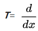
            - 例子 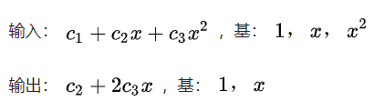
            - 矩阵A满足 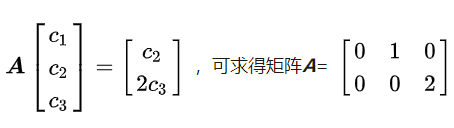
        - 附：A的逆矩阵就是线性变换的逆变换
    - 附： 
- Ch31 基变换和图像压缩？？？
    - 图像压缩 Compression of images：图像压缩的本质就是基变换。
        - 图像标准是一个n*m的矩阵：其基为 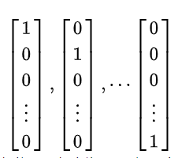
            - 对于图像相近的区域，颜色接近；例如一块黑色，此时标准基没有利用这一种特性，故可以压缩
        - JPEG：傅里叶基 Fourier basis
        - 小波
    - 基变换
        - 基变换：I->W
            - W的列向量是一组新的基向量。
            - 在旧基向量体系下的向量x和新基向量下的c的关系是：**x=W c**
        - 变换矩阵
            - 假设一个线性变换：T：R8→R8
            - 当基为v1，v2……v8；变换矩阵为A
            - 当基为u1，u2……u8；变换矩阵为B
            - A和B为相似矩阵，M是基变换矩阵 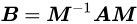
- Ch33 左右逆和伪逆
    - 两侧逆矩阵 2-sided inverse 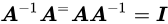
    - 左逆矩阵 Left inverse
        - 矩阵A的列满秩r=n，列向量线性无关。
            - 则矩阵的零空间N(A)只有零向量
            - 方程Ax=b无解或者有唯一解
            - 矩阵A*A^T为可逆矩阵
        - 由于A*A^T 可逆 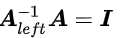
        - 右乘左逆矩阵得到，这是列空间的投影矩阵。 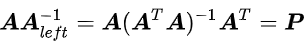
    - 右逆矩阵
        - 如左逆矩阵推导一样 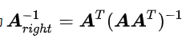
        - 左乘右逆矩阵得到行空间的投影矩阵 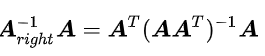
    - 伪逆矩阵
        - 逆矩阵的本质可以看作是对原矩阵的逆操作
        - 当Ax = 0有非零解时，此时操作不可逆
            - 列满秩的零空间只有零向量，所以左逆矩阵
            - 行满秩的左零空间也只有零向量，所以其有右逆矩阵
            - 对于不满秩矩阵，两个零空间皆存在，故没有逆矩阵
        - 观察不满秩矩阵A的四个子空间，其行空间和列空间的维数相等，均为r。故可得到行空间和列空间的对于关系(SVD有)，故可以行空间和列空间上是可逆矩阵，此时称为伪逆矩阵 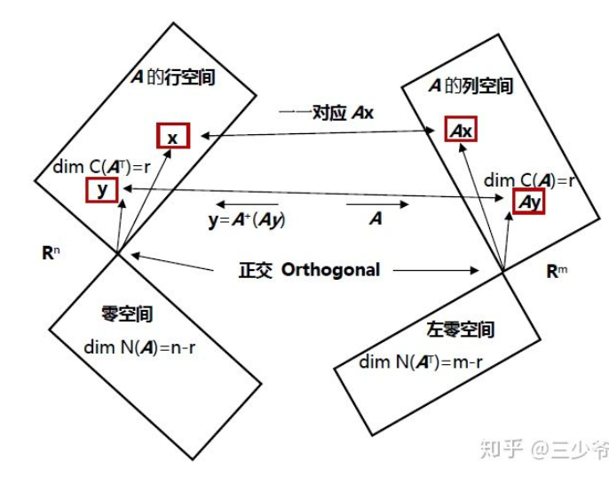
            - 问题的关键就是一一对应，即对于行空间中的向量x≠y，其通过矩阵A映射到列空间得到的向量Ax≠Ay。
                - 证明
                    - 若y于x对应的向量相同 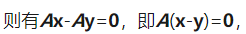
                    - 即x-y为0空间中的向量，但矩阵行空间对线性运算封闭，所以x-y为行空间的向量
                    - 由此可得Ax≠Ay
            - 求伪逆矩阵：利用奇异值分解 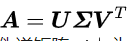
                - 其中\sum 矩阵是奇异值排列在对角线上构成的m*n矩阵 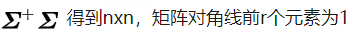
                - 矩阵A的伪逆 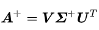
            - 性质 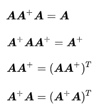
            -  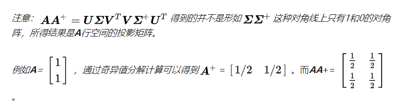
