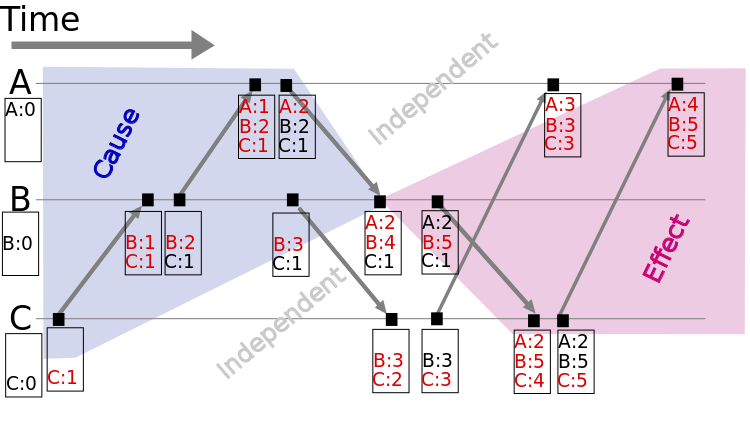

- 需求
    - 在一个系统中，需要明确事件发生的顺序，即构造一个偏序关系
- 问题
    - 在空间独立的机器中，物理时钟并不精确，所以不能使用物理时钟
- 逻辑时钟
    - 基本的逻辑先后原则
        - 同一机器上的事件，若a 先发生，b后发生，则a -> b
        - 不同进程上的事件，若a 和 b有信息交互：a 发送，b接收，则a -> b
    - lamport clock：逻辑时钟是一个值，称为LC
        - 定义
            - 如果一个事件发生，其时钟LC = old_LC + 1
            - 如果事件发送一个消息，那么发送者将其时钟LC_sender 包含在message中，接收者的时钟LC = max(LC, LC_sender)
        - 关系
            - 如果a -> b，则LC(a) < LC(b)
            - 构造了一个全序关系序列
        - 问题
            - 实际的事件是偏序的: a->b d->e
            - lamport 肯构造出的序列是a->d ，但实际上有可能是d->a
    - vector clock：逻辑时钟是一个向量，称为VC 
        - 定义
            - 假设一共有N个机器，则VC 包含n 个值
            - 若机器i 发生一个事件，其逻辑时钟VC_i[i] = VC_i[i]+1
            - 接收发送
                - i发送一个事件，VC_i[i] = VC_i[i]+1，将VC_i包括在message中
                - j收到i发送的一个信息，其逻辑时钟 { for k in 0...n :VC_j[k] = max(VC_i[k], VC_j[k]) }，VC_j[j] = VC_j[j]+1
            - 图示 
        - 关系
            - 假设a -> b，则VC_a < VC_b
                - 小于的定义是，VC_a 至少有一个元素 小于 VC_b，且不能有元素大于VC_b
                - 对于存在元素小于也有元素大于的，叫未定义
            - 构造了一个非全序的偏序关系
        - 优缺点
            - 避免了lamport的缺点，最精确
            - 可以检测冲突，由于其精确性
            - vector 向量多（N*M），开销大
